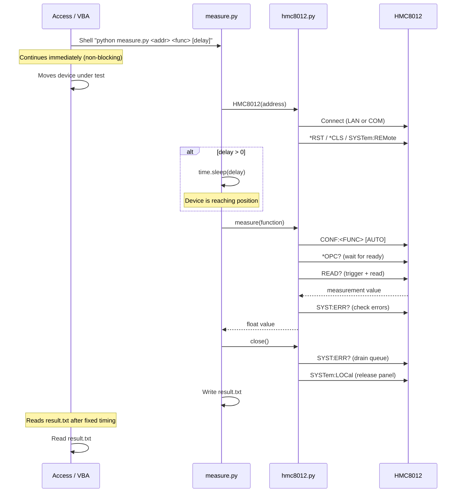
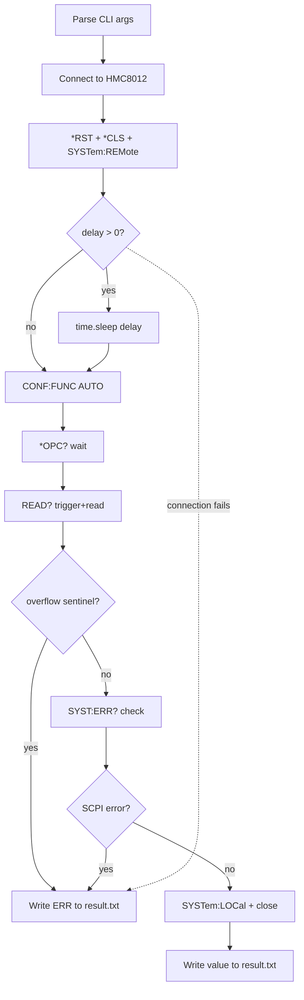
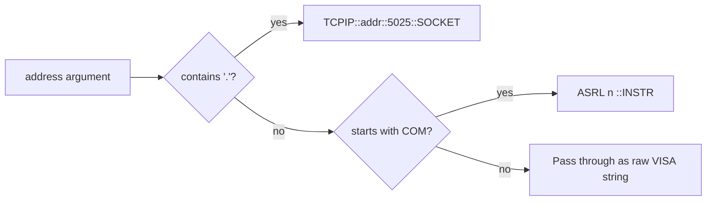

# HMC8012 Measurement Layer

Python CLI script that bridges a Rohde & Schwarz HMC8012 digital multimeter and a Microsoft Access/VBA application on Windows.

## How It Works

VBA launches the script via `Shell` (fire-and-forget). The script connects to the multimeter, optionally waits for the device under test to reach position, performs the measurement, and writes the result to `result.txt`.

### System Flow



### Internal Flow



### Connection Detection



## Usage

```bash
python measure.py <address> <function> [delay_seconds]
```

| Argument | Description |
| --- | --- |
| `address` | IP address (e.g. `192.168.0.2`) or COM port (e.g. `COM3`) |
| `function` | Measurement type (see table below) |
| `delay_seconds` | Optional wait in seconds before measuring (default: 0) |

### Supported Functions

| Name | Measurement | SCPI Command |
| --- | --- | --- |
| `dcv` | DC Voltage | `CONF:VOLT:DC AUTO` |
| `acv` | AC Voltage | `CONF:VOLT:AC AUTO` |
| `dci` | DC Current | `CONF:CURR:DC AUTO` |
| `aci` | AC Current | `CONF:CURR:AC AUTO` |
| `res` | 2-Wire Resistance | `CONF:RES AUTO` |
| `fres` | 4-Wire Resistance | `CONF:FRES AUTO` |
| `cap` | Capacitance | `CONF:CAP AUTO` |
| `temp` | Temperature (PT100) | `CONF:TEMP` |
| `freq` | Frequency | `CONF:FREQ` |
| `cont` | Continuity | `CONF:CONT` |
| `diod` | Diode Test | `CONF:DIOD` |

### Examples

```bash
# DC voltage via LAN
python measure.py 192.168.0.2 dcv

# AC current via COM, 2.5s delay for positioning
python measure.py COM3 aci 2.5

# 4-wire resistance via LAN
python measure.py 192.168.0.2 fres
```

## Output

**result.txt** (same directory as script):

- On success: the measurement value as a plain number (e.g. `4.872341`)
- On error: `ERR`

All diagnostic messages go to stderr for debugging.

## File Structure

| File | Purpose |
| --- | --- |
| `measure.py` | CLI entry point: arg parsing, delay, orchestration, file output |
| `hmc8012.py` | HMC8012 instrument driver: connection, SCPI commands, measurement |
| `app.py` | Development stub (connect + `*IDN?` query) |

## Dependencies

- Python 3.x
- `pyvisa` - VISA instrument communication
- `pyvisa-py` - Pure Python VISA backend (no NI-VISA required for LAN)
- `pyserial` - Required on Windows for COM port connections

```bash
pip install pyvisa pyvisa-py pyserial
```

## VBA Integration Example

```vba
' Fire-and-forget launch
Shell "python C:\path\to\measure.py 192.168.0.2 dcv 2.0", vbNormalFocus

' ... VBA moves device, waits fixed time ...

' Read result
Dim result As String
Open "C:\path\to\result.txt" For Input As #1
Line Input #1, result
Close #1

If result = "ERR" Then
    MsgBox "Measurement failed"
Else
    Dim value As Double
    value = CDbl(result)
End If
```
