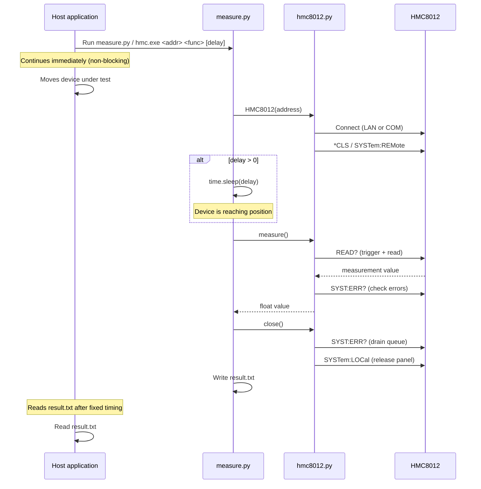
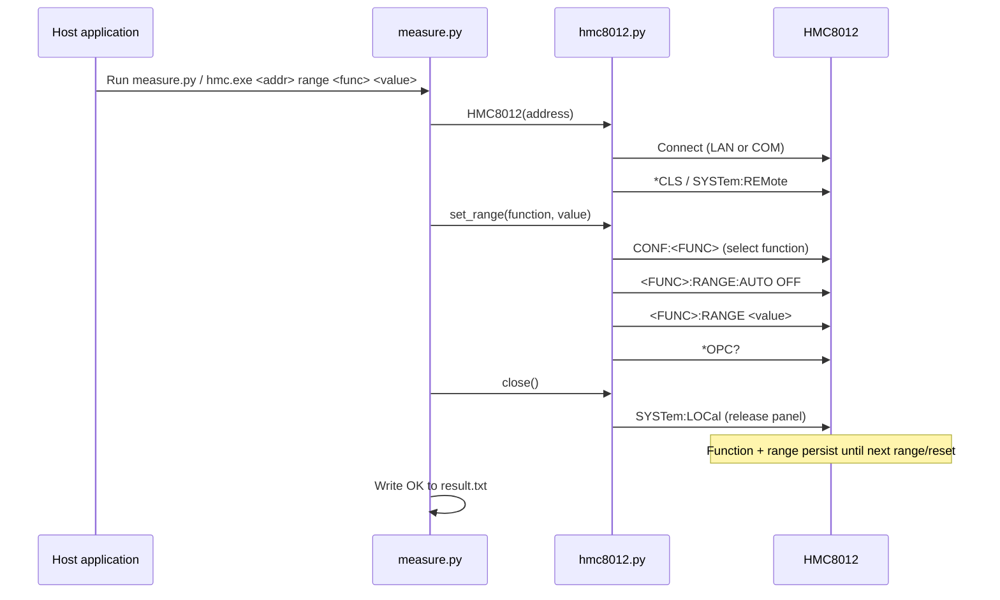
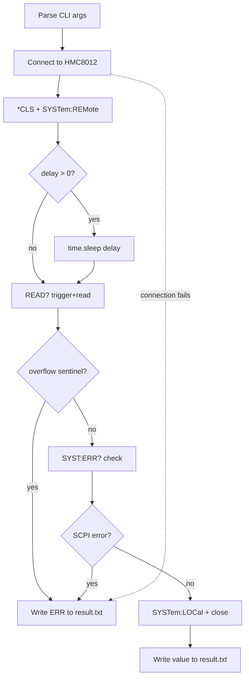
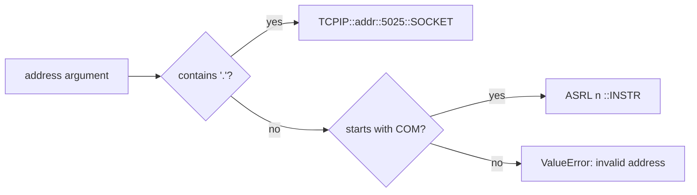

# HMC8012 Measurement Layer

Python tool to interface with the R&S HMC8012 Digital Multimeter by Rohde & Schwarz.

## Usage

### Measure

Reads from the instrument using the current function and range. Does **not** reconfigure anything; use the `range` command first.

```bat
python measure.py <address> <function> [delay_seconds]
hmc.exe <address> <function> [delay_seconds]
```

| Argument | Description |
|-|-|
| `address` | IP address (e.g. `192.168.0.2`) or COM port (e.g. `COM3`) |
| `function` | Measurement type (see table below) |
| `delay_seconds` | Optional wait in seconds before measuring (default: 0) |

### Set Range

Configures function and range on the instrument. Settings are kept until the next `range` or `reset` call. Connection does **not** reset the instrument.

```bat
python measure.py <address> range <function> <value>
hmc.exe <address> range <function> <value>
```

| Argument | Description |
|-|-|
| `function` | dcv, acv, dci, aci, res, fres, cap |
| `value` | Range in SI base units (e.g. `2` for 2A, `0.4` for 400mV) or `AUTO` |

### Reset

Resets the instrument to factory defaults.

```bat
python measure.py <address> reset
hmc.exe <address> reset
```

### Supported Functions

| Name | Measurement | SCPI Command | Available Ranges |
| --- | --- | --- | --- |
| `dcv` | DC Voltage | `CONF:VOLT:DC <range>` | 400mV, 4V, 40V, 400V, 1000V |
| `acv` | AC Voltage | `CONF:VOLT:AC <range>` | 400mV, 4V, 40V, 400V, 750V |
| `dci` | DC Current | `CONF:CURR:DC <range>` | 20mA, 200mA, 2A, 10A |
| `aci` | AC Current | `CONF:CURR:AC <range>` | 20mA, 200mA, 2A, 10A |
| `res` | 2-Wire Resistance | `CONF:RES <range>` | 400, 4k, 40k, 400k, 4M, 40M, 250M |
| `fres` | 4-Wire Resistance | `CONF:FRES <range>` | 400, 4k, 40k, 400k, 4M |
| `cap` | Capacitance | `CONF:CAP <range>` | 5nF, 50nF, 500nF, 5uF, 50uF, 500uF |
| `temp` | Temperature (PT100) | `CONF:TEMP` | — |
| `freq` | Frequency | `CONF:FREQ` | — |
| `cont` | Continuity | `CONF:CONT` | — |
| `diod` | Diode Test | `CONF:DIOD` | — |

### Range Values (SCPI)

Range values use SI base units (volts, amps, ohms, farads). For example, `0.4` = 400mV, `0.02` = 20mA.

| Function | Range values | Unit |
|-|-|-|
| `dcv` | 0.4, 4, 40, 400, 1000 | V |
| `acv` | 0.4, 4, 40, 400, 750 | V |
| `dci` | 0.02, 0.2, 2, 10 | A |
| `aci` | 0.02, 0.2, 2, 10 | A |
| `res` | 400, 4e3, 40e3, 400e3, 4e6, 40e6, 2.5e8 | Ohm |
| `fres` | 400, 4e3, 40e3, 400e3, 4e6 | Ohm |
| `cap` | 5e-9, 50e-9, 500e-9, 5e-6, 50e-6, 500e-6 | F |

### Examples

```bat
rem 1. Reset instrument to factory defaults
hmc.exe 192.168.0.2 reset

rem 2. Configure DC current with 2A range
hmc.exe 192.168.0.2 range dci 2

rem 3. Measure (uses the configured function and range)
hmc.exe 192.168.0.2 dci

rem 4. Measure again with 1.5s delay for positioning
hmc.exe 192.168.0.2 dci 1.5

rem 5. Change to DC voltage, 40V range
hmc.exe 192.168.0.2 range dcv 40

rem 6. Measure DC voltage
hmc.exe 192.168.0.2 dcv

rem 7. Switch to auto-range for AC voltage
hmc.exe COM3 range acv AUTO

rem 8. Measure AC voltage
hmc.exe COM3 acv
```

## Output

**result.txt** (same directory as script):

- Measure success: the measurement value as a plain number (e.g. `4.872341`)
- Range/reset success: `OK`
- On error: `ERR`

All diagnostic messages go to stderr for debugging.

## How It Works

The script connects to the multimeter (without resetting it), waits for the positioning delay if specified, sends `READ?`, and writes the result to `result.txt`. Function and range are configured separately with the `range` command and kept between calls.

### System Flow (Measure)



### System Flow (Range)



### Internal Flow (Measure)



### Connection Detection



## File Structure

| File | Purpose |
| --- | --- |
| `measure.py` | CLI entry point: command dispatch, arg parsing, delay, file output |
| `hmc8012.py` | HMC8012 instrument driver: connection, SCPI commands, measurement, range |

## Code Reference

### hmc8012.py

#### Exceptions

| Class | Description |
| --- | --- |
| `ScpiError` | Raised when the instrument reports a SCPI error (non-zero `SYST:ERR?` response). |
| `RangeOverflowError` | Raised when the instrument returns the overflow sentinel (`9.9e+37`): the input exceeded the selected range. |

#### `HMC8012`

Driver class for the R&S HMC8012. Supports both LAN (TCPIP socket) and COM (serial/VCP) transports via PyVISA. Implements the context manager protocol (`with HMC8012(...) as dmm:`).

##### Constants

| Name | Value | Description |
| --- | --- | --- |
| `OVERFLOW_SENTINEL` | `9.90000000E+37` | Value returned by the instrument on range overflow. |
| `SCPI_PORT` | `5025` | TCP port used for LAN SCPI socket connections. |
| `DEFAULT_TIMEOUT_MS` | `5000` | Default VISA communication timeout in milliseconds. |
| `MAX_ERROR_QUEUE_DEPTH` | `50` | Maximum iterations when draining the instrument error queue. |

##### Maps

`FUNCTION_SCPI_MAP: dict[str, str]`

Maps each CLI function name to the SCPI CONFigure command. Used by `set_range()` to select the measurement function.

| Key | SCPI command |
|-|-|
| `dcv` | `CONF:VOLT:DC` |
| `acv` | `CONF:VOLT:AC` |
| `dci` | `CONF:CURR:DC` |
| `aci` | `CONF:CURR:AC` |
| `res` | `CONF:RES` |
| `fres` | `CONF:FRES` |
| `cap` | `CONF:CAP` |
| `temp` | `CONF:TEMP` |
| `freq` | `CONF:FREQ` |
| `cont` | `CONF:CONT` |
| `diod` | `CONF:DIOD` |

`RANGE_SCPI_MAP: dict[str, str]`

Maps function names to the SENSe SCPI prefix used by `set_range()` for range control.

| Key | SCPI prefix |
|-|-|
| `dcv` | `VOLT:DC:RANGE` |
| `acv` | `VOLT:AC:RANGE` |
| `dci` | `CURR:DC:RANGE` |
| `aci` | `CURR:AC:RANGE` |
| `res` | `RES:RANGE` |
| `fres` | `FRES:RANGE` |
| `cap` | `CAP:RANGE` |

##### Public methods

| Signature | Description |
|-|-|
| `__init__(address, timeout_ms=5000)` | Builds the VISA resource string from `address` (IP or COM port). Does not open the connection. |
| `connect() → None` | Opens the VISA resource, sets termination characters, sends `*CLS`, `SYSTem:REMote`. Does **not** reset the instrument. Called automatically by `__enter__`. |
| `close() → None` | Drains the instrument error queue, sends `SYSTem:LOCal` to restore front-panel control, closes the VISA resource. Called automatically by `__exit__`. |
| `reset() → None` | Sends `*RST`, `*CLS`, then `*OPC?` to confirm completion. Restores factory defaults. |
| `identify() → str` | Returns the `*IDN?` identification string from the instrument. |
| `measure() → float` | Sends `READ?` to read with the current configuration. Checks for overflow and SCPI errors, returns the float value. Raises `RangeOverflowError` or `ScpiError`. |
| `set_range(function, range_value="AUTO") → None` | Selects the measurement function via `CONF:…`, then sets range via SENSe commands. Settings are kept until the next `set_range()` or `reset()`. Raises `ValueError` for unsupported functions. |

##### Private methods

| Signature | Description |
|-|-|
| `_check_errors() → None` | Queries `SYST:ERR?` once; raises `ScpiError` if the response code is non-zero. |
| `_drain_error_queue() → None` | Reads `SYST:ERR?` in a loop (up to `MAX_ERROR_QUEUE_DEPTH`) until the queue is empty. Called during `close()`. |
| `_write(command) → None` | Sends a SCPI command string to the instrument. Raises `ConnectionError` if not connected. |
| `_query(command) → str` | Sends a SCPI query and returns the stripped response string. Raises `ConnectionError` if not connected. |
| `_build_resource_string(address) → str` | Static method. Detects connection type from the address string and returns the correct VISA resource string (`TCPIP::…::5025::SOCKET` or `ASRL<n>::INSTR`). Raises `ValueError` for unrecognized formats. |

---

### measure.py

#### Module-level constants

| Name | Value | Description |
|-|-|-|
| `SCRIPT_DIR` | `Path(sys.argv[0]).resolve().parent` | Absolute directory of the script/executable, used to resolve `result.txt`. |
| `DEFAULT_OUTPUT` | `SCRIPT_DIR / "result.txt"` | Default output file path. |
| `VALID_FUNCTIONS` | sorted keys of `HMC8012.VALID_FUNCTIONS` | All recognized measurement function names, used in usage/error messages. |
| `VALID_RANGE_FUNCTIONS` | sorted keys of `HMC8012.RANGE_SCPI_MAP` | Function names that support range selection. |

#### Functions

| Signature | Description |
|-|-|
| `main() → None` | CLI entry point. Parses `sys.argv`, dispatches to `cmd_measure`, `cmd_range`, or `cmd_reset`. Exits with code 1 on unknown commands or wrong argument counts. |
| `cmd_measure(address, args) → None` | Handles the measure command. Extracts function and optional delay from `args`; opens `HMC8012` as a context manager; calls `dmm.measure()`; writes the float result to `result.txt`. Writes `ERR` and exits with code 1 on any exception. |
| `cmd_range(address, args) → None` | Handles the `range` sub-command. Validates function and value, calls `dmm.set_range()`, writes `OK` to `result.txt`. Writes `ERR` and exits with code 1 on failure. |
| `cmd_reset(address) → None` | Handles the `reset` command. Opens `HMC8012` and calls `dmm.reset()`. Writes `OK` or `ERR` to `result.txt`. |
| `write_result(value, output_path=DEFAULT_OUTPUT) → None` | Writes `value + "\n"` to `output_path`, overwriting any existing content. Only write path for `result.txt`. |
| `_usage_error(message) → None` | Prints an error message and the full usage summary to stderr, then calls `sys.exit(1)`. |

## Building the Standalone Executable

To distribute the tool as a self-contained `hmc.exe` (no Python or NI-VISA required on the target machine), compile with Nuitka **on a Windows machine**.

> **Python version:** Nuitka's bundled MinGW-w64 compiler does not support Python 3.13+. Use **Python 3.12** to compile.

```bat
pip install nuitka pyvisa pyvisa-py pyserial
python -m nuitka --onefile --output-filename=hmc.exe --include-package=pyvisa --include-package=pyvisa_py --include-package=serial measure.py
```

On the first run Nuitka will prompt to download MinGW-w64 if no C compiler is found: answer `yes`.

The resulting `hmc.exe` is placed in the current directory and accepts the same arguments as `python measure.py`.

## Dependencies

- Python 3.x
- `pyvisa` - VISA instrument communication
- `pyvisa-py` - Pure Python VISA backend (no NI-VISA required for LAN)
- `pyserial` - Required on Windows for COM port connections

```bash
pip install pyvisa pyvisa-py pyserial
```
