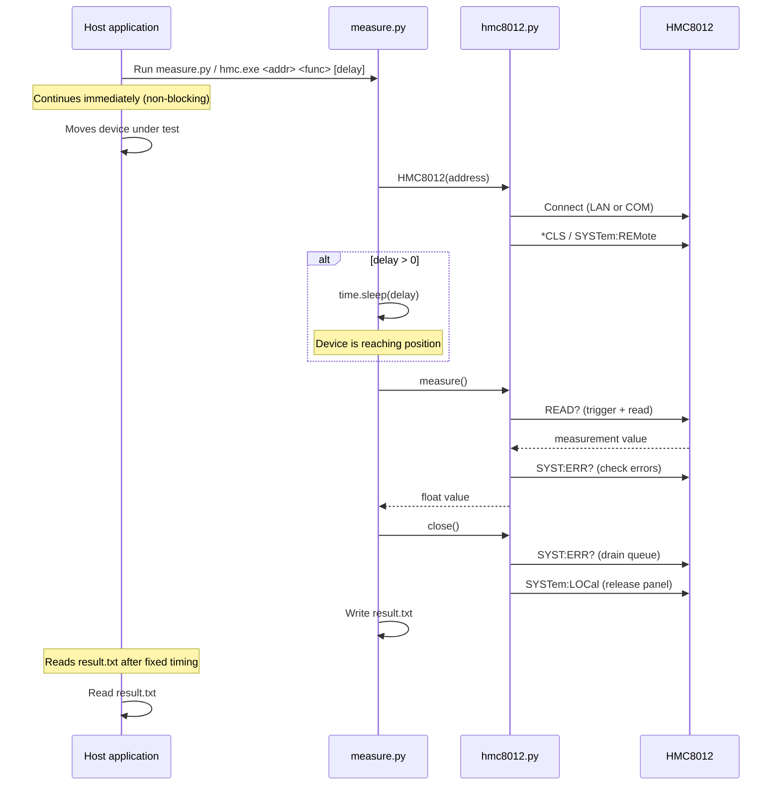
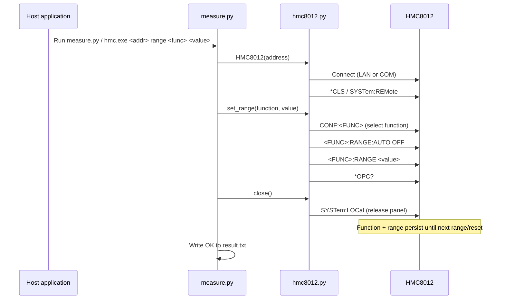
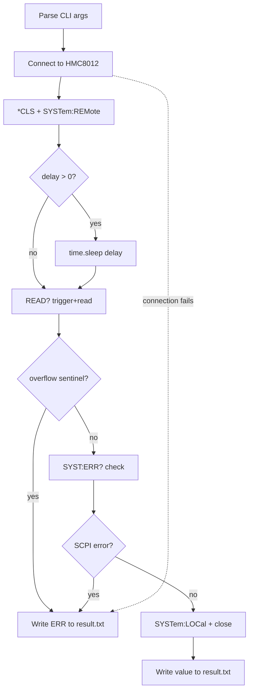
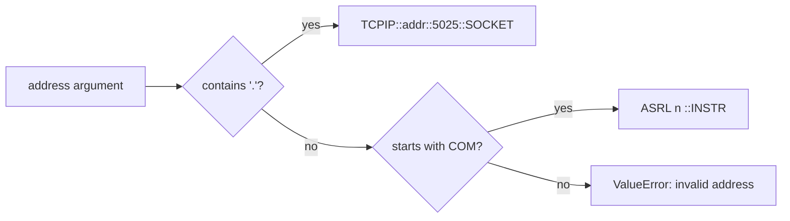

# HMC8012 Measurement Layer

Python tool to interface with the R&S HMC8012 Digital Multimeter by Rohde & Schwarz.

## Usage

### Measure

Reads from the instrument using the current function and range. Does **not** reconfigure anything; use the `range` command first.

```bat
python measure.py <address> <function> [delay_seconds]
hmc.exe <address> <function> [delay_seconds]
```

| Argument | Description |
|-|-|
| `address` | IP address (e.g. `192.168.1.25`) or COM port (e.g. `COM5`) |
| `function` | Measurement type (see table below) |
| `delay_seconds` | Optional wait in seconds before measuring (default: 0) |

### Set Range

Configures function and range on the instrument. Settings are kept until the next `range` or `reset` call. Connection does **not** reset the instrument.

```bat
python measure.py <address> range <function> <value>
hmc.exe <address> range <function> <value>
```

| Argument | Description |
|-|-|
| `function` | dcv, acv, dci, aci, res, fres, cap |
| `value` | Range in SI base units (e.g. `2` for 2A, `0.4` for 400mV) or `AUTO` |

### Reset

Resets the instrument to factory defaults.

```bat
python measure.py <address> reset
hmc.exe <address> reset
```

### Continuous DCI capture

Continuous capture samples DC current over time, runs the analysis pipeline (peaks, settling, stable region), and writes the **stable value** to `result.txt`. Set the DCI range first (e.g. `range dci 0.2`). See [Continuous capture: stable value](#continuous-capture-stable-value) for how the stable value is derived.

**Timed capture (and result.txt only):**

```bat
python measure.py <address> capture [duration] [timeout]
```

With a single number, timeout = duration + 10 seconds.

**Timed capture with live plot:**

```bat
python measure.py <address> capture-plot [duration] [timeout]
```

Same timeout rule. The plot shows the waveform in real time and, at the end, the stable region and a summary box (stable value, σ, N, Δt, rate).

**Start/stop (no fixed duration):**

```bat
python measure.py <address> capture-plot start [FAST|SLOW|MED]
```

Runs until a sentinel file is created (up to 1 hour). ADC rate is optional (default FAST).

```bat
python measure.py <address> capture-plot stop
```

Creates the sentinel file; the process that ran `start` finishes the capture, runs analysis, and writes `result.txt` as usual.

### Supported Functions

| Name | Measurement | SCPI Command | Available Ranges |
| --- | --- | --- | --- |
| `dcv` | DC Voltage | `CONF:VOLT:DC <range>` | 400mV, 4V, 40V, 400V, 1000V |
| `acv` | AC Voltage | `CONF:VOLT:AC <range>` | 400mV, 4V, 40V, 400V, 750V |
| `dci` | DC Current | `CONF:CURR:DC <range>` | 20mA, 200mA, 2A, 10A |
| `aci` | AC Current | `CONF:CURR:AC <range>` | 20mA, 200mA, 2A, 10A |
| `res` | 2-Wire Resistance | `CONF:RES <range>` | 400, 4k, 40k, 400k, 4M, 40M, 250M |
| `fres` | 4-Wire Resistance | `CONF:FRES <range>` | 400, 4k, 40k, 400k, 4M |
| `cap` | Capacitance | `CONF:CAP <range>` | 5nF, 50nF, 500nF, 5uF, 50uF, 500uF |
| `temp` | Temperature (PT100) | `CONF:TEMP` | — |
| `freq` | Frequency | `CONF:FREQ` | — |
| `cont` | Continuity | `CONF:CONT` | — |
| `diod` | Diode Test | `CONF:DIOD` | — |

### Range Values (SCPI)

Range values use SI base units (volts, amps, ohms, farads). For example, `0.4` = 400mV, `0.02` = 20mA.

| Function | Range values | Unit |
|-|-|-|
| `dcv` | 0.4, 4, 40, 400, 1000 | V |
| `acv` | 0.4, 4, 40, 400, 750 | V |
| `dci` | 0.02, 0.2, 2, 10 | A |
| `aci` | 0.02, 0.2, 2, 10 | A |
| `res` | 400, 4e3, 40e3, 400e3, 4e6, 40e6, 2.5e8 | Ohm |
| `fres` | 400, 4e3, 40e3, 400e3, 4e6 | Ohm |
| `cap` | 5e-9, 50e-9, 500e-9, 5e-6, 50e-6, 500e-6 | F |

### Examples

```bat
rem 1. Reset instrument to factory defaults
hmc.exe 192.168.1.25 reset

rem 2. Configure DC current with 2A range
hmc.exe 192.168.1.25 range dci 2

rem 3. Measure (uses the configured function and range)
hmc.exe 192.168.1.25 dci

rem 4. Measure again with 1.5s delay for positioning
hmc.exe 192.168.1.25 dci 1.5

rem 5. Change to DC voltage, 40V range
hmc.exe 192.168.1.25 range dcv 40

rem 6. Measure DC voltage
hmc.exe 192.168.1.25 dcv

rem 7. Switch to auto-range for AC voltage
hmc.exe COM5 range acv AUTO

rem 8. Measure AC voltage
hmc.exe COM5 acv
```

## Output

**result.txt** (same directory as script):

- Measure success: the measurement value as a plain number (e.g. `4.872341`)
- Range/reset success: `OK`
- On error: three lines:

```
ERR
[APP] <command> failed (<layer>).
[EXC] <ExceptionType>: <message>
```

The `[APP]` line identifies the failing command and the layer where the error originated:

| Layer | Meaning |
|-|-|
| `VISA/network` | Instrument not reached — connection or transport failure |
| `instrument SCPI` | Instrument reached, reported a SCPI error via `SYST:ERR?` |
| `instrument` | Instrument responded correctly, but value indicates overflow (`9.9e+37`) |
| `input sanitization` | Invalid argument rejected before opening the connection |
| `unexpected` | Unclassified exception — see `[EXC]` for details |

The `[EXC]` line contains the Python exception type and its message verbatim.

**stderr** uses the same prefixes for all diagnostic output:
- `[APP]` — message written by our code (progress, result, error classification)
- `[EXC]` — exception type and message, only on error

## Continuous capture: stable value

The HMC8012 measures DC current (DCI). The script writes a single number to `result.txt`: the **stable current** (mean of a chosen steady phase), in the same format as a single measurement.

**Modes** (`analyzer.py`: `stable_target`): **baseline** (default) — longest quiet segment with mean &lt; 0.4 A (motor-off baseline, e.g. 7–8.5 s). **post_peak** — settled region after the last peak (motor-on plateau).

The stable value is the **mean of the current in the “quiet” part of the signal** — after the last significant peak and after the current has settled. It is computed in `analyzer.py` (`analyze_waveform`):

1. **Overflow filter** — The meter can return a sentinel value (e.g. 9.9e+37) on overflow. Those points are removed from time and value arrays (keeping them aligned). If too many samples are overflow, analysis fails.

2. **Peak detection** — Local maxima with sufficient prominence (e.g. 3× the signal’s standard deviation) are found to locate the current spike (and any later peaks).

3. **Anchor to last peak** — Only the tail of the signal **after** the last significant peak is used for the stable value.

4. **Settling point** — A sliding window (e.g. 20 samples) and a std threshold (e.g. 0.01 A) define the start of the **stable region**.

5. **Stable region and mean** — All samples from that index onward form the stable region. The **stable value** is their **mean**; **σ** is the **standard deviation of those same samples** (see subsection below).

**Default mode: baseline.** The default `stable_target` is **baseline**: the script finds the **longest** contiguous "quiet" (low std) segment whose mean current is below 0.4 A (configurable: `baseline_threshold`, `min_baseline_samples`). That segment (e.g. 6.4–9 s including 7–8.5 s) is the green zone; its mean is the stable value. Use **post_peak** when the value of interest is the high current after the last pulse (see below).

### How we derive the stable region — post_peak (step by step)

We have a sequence of current samples over time. For **post_peak** mode the **stable region** is the stretch after the last peak where the current has settled. The order of operations is: **first detect peaks**, then take the tail after the last peak, then skip a fixed number of samples, then **on that tail only** apply the sliding window and standard deviation to find where the signal becomes "quiet". Details:

1. **Detect peaks on the full (filtered) signal**  
   We run peak detection on the whole waveform (e.g. inrush spike and any later bumps). We get a list of peak indices.  
   **Functions used:** `detect_peaks()` in `analyzer.py`, which calls `scipy.signal.find_peaks(values, prominence=prominence_sigma * np.std(values), distance=min_peak_distance)`. A peak is kept only if its prominence exceeds that threshold and it is at least `min_peak_distance` samples away from the previous one.

2. **Use only the tail after the last peak**  
   We keep only the part of the signal **after the last** peak. Everything before that is ignored. From here on we work only on this "post-peak" segment.  
   **In the code:** we take the last peak with `anchor = peaks[-1]`. The tail used for the next steps (after the transient skip) is `filtered_vals[anchor.index + min_samples_after_peak:]`, stored as `post_peak_values` in `analyze_waveform()`.

3. **Skip a fixed number of samples (transient)**  
   Right after the peak the current is still decaying. We skip the first **min_samples_after_peak** samples (default 100) of that tail so we don't treat the decay as "stable". This skip is the **transient skip**.  
   **In the code:** parameter `min_samples_after_peak` in `analyze_waveform()` in `analyzer.py` (default 100). The tail we actually scan with the window starts at index `anchor.index + min_samples_after_peak`.

4. **Slide a window and compute std on this tail**  
   On the **remaining** samples (after the skip) we slide a window of **settling_window** points (default 20). For each position we compute the **standard deviation** of the values in the window. Where the signal is still moving, std is high; where it's flat, std is low.  
   **Formula (Python/NumPy):** for each window we use the same definition as `np.std(window)` with default `ddof=0`, i.e. σ = sqrt(mean((x - mean(x))**2)). In the code, `find_settling_point()` in `analyzer.py` uses `sliding_window_view(values, window_size)` from `numpy.lib.stride_tricks`, then `rolling_std = windows.std(axis=-1)` so that each element of `rolling_std` is the std of one window.

5. **Find the first "quiet" run**  
   We require **n_settling_windows** consecutive windows (default 3) to have std below **settling_threshold** (e.g. 0.01 A). The **start index of that run** is the first index of the stable region.  
   **In the code:** `find_settling_point()` in `analyzer.py`, with `window_size=settling_window`, `std_threshold=settling_threshold`, `n_consecutive=n_settling_windows`. All these are arguments of `analyze_waveform()`.

6. **Stable region = from that index until std rises again**  
   We do **not** use the rest of the capture to the end: when the user stops the capture, the device may already have stopped and the current can show a final rise/fall. So we scan forward from the settling start and **end the stable region** when the rolling std goes back above the threshold (first window that is no longer "quiet"). All samples from the settling start to that end form the **stable region** (the green zone). We take the **mean** of those samples as the stable value and their **std** as σ.

Summary: **Peak detection → tail after last peak → transient skip → sliding window + std → first run of 3 quiet windows (start) → scan forward until std rises again (end) → stable region = that segment only.** Configurable parameters are in `analyzer.py`: `analyze_waveform()` for `min_samples_after_peak`, `settling_window`, `settling_threshold`, `n_settling_windows`; `find_settling_point()` for the window/std logic.

### Stable region, stable value, and σ (standard deviation)

The **green zone** in the plot is the **stable region**: the set of samples from the settling point to the point where the rolling std rises again (not necessarily to the end of the capture). All three quantities use **exactly that same set of samples**:

| Quantity | Meaning | How it is computed |
|----------|---------|--------------------|
| **Stable region** (green zone) | The part of the signal considered settled (current at regime). | From the settling index to the index where rolling std first goes back above threshold (so we stop before a final rise/fall). |
| **Stable value** (line + number) | The current we report. | **Mean** of the samples in the stable region. |
| **σ** (sigma in the box) | How much the current varies inside the green zone. | **Standard deviation** of the **same** samples used for the mean. |

So: **σ is the standard deviation of the samples inside the green zone.** Same slice of data → mean = stable value, std = σ. If σ is small (e.g. a few mA), the zone is flat and the measure is reliable. If σ is large (e.g. close to the mean or half an ampere), either the region still includes transient (settling may start too early) or the signal is noisy; it is a quality warning.

**Where it happens:** `analyzer.py` (filter_overflows, detect_peaks, find_settling_point, analyze_waveform); `capture.py` (ContinuousCapture loop, CaptureResult, preconditions: DCI, ADC rate FAST/SLOW/MED, range not auto); `hmc8012.py` (measure_fast, get_function, get_adc_rate, get_range_auto); `measure.py` (cmd_capture, cmd_capture_plot, _run_capture_session, start/stop); `plotting.py` (show_capture_plot; live plot is in measure.py).

---

## How It Works

The script connects to the multimeter (without resetting it), waits for the positioning delay if specified, sends `READ?`, and writes the result to `result.txt`. Function and range are configured separately with the `range` command and kept between calls.

### System Flow (Measure)


```mermaid
sequenceDiagram
    participant HOST as Host application
    participant PY as measure.py
    participant DRV as hmc8012.py
    participant DMM as HMC8012

    HOST->>PY: Run measure.py / hmc.exe <addr> <func> [delay]
    Note over HOST: Continues immediately (non-blocking)
    HOST->>HOST: Moves device under test

    PY->>DRV: HMC8012(address)
    DRV->>DMM: Connect (LAN or COM)
    DRV->>DMM: *CLS / SYSTem:REMote

    alt delay > 0
        PY->>PY: time.sleep(delay)
        Note over PY: Device is reaching position
    end

    PY->>DRV: measure()
    DRV->>DMM: READ? (trigger + read)
    DMM-->>DRV: measurement value
    DRV->>DMM: SYST:ERR? (check errors)
    DRV-->>PY: float value

    PY->>DRV: close()
    DRV->>DMM: SYST:ERR? (drain queue)
    DRV->>DMM: SYSTem:LOCal (release panel)

    PY->>PY: Write result.txt
    Note over HOST: Reads result.txt after fixed timing
    HOST->>HOST: Read result.txt
```

### System Flow (Range)


```mermaid
sequenceDiagram
    participant HOST as Host application
    participant PY as measure.py
    participant DRV as hmc8012.py
    participant DMM as HMC8012

    HOST->>PY: Run measure.py / hmc.exe <addr> range <func> <value>

    PY->>DRV: HMC8012(address)
    DRV->>DMM: Connect (LAN or COM)
    DRV->>DMM: *CLS / SYSTem:REMote

    PY->>DRV: set_range(function, value)
    DRV->>DMM: CONF:<FUNC> (select function)
    DRV->>DMM: <FUNC>:RANGE:AUTO OFF
    DRV->>DMM: <FUNC>:RANGE <value>
    DRV->>DMM: *OPC?

    PY->>DRV: close()
    DRV->>DMM: SYSTem:LOCal (release panel)

    Note over DMM: Function + range persist until next range/reset
    PY->>PY: Write OK to result.txt
```

### Internal Flow (Measure)


```mermaid
flowchart TD
    A[Parse CLI args] --> B[Connect to HMC8012]
    B --> C[*CLS + SYSTem:REMote]
    C --> D{delay > 0?}
    D -- yes --> E[time.sleep delay]
    D -- no --> F
    E --> F[READ? trigger+read]
    F --> G{overflow sentinel?}
    G -- yes --> ERR[Write ERR to result.txt]
    G -- no --> H[SYST:ERR? check]
    H --> I{SCPI error?}
    I -- yes --> ERR
    I -- no --> J[SYSTem:LOCal + close]
    J --> K[Write value to result.txt]

    B -.->|connection fails| ERR
```

### Connection Detection


```mermaid
flowchart LR
    A[address argument] --> B{contains '.'?}
    B -- yes --> C["TCPIP::addr::5025::SOCKET"]
    B -- no --> D{starts with COM?}
    D -- yes --> E["ASRL n ::INSTR"]
    D -- no --> F[ValueError: invalid address]
```

## File Structure

| File | Purpose |
| --- | --- |
| `measure.py` | CLI entry point: command dispatch, arg parsing, delay, capture/capture-plot, file output |
| `hmc8012.py` | HMC8012 instrument driver: connection, SCPI commands, measurement, range |
| `capture.py` | ContinuousCapture: DCI sampling loop, sentinel/deadline, sample_callback for live plot |
| `analyzer.py` | Waveform analysis: overflow filter, peak detection, settling point, stable value (mean of stable region) |
| `plotting.py` | Post-capture plot; live plot during capture is implemented in measure.py |

## Code Reference

### hmc8012.py

#### Exceptions

| Class | Description |
| --- | --- |
| `ScpiError` | Raised when the instrument reports a SCPI error (non-zero `SYST:ERR?` response). |
| `RangeOverflowError` | Raised when the instrument returns the overflow sentinel (`9.9e+37`): the input exceeded the selected range. |

#### `HMC8012`

Driver class for the R&S HMC8012. Supports both LAN (TCPIP socket) and COM (serial/VCP) transports via PyVISA. Implements the context manager protocol (`with HMC8012(...) as dmm:`).

##### Constants

| Name | Value | Description |
| --- | --- | --- |
| `OVERFLOW_SENTINEL` | `9.90000000E+37` | Value returned by the instrument on range overflow. |
| `SCPI_PORT` | `5025` | TCP port used for LAN SCPI socket connections. |
| `DEFAULT_TIMEOUT_MS` | `5000` | Default VISA communication timeout in milliseconds. |
| `MAX_ERROR_QUEUE_DEPTH` | `50` | Maximum iterations when draining the instrument error queue. |

##### Maps

`FUNCTION_SCPI_MAP: dict[str, str]`

Maps each CLI function name to the SCPI CONFigure command. Used by `set_range()` to select the measurement function.

| Key | SCPI command |
|-|-|
| `dcv` | `CONF:VOLT:DC` |
| `acv` | `CONF:VOLT:AC` |
| `dci` | `CONF:CURR:DC` |
| `aci` | `CONF:CURR:AC` |
| `res` | `CONF:RES` |
| `fres` | `CONF:FRES` |
| `cap` | `CONF:CAP` |
| `temp` | `CONF:TEMP` |
| `freq` | `CONF:FREQ` |
| `cont` | `CONF:CONT` |
| `diod` | `CONF:DIOD` |

`RANGE_SCPI_MAP: dict[str, str]`

Maps function names to the SENSe SCPI prefix used by `set_range()` for range control.

| Key | SCPI prefix |
|-|-|
| `dcv` | `VOLT:DC:RANGE` |
| `acv` | `VOLT:AC:RANGE` |
| `dci` | `CURR:DC:RANGE` |
| `aci` | `CURR:AC:RANGE` |
| `res` | `RES:RANGE` |
| `fres` | `FRES:RANGE` |
| `cap` | `CAP:RANGE` |

##### Public methods

| Signature | Description |
|-|-|
| `__init__(address, timeout_ms=5000)` | Builds the VISA resource string from `address` (IP or COM port). Does not open the connection. |
| `connect() → None` | Opens the VISA resource, sets termination characters, sends `*CLS`, `SYSTem:REMote`. Does **not** reset the instrument. Called automatically by `__enter__`. |
| `close() → None` | Drains the instrument error queue, sends `SYSTem:LOCal` to restore front-panel control, closes the VISA resource. Called automatically by `__exit__`. |
| `reset() → None` | Sends `*RST`, `*CLS`, then `*OPC?` to confirm completion. Restores factory defaults. |
| `identify() → str` | Returns the `*IDN?` identification string from the instrument. |
| `measure() → float` | Sends `READ?` to read with the current configuration. Checks for overflow and SCPI errors, returns the float value. Raises `RangeOverflowError` or `ScpiError`. |
| `set_range(function, range_value="AUTO") → None` | Selects the measurement function via `CONF:…`, then sets range via SENSe commands. Settings are kept until the next `set_range()` or `reset()`. Raises `ValueError` for unsupported functions. |

##### Private methods

| Signature | Description |
|-|-|
| `_check_errors() → None` | Queries `SYST:ERR?` once; raises `ScpiError` if the response code is non-zero. |
| `_drain_error_queue() → None` | Reads `SYST:ERR?` in a loop (up to `MAX_ERROR_QUEUE_DEPTH`) until the queue is empty. Called during `close()`. |
| `_write(command) → None` | Sends a SCPI command string to the instrument. Raises `ConnectionError` if not connected. |
| `_query(command) → str` | Sends a SCPI query and returns the stripped response string. Raises `ConnectionError` if not connected. |
| `_build_resource_string(address) → str` | Static method. Detects connection type from the address string and returns the correct VISA resource string (`TCPIP::…::5025::SOCKET` or `ASRL<n>::INSTR`). Raises `ValueError` for unrecognized formats. |

---

### measure.py

#### Module-level constants

| Name | Value | Description |
|-|-|-|
| `SCRIPT_DIR` | `Path(sys.argv[0]).resolve().parent` | Absolute directory of the script/executable, used to resolve `result.txt`. |
| `DEFAULT_OUTPUT` | `SCRIPT_DIR / "result.txt"` | Default output file path. |
| `VALID_FUNCTIONS` | sorted keys of `HMC8012.VALID_FUNCTIONS` | All recognized measurement function names, used in usage/error messages. |
| `VALID_RANGE_FUNCTIONS` | sorted keys of `HMC8012.RANGE_SCPI_MAP` | Function names that support range selection. |

#### Functions

| Signature | Description |
|-|-|
| `main() → None` | CLI entry point. Parses `sys.argv`, dispatches to `cmd_measure`, `cmd_range`, or `cmd_reset`. Exits with code 1 on unknown commands or wrong argument counts. |
| `cmd_measure(address, args) → None` | Handles the measure command. Extracts function and optional delay from `args`; opens `HMC8012` as a context manager; calls `dmm.measure()`; writes the float result to `result.txt`. Writes `ERR` and exits with code 1 on any exception. |
| `cmd_range(address, args) → None` | Handles the `range` sub-command. Validates function and value, calls `dmm.set_range()`, writes `OK` to `result.txt`. Writes `ERR` and exits with code 1 on failure. |
| `cmd_reset(address) → None` | Handles the `reset` command. Opens `HMC8012` and calls `dmm.reset()`. Writes `OK` or `ERR` to `result.txt`. |
| `write_result(value, app_msg="", exc_detail="", output_path=DEFAULT_OUTPUT) → None` | Writes `result.txt`, overwriting any existing content. Line 1 is always `value`; if `app_msg` is provided it is written on line 2; if `exc_detail` is provided it is written on line 3. |
| `_write_error(command, layer, exc) → None` | Writes a layered error to both stderr and `result.txt`. Formats `[APP] <command> failed (<layer>).` and `[EXC] <type>: <message>`, prints both to stderr, then calls `write_result("ERR", ...)`. |
| `_usage_error(message) → None` | Prints an error message and the full usage summary to stderr, then calls `sys.exit(1)`. |

## Building the Standalone Executable

To distribute the tool as a self-contained `hmc.exe` (no Python or NI-VISA required on the target machine), compile with Nuitka **on a Windows machine**.

> **Python version:** Nuitka's bundled MinGW-w64 compiler does not support Python 3.13+. Use **Python 3.12** to compile.

```bat
pip install nuitka pyvisa pyvisa-py pyserial
python -m nuitka --onefile --output-filename=hmc.exe --include-package=pyvisa --include-package=pyvisa_py --include-package=serial measure.py
```

On the first run Nuitka will prompt to download MinGW-w64 if no C compiler is found: answer `yes`.

The resulting `hmc.exe` is placed in the current directory and accepts the same arguments as `python measure.py`.

## Dependencies

- Python 3.x
- `pyvisa` - VISA instrument communication
- `pyvisa-py` - Pure Python VISA backend (no NI-VISA required for LAN)
- `pyserial` - Required on Windows for COM port connections

```bash
pip install -r requirements.txt
```
