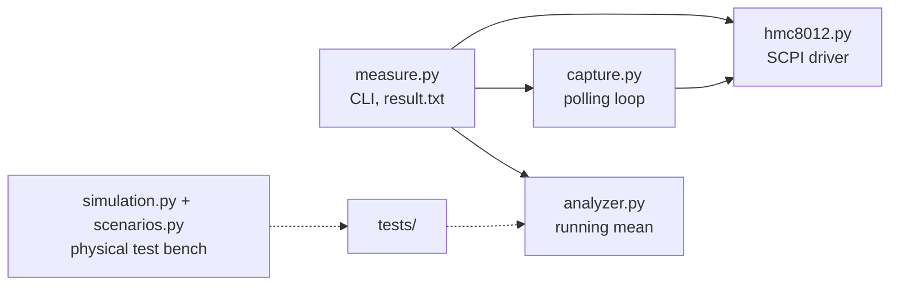

# HMC8012 Measurement Layer

Command-line tool for the Rohde & Schwarz HMC8012 digital multimeter, called by a host program (a VBA macro). Each call does one job, writes its outcome to `result.txt` next to the executable, and exits. Besides instantaneous readings, `capture` records the supply current of a motor while it runs and reports its mean running current, handling the inrush peak and noise.

Italian version: [README_ita.md](README_ita.md).

## Quick start

```bat
hmc.exe 192.168.0.2 dci              rem instantaneous DC current reading
hmc.exe 192.168.0.2 range dci 2      rem DC current, 2 A range (kept until changed)
hmc.exe 192.168.0.2 capture 10       rem start the capture, then move the motor
type result.txt                      rem the value in amperes, or ERR
hmc.exe --version                    rem version of this executable
```

For development (Python 3.11+):

```bash
python -m venv venv && source venv/bin/activate     # Windows: venv\Scripts\activate
pip install -r requirements.txt
python -m pytest -q
```

## Commands

`<address>` is an IP address (`192.168.0.2`, LAN, port 5025) or a COM port (`COM3`, USB virtual COM port, Windows only). `hmc.exe` and `python measure.py` accept the same arguments.

| Command | What it does | `result.txt` |
|-|-|-|
| `<address> <function> [delay]` | One reading with the current settings, after an optional delay in seconds | value or `ERR` |
| `<address> range <function> <value>` | Selects the function and its range; kept until the next `range` or `reset` | `OK` or `ERR` |
| `<address> adc` | Reads the ADC rate of the active function | `SLOW`, `MED`, `FAST` or `ERR` |
| `<address> adc <SLOW\|MED\|FAST>` | Sets the ADC rate of the active function (the one selected last) | `OK` or `ERR` |
| `<address> reset` | Restores factory defaults (ADC rate SLOW, auto-range on) | `OK` or `ERR` |
| `<address> capture [duration] [timeout] [--save-samples]` | Records DC current for `duration` s (default 10) and reports the mean running current | value or `ERR` |
| `--version` | Prints the version on the console | unchanged |

**Capture details.** `timeout` defaults to `duration + 10` s. A capture always reads at the SLOW ADC rate: if the instrument is at another rate, capture switches to SLOW and restores the previous rate at the end, also when the capture fails, so it never changes the settings of later measurements. Set the DC current range with `range` first; capture refuses auto-range. `--save-samples` also writes the raw readings to `capture_samples_<UTC date>.csv` next to the executable (for diagnosis; off by default).

### Functions and ranges

| Name | Measurement | SCPI command | Range values (SI units) |
|-|-|-|-|
| `dcv` | DC voltage | `CONF:VOLT:DC` | 0.4, 4, 40, 400, 1000 V |
| `acv` | AC voltage | `CONF:VOLT:AC` | 0.4, 4, 40, 400, 750 V |
| `dci` | DC current | `CONF:CURR:DC` | 0.02, 0.2, 2, 10 A |
| `aci` | AC current | `CONF:CURR:AC` | 0.02, 0.2, 2, 10 A |
| `res` | 2-wire resistance | `CONF:RES` | 400, 4e3, 40e3, 400e3, 4e6, 40e6, 2.5e8 Ohm |
| `fres` | 4-wire resistance | `CONF:FRES` | 400, 4e3, 40e3, 400e3, 4e6 Ohm |
| `cap` | Capacitance | `CONF:CAP` | 5e-9, 50e-9, 500e-9, 5e-6, 50e-6, 500e-6 F |
| `temp` | Temperature (PT100) | `CONF:TEMP` | none |
| `freq` | Frequency | `CONF:FREQ` | none |
| `cont` | Continuity | `CONF:CONT` | none |
| `diod` | Diode test | `CONF:DIOD` | none |

`range <function> AUTO` enables auto-range.

## Contract with the host program

**Files.** `result.txt` is written next to `hmc.exe`, so it must sit in a writable folder. A LAN connection needs nothing else; a COM (USB) connection needs the HMC8012 VCP driver.

**`result.txt`:**

- It is deleted when a command starts (except `--version`) and written in one step (temporary file, then rename) when it ends: while a command runs the file does not exist, and a file that exists is always complete.
- Line 1 is the value (decimal point), `OK`, the ADC rate, or `ERR`.
- After `ERR`, line 2 is `[APP] <command> failed (<layer>).` and line 3 is `[EXC] <type>: <message>`.
- The exit code is 0 on success and 1 on any error.

| Layer | Meaning |
|-|-|
| `VISA/network` | Instrument not reached: connection or transport failure |
| `instrument SCPI` / `instrument` | Instrument reached but it reported an error, an overflow, or the capture stopped on failed readings |
| `instrument config` | Capture: wrong function or auto-range still on |
| `insufficient samples` | Capture: too few valid readings |
| `analysis` | Capture: readings taken, but no trustworthy value (see the error table below) |
| `input sanitization` | Invalid argument |
| `unexpected` | Anything else; `[EXC]` has the details |

**Timing.** Every command first pays the start-up of `hmc.exe` (the single-file executable unpacks itself; typically a few seconds, to be measured on the lab PC). A capture then takes `duration` seconds plus the analysis (well under 0.1 s). Wait for the process to end, then read the file:

```vba
Dim sh As Object, rc As Long
Set sh = CreateObject("WScript.Shell")
rc = sh.Run("""C:\hmc\hmc.exe"" 192.168.0.2 capture 10", 0, True) ' True = wait for exit
' Then read C:\hmc\result.txt: line 1 is the value or ERR.
```

Reading after a fixed time also works if the wait is longer than the command and a missing file is treated as "not ready yet". Parse numbers with `Val()`, which always expects a decimal point; `CDbl` follows the Windows locale and expects a comma on Italian systems.

**One capture, one movement.** Start the capture at least 1 s before the motor moves (the analysis needs the idle current first) and let the motor stop before the capture ends.

## How the capture value is computed

`result.txt` holds the **mean supply current over the run**, from the end of the start transient to the stop, in a capture shaped idle, start/inrush, run, stop, idle. Ripple, PWM and load variations during the run are part of the mean. The code is `analyzer.py` (`analyze_waveform`):

1. **Validate.** Timestamps must increase. NaN/inf readings and overflow sentinels (+/-9.9E37) are invalid; more than 20% invalid readings reject the capture.
2. **Idle reference.** The capture must open with at least 0.25 s of steady idle current (plus half the 0.5 s smoothing window).
3. **Run.** The run is where the time-weighted smoothed current sits above idle by more than two tolerances (the motor only adds current), with a mean above idle beyond its noise, for at least `min_run_s` (0.5 s). Two separate runs in one capture are rejected. The run edges are refined on the raw readings.
4. **Averaging window.** The start and the end of the run are trimmed (each by up to `max_settle_s`, default 1 s, in 0.1 s steps, smallest trims first) to drop inrush, acceleration and deceleration. A window is accepted when it holds no invalid reading, its 1 s blocks agree on the mean within the tolerance (max(2 mA, 2% of the mean), plus reading noise), and the mean is precise: two standard errors, from the readings and from the spread of the block means, within the tolerance.
5. **Result.** The time-weighted mean over the window: each reading weighs for the interval until the next reading, so uneven polling and repeated `READ?` answers do not bias it.

**Errors instead of wrong numbers.** When no trustworthy value exists, `result.txt` gets `ERR`:

| Error | Meaning | What to change |
|-|-|-|
| `InvalidCaptureError` | Malformed data, too many invalid readings, no steady idle at the start, or overflow/NaN readings inside the run | Start the capture before the motor moves; raise the DC current range if peaks overflow; raise `abs_tolerance_a` if the idle current itself fluctuates by more than 2 mA |
| `SignalNotSettledError` | No run, or a run that is not steady: drift, settling longer than `max_settle_s`, a second level (hold, standby after the stop, another speed) | Capture one steady run; raise `max_settle_s` for slow settling |
| `AmbiguousRunError` | More than one separate run in the capture | One movement per capture |
| `ImpreciseValueError` | Steady run, but the mean is too uncertain (noise, slow load changes, few readings) | Longer run, or a looser tolerance |

**Known limits.**

- A periodic load whose period divides the 200 ms SLOW conversion period can alias if the ADC aperture is shorter than the conversion period (not stated in the manual). Fast ripple (stepper steps, driver PWM) is averaged within each conversion.
- Loads that vary over tenths of a second give few distinct readings at 5 per second and often end in `ImpreciseValueError`; a longer run helps.
- A different level shorter than about `max_settle_s` at the start or end of the run is trimmed away as if it were a transient.

## Developer guide

### Architecture


```mermaid
flowchart LR
    CLI["measure.py<br/>CLI, result.txt"] --> DRV["hmc8012.py<br/>SCPI driver"]
    CLI --> CAP["capture.py<br/>polling loop"]
    CAP --> DRV
    CLI --> ANA["analyzer.py<br/>running mean"]
    SIM["simulation.py + scenarios.py<br/>physical test bench"] -.-> TESTS["tests/"]
    TESTS -.-> ANA
```

A `capture` runs: `measure.py` opens the instrument (`hmc8012.py`), selects DC current, switches to SLOW if needed, `capture.py` polls `READ?` until the duration ends (failed readings stay as NaN, five in a row stop the capture), the previous ADC rate is restored, `analyzer.py` computes the value, and `measure.py` writes `result.txt`.

| Module | Responsibility | Public entry points |
|-|-|-|
| `measure.py` | CLI dispatch, `result.txt`, error layers | `main`, `cmd_*`, `write_result`, `clear_result` |
| `hmc8012.py` | SCPI over PyVISA (LAN socket or COM); every setter checks `SYST:ERR?` | `HMC8012`, `ScpiError`, `RangeOverflowError` |
| `capture.py` | Timed polling loop, failure counting | `ContinuousCapture`, `CaptureResult` |
| `analyzer.py` | Idle, run, averaging window, precision; raises instead of guessing | `analyze_waveform`, `AnalysisConfig`, `AnalysisResult`, error classes |
| `simulation.py` | Test bench: true motor current and HMC8012 sampling model | `Phase`, `InstrumentModel`, `simulate_capture` |
| `scenarios.py` | Test bench: named device behaviours | `SCENARIOS`, `ScenarioParams` |
| `version.py` | Single source of the release version | `__version__` |

Docstrings in each module are the reference for arguments, returns and raised errors.

### Where to change things

| To change | Edit |
|-|-|
| Analysis tuning (smoothing window, minimum run, trims, tolerance) | `AnalysisConfig` defaults in `analyzer.py` |
| ADC rate of captures | `CAPTURE_ADC_RATE` in `measure.py` |
| Failed readings that stop a capture | `DEFAULT_MAX_CONSECUTIVE_FAILURES` in `capture.py` |
| A new simulated behaviour for the tests | a builder and an entry in `SCENARIOS` (`scenarios.py`) |
| A new command | a `cmd_*` function and a branch in `main()` (`measure.py`) |
| The version | `version.py` (see Releases) |

### Tests

`python -m pytest -q` runs the whole suite, including tests that wait for a connection timeout on an unreachable address. The analyzer is tested against the physical simulation (`simulation.py`, `scenarios.py`: idle, inrush, step ripple, PWM load, hold current, slow settling, aliasing, at each ADC rate) and hand-built edge cases. The rule the tests enforce: a capture yields the right value or an explicit error, never a wrong value.

### Design decisions

- **Mean of the whole run.** With ripple or variable load the useful number is the average consumption while running, not the flattest stretch.
- **An error is better than a wrong number.** Every check (idle at start, one run, steady blocks, precision, no invalid reading in the window) rejects the capture with a reason instead of returning a value that may be wrong.
- **Always SLOW, without side effects.** SLOW is the only rate with specified accuracy and averages the stepper ripple within each conversion; capture restores the previous rate so instantaneous readings keep their settings.
- **Time-weighted, each reading held until the next.** The HMC8012 answers `READ?` with its latest conversion, so polling faster than the ADC repeats values; weighting by time makes the result independent of the polling rate.
- **Failed readings are kept as NaN.** Dropping them would hide overflowing peaks and bias the mean low.

### Instrument notes

From the HMC8012 user and SCPI manuals: DC current gives 5 / 10 / 200 readings per second at SLOW / MED / FAST with 5¾ / 4¾ / 4¾ digits, accuracy is specified at SLOW only, `*RST` sets SLOW, and `ADCRate` "selects the ADC rate for the activated measurement function". Not stated in the manuals, to verify on the instrument: whether `CONF:CURR:DC` without a range resets the range to auto (capture would then stop with `instrument config`), and the ADC aperture length.

## Releases and build

The version lives in `version.py` and nowhere else: `hmc.exe --version` prints it and the build writes it into the executable's file properties. Every shipped change bumps it (semantic versioning: major for a changed host contract, minor for new commands, patch for fixes).

**From GitHub.** Every push to `master` runs `.github/workflows/build-windows.yml` on a Windows runner: Python 3.12, the test suite, the Nuitka build, a smoke test (the version on the command line and in the file properties must match `version.py`, and an invalid command must give `ERR`) and the upload of `hmc.exe` as the artifact `hmc-exe-v<version>-<commit>` on the run page under the Actions tab. It can also be started by hand there (Run workflow).

**On Windows**, with Python 3.12 (Nuitka's bundled MinGW-w64 does not support 3.13+):

```bat
pip install -r requirements.txt nuitka
python -m pytest -q
python -m nuitka --onefile --assume-yes-for-downloads --output-filename=hmc.exe --include-package=pyvisa --include-package=pyvisa_py --include-package=serial --product-name=hmc8012-measure --file-description="HMC8012 measurement CLI" --file-version=2.0.0 --product-version=2.0.0 measure.py
```

Use the version from `version.py` in `--file-version` and `--product-version`.

## Dependencies

- Python 3.11 or newer (3.12 to build the executable)
- `pyvisa`, `pyvisa-py`: instrument communication without NI-VISA
- `pyserial`: COM port connections
- `numpy`: capture analysis
- `pytest`: test suite

```bash
pip install -r requirements.txt
```
