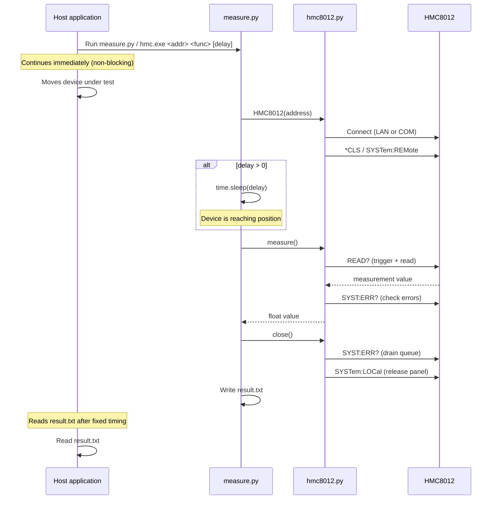
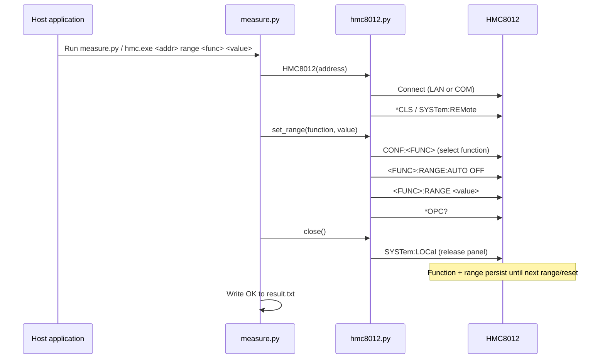
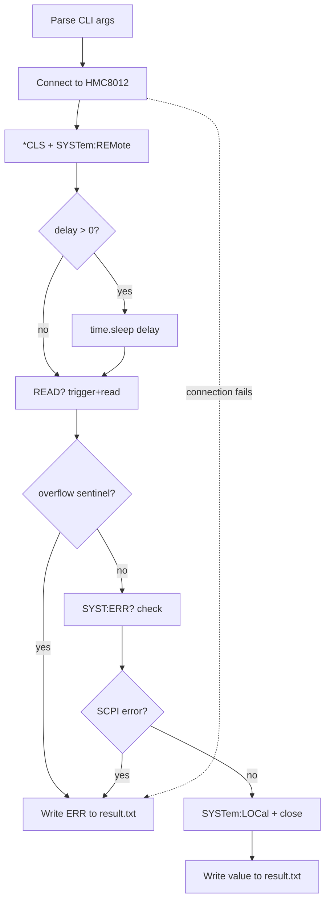
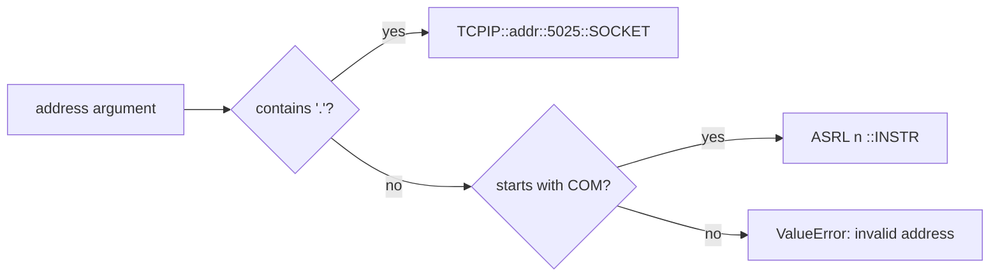

# HMC8012 Measurement Layer

Python tool to interface with the R&S HMC8012 Digital Multimeter by Rohde & Schwarz.

## Usage

### Measure

Reads from the instrument using the current function and range. Does **not** reconfigure anything; use the `range` command first.

```bat
python measure.py <address> <function> [delay_seconds]
hmc.exe <address> <function> [delay_seconds]
```

| Argument | Description |
|-|-|
| `address` | IP address (e.g. `192.168.1.25`) or COM port (e.g. `COM5`) |
| `function` | Measurement type (see table below) |
| `delay_seconds` | Optional wait in seconds before measuring (default: 0) |

### Set Range

Configures function and range on the instrument. Settings are kept until the next `range` or `reset` call. Connection does **not** reset the instrument.

```bat
python measure.py <address> range <function> <value>
hmc.exe <address> range <function> <value>
```

| Argument | Description |
|-|-|
| `function` | dcv, acv, dci, aci, res, fres, cap |
| `value` | Range in SI base units (e.g. `2` for 2A, `0.4` for 400mV) or `AUTO` |

### Reset

Resets the instrument to factory defaults.

```bat
python measure.py <address> reset
hmc.exe <address> reset
```

### Continuous DCI capture

Continuous capture samples DC current over time, finds the run, and writes its mean current (the **stable value**) to `result.txt`. Set the DCI range first (e.g. `range dci 0.2`). See [Continuous capture: stable value](#continuous-capture-stable-value) for how the stable value is derived.

**Timed capture (and result.txt only):**

```bat
python measure.py <address> capture [duration] [timeout]
```

With a single number, timeout = duration + 10 seconds.

**Timed capture with live plot:**

```bat
python measure.py <address> capture-plot [duration] [timeout]
```

Same timeout rule. The plot shows the waveform in real time and, at the end, the stable region and a summary box (stable value, σ, N, Δt, rate).

**Start/stop (no fixed duration):**

```bat
python measure.py <address> capture-plot start [SLOW|MED|FAST]
```

Runs until a sentinel file is created (up to 1 hour). ADC rate is optional (default SLOW, also used by `capture` and timed `capture-plot`: it averages the stepper ripple and is the only rate with specified accuracy).

```bat
python measure.py <address> capture-plot stop
```

Creates the sentinel file; the process that ran `start` finishes the capture, runs analysis, and writes `result.txt` as usual.

### Supported Functions

| Name | Measurement | SCPI Command | Available Ranges |
| --- | --- | --- | --- |
| `dcv` | DC Voltage | `CONF:VOLT:DC <range>` | 400mV, 4V, 40V, 400V, 1000V |
| `acv` | AC Voltage | `CONF:VOLT:AC <range>` | 400mV, 4V, 40V, 400V, 750V |
| `dci` | DC Current | `CONF:CURR:DC <range>` | 20mA, 200mA, 2A, 10A |
| `aci` | AC Current | `CONF:CURR:AC <range>` | 20mA, 200mA, 2A, 10A |
| `res` | 2-Wire Resistance | `CONF:RES <range>` | 400, 4k, 40k, 400k, 4M, 40M, 250M |
| `fres` | 4-Wire Resistance | `CONF:FRES <range>` | 400, 4k, 40k, 400k, 4M |
| `cap` | Capacitance | `CONF:CAP <range>` | 5nF, 50nF, 500nF, 5uF, 50uF, 500uF |
| `temp` | Temperature (PT100) | `CONF:TEMP` | n/a |
| `freq` | Frequency | `CONF:FREQ` | n/a |
| `cont` | Continuity | `CONF:CONT` | n/a |
| `diod` | Diode Test | `CONF:DIOD` | n/a |

### Range Values (SCPI)

Range values use SI base units (volts, amps, ohms, farads). For example, `0.4` = 400mV, `0.02` = 20mA.

| Function | Range values | Unit |
|-|-|-|
| `dcv` | 0.4, 4, 40, 400, 1000 | V |
| `acv` | 0.4, 4, 40, 400, 750 | V |
| `dci` | 0.02, 0.2, 2, 10 | A |
| `aci` | 0.02, 0.2, 2, 10 | A |
| `res` | 400, 4e3, 40e3, 400e3, 4e6, 40e6, 2.5e8 | Ohm |
| `fres` | 400, 4e3, 40e3, 400e3, 4e6 | Ohm |
| `cap` | 5e-9, 50e-9, 500e-9, 5e-6, 50e-6, 500e-6 | F |

### Examples

```bat
rem 1. Reset instrument to factory defaults
hmc.exe 192.168.1.25 reset

rem 2. Configure DC current with 2A range
hmc.exe 192.168.1.25 range dci 2

rem 3. Measure (uses the configured function and range)
hmc.exe 192.168.1.25 dci

rem 4. Measure again with 1.5s delay for positioning
hmc.exe 192.168.1.25 dci 1.5

rem 5. Change to DC voltage, 40V range
hmc.exe 192.168.1.25 range dcv 40

rem 6. Measure DC voltage
hmc.exe 192.168.1.25 dcv

rem 7. Switch to auto-range for AC voltage
hmc.exe COM5 range acv AUTO

rem 8. Measure AC voltage
hmc.exe COM5 acv
```

## Output

**result.txt** (same directory as script):

- Measure success: the measurement value as a plain number (e.g. `4.872341`)
- Range/reset success: `OK`
- On error: three lines:

```
ERR
[APP] <command> failed (<layer>).
[EXC] <ExceptionType>: <message>
```

The `[APP]` line identifies the failing command and the layer where the error originated:

| Layer | Meaning |
|-|-|
| `VISA/network` | Instrument not reached: connection or transport failure |
| `instrument SCPI` | Instrument reached, reported a SCPI error via `SYST:ERR?` |
| `instrument` | Instrument responded correctly, but value indicates overflow (`9.9e+37`) |
| `input sanitization` | Invalid argument rejected before opening the connection |
| `unexpected` | Unclassified exception, see `[EXC]` for details |

The `[EXC]` line contains the Python exception type and its message verbatim.

**stderr** uses the same prefixes for all diagnostic output:
- `[APP]`: message written by our code (progress, result, error classification)
- `[EXC]`: exception type and message, only on error

## Continuous capture: stable value

The script writes one number to `result.txt`: the **mean supply current of the device over its run**, from the end of the start transient to the stop, in a capture shaped idle, start/inrush, run, stop, idle. Ripple, PWM and load variations during the run are part of the mean. It is computed in `analyzer.py` (`analyze_waveform`):

1. **Validate.** Timestamps must be strictly increasing. NaN/inf readings and overflow sentinels (+/-9.9E37) are invalid samples; more than 20% invalid samples reject the capture.
2. **Idle reference.** The capture must open with at least 0.25 s of steady idle current (plus half the 0.5 s smoothing window), so start the capture before the device moves.
3. **Run.** The run is where the time-weighted smoothed current sits above idle by more than two tolerances (the motors only add current), for at least `min_run_s` (0.5 s). A capture with two separate runs is rejected. The run edges are refined on the raw readings.
4. **Averaging window.** The analyzer trims the start and the end of the run (each by up to `max_settle_s`, default 1 s, in 0.1 s steps, smallest trims first) to drop inrush, acceleration and deceleration. A window is accepted when it holds no invalid reading, its blocks of 1 s (two smoothing windows) agree on the mean within the tolerance (max(2 mA, 2% of the mean), plus the reading noise), and the mean is precise: two standard errors, from the readings and from the spread of the block means, within the tolerance. So the first and last `max_settle_s` of the run may be left out when they differ from the rest: inrush, acceleration, deceleration, or a brief load just before the stop.
5. **Report** the time-weighted mean over the window, each reading held until the next one, so uneven polling and repeated `READ?` answers do not bias it.

**Errors instead of wrong numbers.** `result.txt` gets `ERR` with the reason when:

| Error | Meaning | What to change |
|-|-|-|
| `InvalidCaptureError` | Malformed data, too many invalid readings, no steady idle at the start, or overflow/NaN readings inside the run | Start the capture before the device moves; raise the DCI range if peaks overflow; raise `abs_tolerance_a` if the idle current itself fluctuates by more than 2 mA |
| `SignalNotSettledError` | No run, or a run that is not steady: drift, settling longer than `max_settle_s`, a second level (hold, standby after the stop, another speed) | Capture one steady run; raise `max_settle_s` for slow settling |
| `AmbiguousRunError` | More than one separate run in the capture | One move per capture |
| `ImpreciseValueError` | Steady run, but the mean is too uncertain (noise, slow bursts, few readings) | Longer run, slower ADC rate, or looser tolerance |

**Raw samples** are always saved to `capture_samples_<UTC date>.csv` before the analysis, also when the capture stops early, so a failed capture can be replayed in the simulator. A failed reading (overflow, unreadable answer) is kept as `nan` at its time: dropping it would hide the peak it belonged to. Five failed readings in a row stop the capture and give `ERR`.

**Known limits.**

- A periodic current (step ripple, PWM, bursts) whose frequency is an exact or near multiple of the ADC conversion rate is sampled stroboscopically: the readings drift so slowly, or not at all, that the run looks steady at the wrong level. The block test catches slow beats within the run, but an exactly synchronous load cannot be detected from the samples. SLOW integrates over many periods of fast ripple, so it is the safest rate (and the only one with specified accuracy), but a load whose period divides its 200 ms conversion period can still alias if the ADC aperture is shorter than the conversion period (not stated in the manual; the simulator assumes 50%).
- A different level shorter than about `max_settle_s` at the start or end of the run is trimmed away as if it were a transient.

In the capture plot the green zone is the averaging window, the green dashed line the reported value, and sigma the standard deviation of the readings in the window.

## Simulator

`simulate.py` runs the real analyzer on realistic simulated captures (device current model plus HMC8012 acquisition model) and grades the result against the known true value: PASS (within tolerance), FAIL (wrong value), RAISE (explicit error).

```bash
python simulate.py                                     # interactive window: scenario, ADC rate, range, sliders
python simulate.py --scenario long_idle_after --adc SLOW
python simulate.py --matrix --seeds 10                 # PASS/FAIL/RAISE table, all scenarios x ADC rates
python simulate.py --csv capture_samples_2026-10-01_15-00-00.csv   # replay a real capture
# common options: --window S  --tolerance PCT  --min-run S  --max-settle S  --seed N  --save chart.png
```

Scenarios (`scenarios.py`) model a stepper-driven device: nominal run, long idle after the stop, running current above 0.4 A, fast PWM load, bursts slower than the window, hold current after the stop, hold before and after the move, slow settling, step ripple aliasing at FAST, device still running at capture end, and ripple near the FAST conversion rate (the known limit above). Supply-current levels are illustrative; tune them with the sliders.

Acquisition model (`simulation.py`): readings per second per ADC rate from the HMC8012 manual. Each conversion integrates the current over an aperture (assumed 50% of the conversion period; not stated in the manual), is quantized to the range resolution and returned by `READ?` polls that, in AUTO trigger, return the latest conversion (duplicates when polling faster than the ADC). Readings over range become `nan` markers and five in a row end the capture (graded RAISE), as the capture loop does.

Chart: grey line = true current, blue dots = samples, orange line = smoothed level, grey band = run, green band and dashed line = averaging window and reported value, black dotted line = expected value. The title box is green (PASS), red (FAIL) or orange (RAISE).

## How It Works

The script connects to the multimeter (without resetting it), waits for the positioning delay if specified, sends `READ?`, and writes the result to `result.txt`. Function and range are configured separately with the `range` command and kept between calls.

### System Flow (Measure)


```mermaid
sequenceDiagram
    participant HOST as Host application
    participant PY as measure.py
    participant DRV as hmc8012.py
    participant DMM as HMC8012

    HOST->>PY: Run measure.py / hmc.exe <addr> <func> [delay]
    Note over HOST: Continues immediately (non-blocking)
    HOST->>HOST: Moves device under test

    PY->>DRV: HMC8012(address)
    DRV->>DMM: Connect (LAN or COM)
    DRV->>DMM: *CLS / SYSTem:REMote

    alt delay > 0
        PY->>PY: time.sleep(delay)
        Note over PY: Device is reaching position
    end

    PY->>DRV: measure()
    DRV->>DMM: READ? (trigger + read)
    DMM-->>DRV: measurement value
    DRV->>DMM: SYST:ERR? (check errors)
    DRV-->>PY: float value

    PY->>DRV: close()
    DRV->>DMM: SYST:ERR? (drain queue)
    DRV->>DMM: SYSTem:LOCal (release panel)

    PY->>PY: Write result.txt
    Note over HOST: Reads result.txt after fixed timing
    HOST->>HOST: Read result.txt
```

### System Flow (Range)


```mermaid
sequenceDiagram
    participant HOST as Host application
    participant PY as measure.py
    participant DRV as hmc8012.py
    participant DMM as HMC8012

    HOST->>PY: Run measure.py / hmc.exe <addr> range <func> <value>

    PY->>DRV: HMC8012(address)
    DRV->>DMM: Connect (LAN or COM)
    DRV->>DMM: *CLS / SYSTem:REMote

    PY->>DRV: set_range(function, value)
    DRV->>DMM: CONF:<FUNC> (select function)
    DRV->>DMM: <FUNC>:RANGE:AUTO OFF
    DRV->>DMM: <FUNC>:RANGE <value>
    DRV->>DMM: *OPC?

    PY->>DRV: close()
    DRV->>DMM: SYSTem:LOCal (release panel)

    Note over DMM: Function + range persist until next range/reset
    PY->>PY: Write OK to result.txt
```

### Internal Flow (Measure)


```mermaid
flowchart TD
    A[Parse CLI args] --> B[Connect to HMC8012]
    B --> C[*CLS + SYSTem:REMote]
    C --> D{delay > 0?}
    D -- yes --> E[time.sleep delay]
    D -- no --> F
    E --> F[READ? trigger+read]
    F --> G{overflow sentinel?}
    G -- yes --> ERR[Write ERR to result.txt]
    G -- no --> H[SYST:ERR? check]
    H --> I{SCPI error?}
    I -- yes --> ERR
    I -- no --> J[SYSTem:LOCal + close]
    J --> K[Write value to result.txt]

    B -.->|connection fails| ERR
```

### Connection Detection


```mermaid
flowchart LR
    A[address argument] --> B{contains '.'?}
    B -- yes --> C["TCPIP::addr::5025::SOCKET"]
    B -- no --> D{starts with COM?}
    D -- yes --> E["ASRL n ::INSTR"]
    D -- no --> F[ValueError: invalid address]
```

## File Structure

| File | Purpose |
| --- | --- |
| `measure.py` | CLI entry point: command dispatch, arg parsing, delay, capture/capture-plot, file output |
| `hmc8012.py` | HMC8012 instrument driver: connection, SCPI commands, measurement, range |
| `capture.py` | ContinuousCapture: DCI sampling loop, sentinel/deadline, sample_callback for live plot |
| `analyzer.py` | Running-current analysis: validation, idle and run detection, steady averaging window, precision check |
| `plotting.py` | Post-capture plot; live plot during capture is implemented in measure.py |
| `simulation.py` | Physical model: device current phases and HMC8012 acquisition (aperture, quantization, READ? polling) |
| `scenarios.py` | Scenario catalogue for the simulator and the analyzer tests |
| `simulator_core.py` | Runs and grades the analyzer on simulated captures; loads capture CSV files |
| `simulator_view.py` | Matplotlib charts and the interactive simulator window |
| `simulate.py` | Simulator CLI |

## Code Reference

### hmc8012.py

#### Exceptions

| Class | Description |
| --- | --- |
| `ScpiError` | Raised when the instrument reports a SCPI error (non-zero `SYST:ERR?` response). |
| `RangeOverflowError` | Raised when the instrument returns the overflow sentinel (`9.9e+37`): the input exceeded the selected range. |

#### `HMC8012`

Driver class for the R&S HMC8012. Supports both LAN (TCPIP socket) and COM (serial/VCP) transports via PyVISA. Implements the context manager protocol (`with HMC8012(...) as dmm:`).

##### Constants

| Name | Value | Description |
| --- | --- | --- |
| `OVERFLOW_SENTINEL` | `9.90000000E+37` | Value returned by the instrument on range overflow. |
| `SCPI_PORT` | `5025` | TCP port used for LAN SCPI socket connections. |
| `DEFAULT_TIMEOUT_MS` | `8000` | Default VISA communication timeout in milliseconds. |
| `MAX_ERROR_QUEUE_DEPTH` | `50` | Maximum iterations when draining the instrument error queue. |

##### Maps

`FUNCTION_SCPI_MAP: dict[str, str]`

Maps each CLI function name to the SCPI CONFigure command. Used by `set_range()` to select the measurement function.

| Key | SCPI command |
|-|-|
| `dcv` | `CONF:VOLT:DC` |
| `acv` | `CONF:VOLT:AC` |
| `dci` | `CONF:CURR:DC` |
| `aci` | `CONF:CURR:AC` |
| `res` | `CONF:RES` |
| `fres` | `CONF:FRES` |
| `cap` | `CONF:CAP` |
| `temp` | `CONF:TEMP` |
| `freq` | `CONF:FREQ` |
| `cont` | `CONF:CONT` |
| `diod` | `CONF:DIOD` |

`RANGE_SCPI_MAP: dict[str, str]`

Maps function names to the SENSe SCPI prefix used by `set_range()` for range control.

| Key | SCPI prefix |
|-|-|
| `dcv` | `VOLT:DC:RANGE` |
| `acv` | `VOLT:AC:RANGE` |
| `dci` | `CURR:DC:RANGE` |
| `aci` | `CURR:AC:RANGE` |
| `res` | `RES:RANGE` |
| `fres` | `FRES:RANGE` |
| `cap` | `CAP:RANGE` |

##### Public methods

| Signature | Description |
|-|-|
| `__init__(address, timeout_ms=8000)` | Builds the VISA resource string from `address` (IP or COM port). Does not open the connection. |
| `connect() → None` | Opens the VISA resource, sets termination characters, sends `*CLS`, `SYSTem:REMote`. Does **not** reset the instrument. Called automatically by `__enter__`. |
| `close() → None` | Drains the instrument error queue, sends `SYSTem:LOCal` to restore front-panel control, closes the VISA resource. Called automatically by `__exit__`. |
| `reset() → None` | Sends `*RST`, `*CLS`, then `*OPC?` to confirm completion. Restores factory defaults. |
| `identify() → str` | Returns the `*IDN?` identification string from the instrument. |
| `measure() → float` | Sends `READ?` to read with the current configuration. Checks for overflow and SCPI errors, returns the float value. Raises `RangeOverflowError` or `ScpiError`. |
| `set_range(function, range_value="AUTO") → None` | Selects the measurement function via `CONF:…`, then sets range via SENSe commands. Settings are kept until the next `set_range()` or `reset()`. Raises `ValueError` for unsupported functions. |

##### Private methods

| Signature | Description |
|-|-|
| `_check_errors() → None` | Queries `SYST:ERR?` once; raises `ScpiError` if the response code is non-zero. |
| `_drain_error_queue() → None` | Reads `SYST:ERR?` in a loop (up to `MAX_ERROR_QUEUE_DEPTH`) until the queue is empty. Called during `close()`. |
| `_write(command) → None` | Sends a SCPI command string to the instrument. Raises `ConnectionError` if not connected. |
| `_query(command) → str` | Sends a SCPI query and returns the stripped response string. Raises `ConnectionError` if not connected. |
| `_build_resource_string(address) → str` | Static method. Detects connection type from the address string and returns the correct VISA resource string (`TCPIP::…::5025::SOCKET` or `ASRL<n>::INSTR`). Raises `ValueError` for unrecognized formats. |

---

### measure.py

#### Module-level constants

| Name | Value | Description |
|-|-|-|
| `SCRIPT_DIR` | `Path(sys.argv[0]).resolve().parent` | Absolute directory of the script/executable, used to resolve `result.txt`. |
| `DEFAULT_OUTPUT` | `SCRIPT_DIR / "result.txt"` | Default output file path. |
| `VALID_FUNCTIONS` | sorted keys of `HMC8012.VALID_FUNCTIONS` | All recognized measurement function names, used in usage/error messages. |
| `VALID_RANGE_FUNCTIONS` | sorted keys of `HMC8012.RANGE_SCPI_MAP` | Function names that support range selection. |

#### Functions

| Signature | Description |
|-|-|
| `main() → None` | CLI entry point. Parses `sys.argv`, dispatches to `cmd_measure`, `cmd_range`, or `cmd_reset`. Exits with code 1 on unknown commands or wrong argument counts. |
| `cmd_measure(address, args) → None` | Handles the measure command. Extracts function and optional delay from `args`; opens `HMC8012` as a context manager; calls `dmm.measure()`; writes the float result to `result.txt`. Writes `ERR` and exits with code 1 on any exception. |
| `cmd_range(address, args) → None` | Handles the `range` sub-command. Validates function and value, calls `dmm.set_range()`, writes `OK` to `result.txt`. Writes `ERR` and exits with code 1 on failure. |
| `cmd_reset(address) → None` | Handles the `reset` command. Opens `HMC8012` and calls `dmm.reset()`. Writes `OK` or `ERR` to `result.txt`. |
| `write_result(value, app_msg="", exc_detail="", output_path=DEFAULT_OUTPUT) → None` | Writes `result.txt`, overwriting any existing content. Line 1 is always `value`; if `app_msg` is provided it is written on line 2; if `exc_detail` is provided it is written on line 3. |
| `_write_error(command, layer, exc) → None` | Writes a layered error to both stderr and `result.txt`. Formats `[APP] <command> failed (<layer>).` and `[EXC] <type>: <message>`, prints both to stderr, then calls `write_result("ERR", ...)`. |
| `_usage_error(message) → None` | Prints an error message and the full usage summary to stderr, then calls `sys.exit(1)`. |

## Building the Standalone Executable

To distribute the tool as a self-contained `hmc.exe` (no Python or NI-VISA required on the target machine), compile it with Nuitka on Windows.

**From GitHub (no Windows machine needed).** Every push to `master` runs `.github/workflows/build-windows.yml` on a Windows runner: it installs Python 3.12, runs the test suite, builds `hmc.exe`, checks that it starts, and publishes it as the artifact `hmc-exe-<commit>` on the run's page under the repository's Actions tab. The workflow can also be started by hand there (Run workflow).

**On a Windows machine.** Use **Python 3.12** (Nuitka's bundled MinGW-w64 does not support 3.13+):

```bat
pip install -r requirements.txt nuitka
python -m pytest -q
python -m nuitka --onefile --enable-plugin=tk-inter --assume-yes-for-downloads --output-filename=hmc.exe --include-package=pyvisa --include-package=pyvisa_py --include-package=serial measure.py
```

The resulting `hmc.exe` accepts the same arguments as `python measure.py` and writes `result.txt` and the capture CSV files next to itself, so place it in a writable folder. A COM (USB) connection needs the HMC8012 VCP driver; LAN needs nothing.

## Dependencies

- Python 3.11 or newer (3.12 to compile the executable)
- `pyvisa` - VISA instrument communication
- `pyvisa-py` - Pure Python VISA backend (no NI-VISA required for LAN)
- `pyserial` - Required on Windows for COM port connections
- `numpy` - capture analysis
- `matplotlib` - capture plots and the simulator
- `pytest` - test suite

```bash
pip install -r requirements.txt
```
