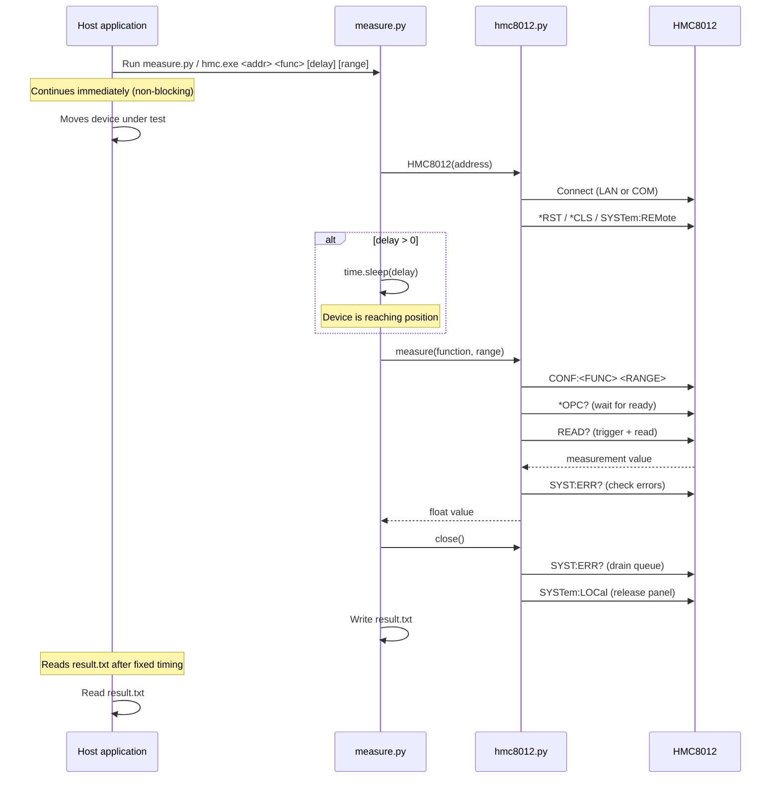
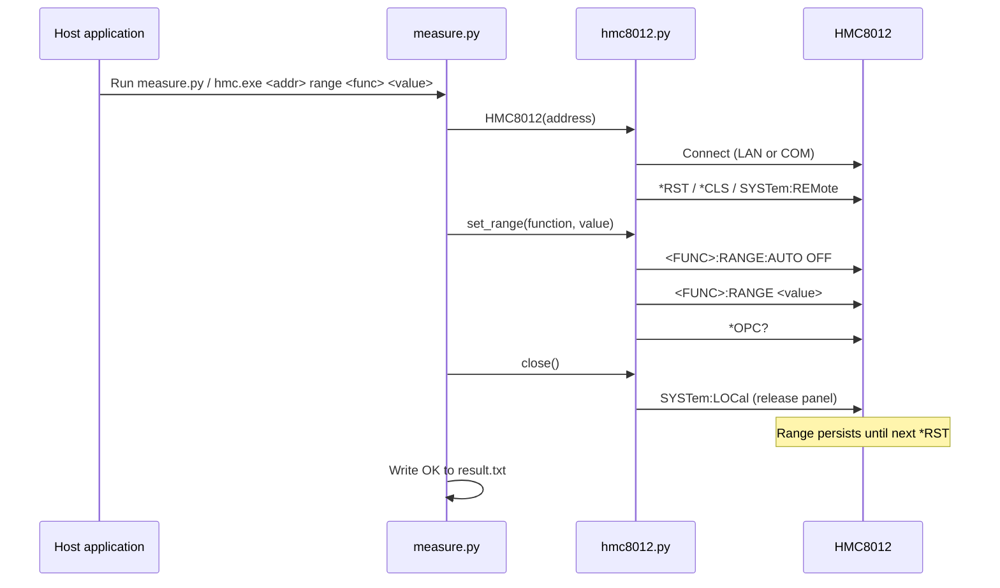
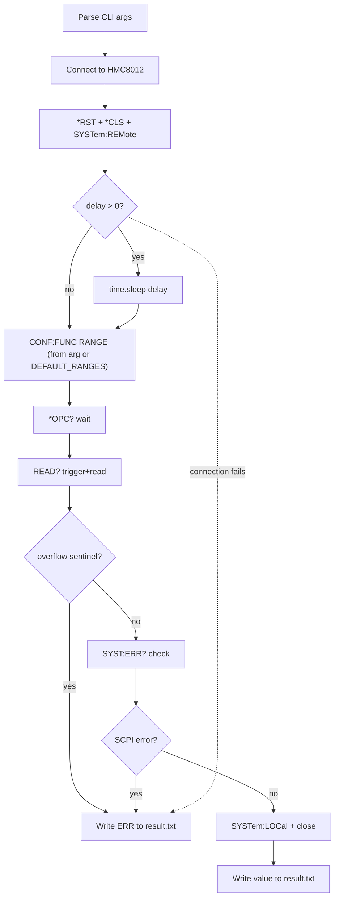

# HMC8012 Measurement Layer

Python tool to interface with the R&S HMC8012 Digital Multimeter by Rohde & Schwarz.

## Usage

### Measure

```bat
python measure.py <address> <function> [delay_seconds] [range]
hmc.exe <address> <function> [delay_seconds] [range]
```

| Argument | Description |
| --- | --- |
| `address` | IP address (e.g. `192.168.0.2`) or COM port (e.g. `COM3`) |
| `function` | Measurement type (see table below) |
| `delay_seconds` | Optional wait in seconds before measuring (default: 0) |
| `range` | Optional measurement range (default: per `DEFAULT_RANGES` in measure.py) |

### Set Range

Pre-configures the measurement range on the instrument. Useful to avoid overrange on the display while the device under test is moving to position.

```bat
python measure.py <address> range <function> <value>
hmc.exe <address> range <function> <value>
```

| Argument | Description |
| --- | --- |
| `function` | dcv, acv, dci, aci, res, fres, cap |
| `value` | Range value (e.g. `4` for 4V) or `AUTO` |

### Reset

Resets the instrument to factory defaults.

```bat
python measure.py <address> reset
hmc.exe <address> reset
```

### Supported Functions

| Name | Measurement | SCPI Command | Available Ranges |
| --- | --- | --- | --- |
| `dcv` | DC Voltage | `CONF:VOLT:DC <range>` | 400mV, 4V, 40V, 400V, 1000V |
| `acv` | AC Voltage | `CONF:VOLT:AC <range>` | 400mV, 4V, 40V, 400V, 750V |
| `dci` | DC Current | `CONF:CURR:DC <range>` | 20mA, 200mA, 2A, 10A |
| `aci` | AC Current | `CONF:CURR:AC <range>` | 20mA, 200mA, 2A, 10A |
| `res` | 2-Wire Resistance | `CONF:RES <range>` | 400, 4k, 40k, 400k, 4M, 40M, 250M |
| `fres` | 4-Wire Resistance | `CONF:FRES <range>` | 400, 4k, 40k, 400k, 4M |
| `cap` | Capacitance | `CONF:CAP <range>` | 5nF, 50nF, 500nF, 5uF, 50uF, 500uF |
| `temp` | Temperature (PT100) | `CONF:TEMP` | — |
| `freq` | Frequency | `CONF:FREQ` | — |
| `cont` | Continuity | `CONF:CONT` | — |
| `diod` | Diode Test | `CONF:DIOD` | — |

### Examples

```bat
rem DC voltage via LAN (auto range, from DEFAULT_RANGES)
python measure.py 192.168.0.2 dcv
hmc.exe 192.168.0.2 dcv

rem AC current via COM, 2.5s delay for positioning
python measure.py COM3 aci 2.5
hmc.exe COM3 aci 2.5

rem DC voltage with fixed 4V range, no delay
python measure.py 192.168.0.2 dcv 0 4
hmc.exe 192.168.0.2 dcv 0 4

rem DC current with 200mA range, 1s delay
python measure.py COM3 dci 1 0.2
hmc.exe COM3 dci 1 0.2

rem Set range to 40V before device movement (persists until next *RST)
python measure.py 192.168.0.2 range dcv 40
hmc.exe 192.168.0.2 range dcv 40

rem Reset instrument
python measure.py 192.168.0.2 reset
hmc.exe 192.168.0.2 reset
```

## Output

**result.txt** (same directory as script):

- Measure success: the measurement value as a plain number (e.g. `4.872341`)
- Range/reset success: `OK`
- On error: `ERR`

All diagnostic messages go to stderr for debugging.

## How It Works

The script connects to the multimeter, optionally waits for the device under test to reach position, performs the operation, and writes the result to `result.txt`.

### System Flow (Measure)



### System Flow (Range)



### Internal Flow (Measure)



### Connection Detection


## File Structure

| File | Purpose |
| --- | --- |
| `measure.py` | CLI entry point: command dispatch, arg parsing, delay, file output |
| `hmc8012.py` | HMC8012 instrument driver: connection, SCPI commands, measurement, range |

## Code Reference

### hmc8012.py

#### Exceptions

| Class | Description |
| --- | --- |
| `ScpiError` | Raised when the instrument reports a SCPI error (non-zero `SYST:ERR?` response). |
| `RangeOverflowError` | Raised when the instrument returns the overflow sentinel (`9.9e+37`), indicating the input exceeded the selected range. |

#### `HMC8012`

Driver class for the R&S HMC8012. Supports both LAN (TCPIP socket) and COM (serial/VCP) transports via PyVISA. Implements the context manager protocol (`with HMC8012(...) as dmm:`).

##### Constants

| Name | Value | Description |
| --- | --- | --- |
| `OVERFLOW_SENTINEL` | `9.90000000E+37` | Value returned by the instrument on range overflow. |
| `SCPI_PORT` | `5025` | TCP port used for LAN SCPI socket connections. |
| `DEFAULT_TIMEOUT_MS` | `5000` | Default VISA communication timeout in milliseconds. |
| `MAX_ERROR_QUEUE_DEPTH` | `50` | Maximum iterations when draining the instrument error queue. |

##### Maps

`FUNCTION_MAP: dict[str, tuple[str, bool]]`

Maps each CLI function name to a `(SCPI_configure_command, supports_range)` tuple. Used by `measure()` to build the `CONF:…` command and determine whether a range argument is applicable.

| Key | SCPI command | Supports range |
| --- | --- | --- |
| `dcv` | `CONF:VOLT:DC` | yes |
| `acv` | `CONF:VOLT:AC` | yes |
| `dci` | `CONF:CURR:DC` | yes |
| `aci` | `CONF:CURR:AC` | yes |
| `res` | `CONF:RES` | yes |
| `fres` | `CONF:FRES` | yes |
| `cap` | `CONF:CAP` | yes |
| `temp` | `CONF:TEMP` | no |
| `freq` | `CONF:FREQ` | no |
| `cont` | `CONF:CONT` | no |
| `diod` | `CONF:DIOD` | no |

`RANGE_SCPI_MAP: dict[str, str]`

Maps function names to the SENSe SCPI prefix used by `set_range()` for standalone range control (independent of a measurement trigger).

| Key | SCPI prefix |
| --- | --- |
| `dcv` | `VOLT:DC:RANGE` |
| `acv` | `VOLT:AC:RANGE` |
| `dci` | `CURR:DC:RANGE` |
| `aci` | `CURR:AC:RANGE` |
| `res` | `RES:RANGE` |
| `fres` | `FRES:RANGE` |
| `cap` | `CAP:RANGE` |

##### Public methods

| Signature | Description |
| --- | --- |
| `__init__(address, timeout_ms=5000)` | Builds the VISA resource string from `address` (IP or COM port). Does not open the connection. |
| `connect() → None` | Opens the VISA resource, sets termination characters, sends `*RST`, `*CLS`, `SYSTem:REMote`. Called automatically by `__enter__`. |
| `close() → None` | Drains the instrument error queue, sends `SYSTem:LOCal` to restore front-panel control, closes the VISA resource. Called automatically by `__exit__`. |
| `reset() → None` | Sends `*RST`, `*CLS`, then `*OPC?` to confirm completion. |
| `identify() → str` | Returns the `*IDN?` identification string from the instrument. |
| `measure(function, range_value="AUTO") → float` | Configures the function via `CONF:…`, waits for `*OPC?`, reads with `READ?`, validates for overflow and SCPI errors, returns the float value. Raises `ValueError`, `RangeOverflowError`, or `ScpiError`. |
| `set_range(function, range_value="AUTO") → None` | Sets the measurement range using SENSe commands without triggering a measurement. Sends `<PREFIX>:AUTO ON/OFF` and optionally `<PREFIX> <value>`, then waits for `*OPC?`. Raises `ValueError` for unsupported functions. |

##### Private methods

| Signature | Description |
| --- | --- |
| `_execute_measurement(config_cmd) → float` | Sends the configure command, triggers with `READ?`, parses the float, checks for overflow sentinel and SCPI errors. |
| `_check_errors() → None` | Queries `SYST:ERR?` once; raises `ScpiError` if the response code is non-zero. |
| `_drain_error_queue() → None` | Reads `SYST:ERR?` in a loop (up to `MAX_ERROR_QUEUE_DEPTH`) until the queue is empty. Called during `close()`. |
| `_write(command) → None` | Sends a SCPI command string to the instrument. Raises `ConnectionError` if not connected. |
| `_query(command) → str` | Sends a SCPI query and returns the stripped response string. Raises `ConnectionError` if not connected. |
| `_build_resource_string(address) → str` | Static method. Detects connection type from the address string and returns the correct VISA resource string (`TCPIP::…::5025::SOCKET` or `ASRL<n>::INSTR`). Raises `ValueError` for unrecognized formats. |

---

### measure.py

#### Module-level constants

| Name | Value | Description |
| --- | --- | --- |
| `SCRIPT_DIR` | `Path(__file__).resolve().parent` | Absolute directory of the script, used to resolve `result.txt`. |
| `DEFAULT_OUTPUT` | `SCRIPT_DIR / "result.txt"` | Default output file path. |
| `VALID_FUNCTIONS` | sorted keys of `HMC8012.FUNCTION_MAP` | All recognized measurement function names, used in usage/error messages. |
| `VALID_RANGE_FUNCTIONS` | sorted keys of `HMC8012.RANGE_SCPI_MAP` | Function names that support range selection. |

#### `DEFAULT_RANGES`

`DEFAULT_RANGES: dict[str, str]`

Default measurement range applied per function when no `range` argument is provided on the CLI. All entries default to `"AUTO"` (auto-ranging). Change a value to a numeric string (e.g. `"4"` for 4V) to lock a fixed range project-wide.

| Key | Default |
| --- | --- |
| `dcv` | `AUTO` |
| `acv` | `AUTO` |
| `dci` | `AUTO` |
| `aci` | `AUTO` |
| `res` | `AUTO` |
| `fres` | `AUTO` |
| `cap` | `AUTO` |

Functions `temp`, `freq`, `cont`, and `diod` are absent because they have no range setting.

#### Functions

| Signature | Description |
| --- | --- |
| `main() → None` | CLI entry point. Parses `sys.argv`, dispatches to `cmd_measure`, `cmd_range`, or `cmd_reset`. Exits with code 1 on unknown commands or wrong argument counts. |
| `cmd_measure(address, args) → None` | Handles the measure command. Extracts function, optional delay, and optional range from `args`; opens `HMC8012` as a context manager; calls `dmm.measure()`; writes the float result to `result.txt`. Writes `ERR` and exits with code 1 on any exception. |
| `cmd_range(address, args) → None` | Handles the `range` sub-command. Validates function and value, calls `dmm.set_range()`, writes `OK` to `result.txt`. Writes `ERR` and exits with code 1 on failure. |
| `cmd_reset(address) → None` | Handles the `reset` command. Opens `HMC8012` (which sends `*RST` on connect) and immediately closes it. Writes `OK` or `ERR` to `result.txt`. |
| `write_result(value, output_path=DEFAULT_OUTPUT) → None` | Writes `value + "\n"` to `output_path`, overwriting any existing content. This is the sole write path for `result.txt`. |
| `_usage_error(message) → None` | Prints an error message and the full usage summary to stderr, then calls `sys.exit(1)`. |

## Building the Standalone Executable

To distribute the tool as a self-contained `hmc.exe` (no Python or NI-VISA required on the target machine), compile with Nuitka **on a Windows machine**.

> **Python version:** Nuitka's bundled MinGW-w64 compiler does not support Python 3.13+. Use **Python 3.12** to compile.

```bat
pip install nuitka pyvisa pyvisa-py pyserial
python -m nuitka --onefile --output-filename=hmc.exe --include-package=pyvisa --include-package=pyvisa_py --include-package=serial measure.py
```

On the first run Nuitka will prompt to download MinGW-w64 if no C compiler is found: answer `yes`.

The resulting `hmc.exe` is placed in the current directory and accepts the same arguments as `python measure.py`.

## Dependencies

- Python 3.x
- `pyvisa` - VISA instrument communication
- `pyvisa-py` - Pure Python VISA backend (no NI-VISA required for LAN)
- `pyserial` - Required on Windows for COM port connections

```bash
pip install pyvisa pyvisa-py pyserial
```
