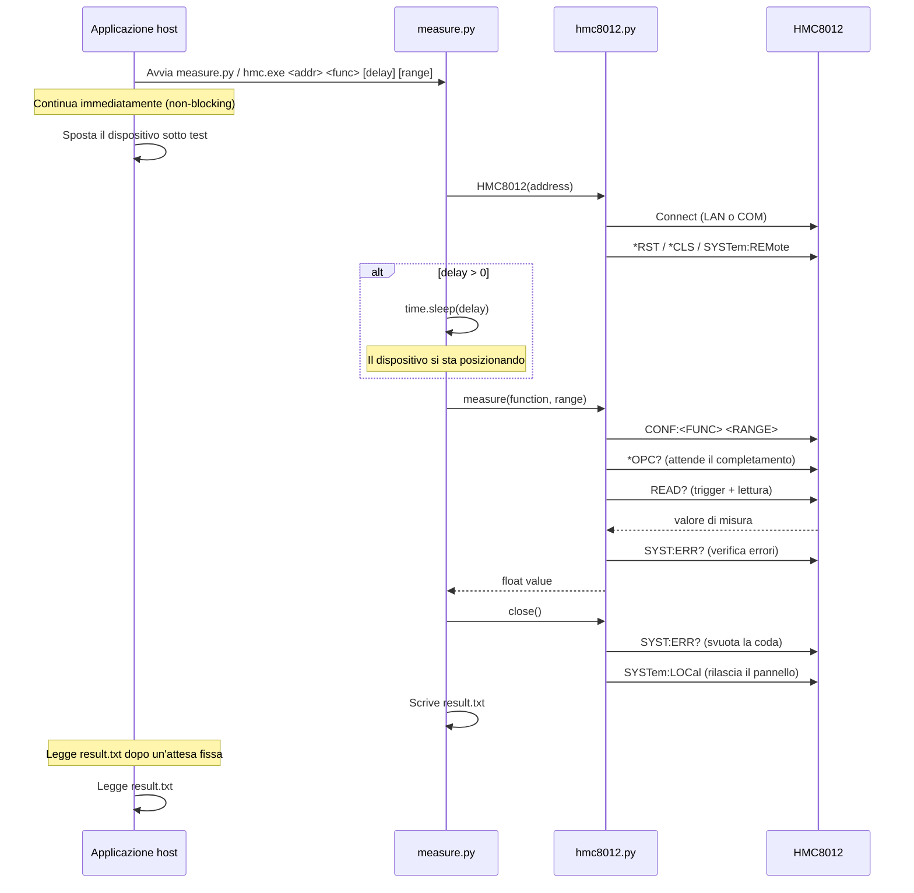
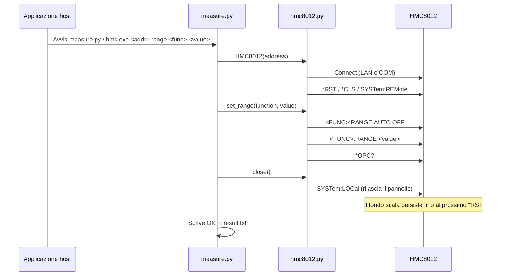
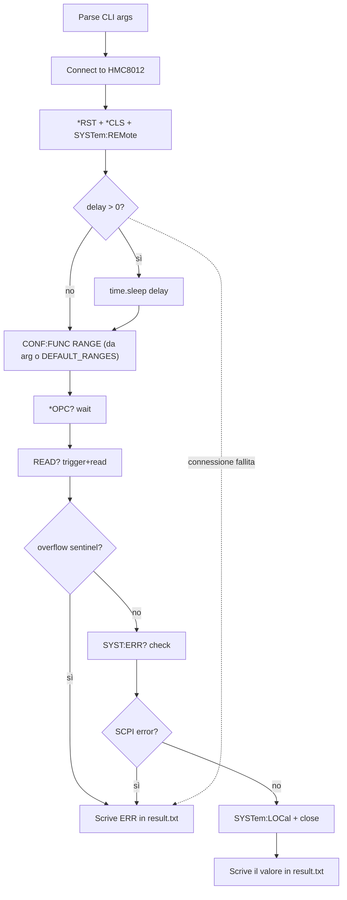
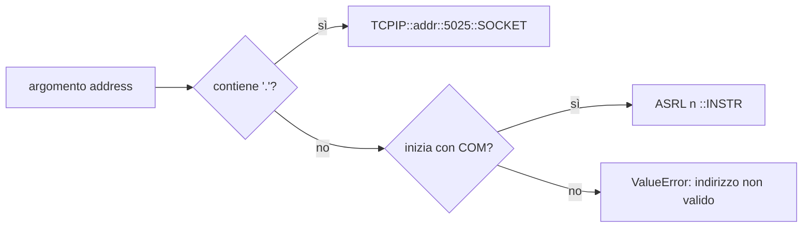

# HMC8012 Measurement Layer

Tool Python per interfacciarsi con l'HMC8012 Digital Multimeter di Rohde & Schwarz.

## Utilizzo

### Misura

```bat
python measure.py <address> <function> [delay_seconds] [range]
hmc.exe <address> <function> [delay_seconds] [range]
```

| Argomento | Descrizione |
| --- | --- |
| `address` | Indirizzo IP (es. `192.168.0.2`) o porta COM (es. `COM3`) |
| `function` | Tipo di misura (vedi tabella sotto) |
| `delay_seconds` | Attesa opzionale in secondi prima della misura (default: 0) |
| `range` | Fondo scala opzionale (default: secondo `DEFAULT_RANGES` in measure.py) |

### Impostare il Fondo Scala

Pre-configura il fondo scala sullo strumento. Utile per evitare overrange sul display mentre il dispositivo sotto test si sposta verso la posizione di misura.

```bat
python measure.py <address> range <function> <value>
hmc.exe <address> range <function> <value>
```

| Argomento | Descrizione |
| --- | --- |
| `function` | dcv, acv, dci, aci, res, fres, cap |
| `value` | Valore del fondo scala (es. `4` per 4V) oppure `AUTO` |

### Reset

Ripristina lo strumento ai valori di fabbrica.

```bat
python measure.py <address> reset
hmc.exe <address> reset
```

### Funzioni Supportate

| Nome | Misura | Comando SCPI | Fondi scala disponibili |
| --- | --- | --- | --- |
| `dcv` | Tensione DC | `CONF:VOLT:DC <range>` | 400mV, 4V, 40V, 400V, 1000V |
| `acv` | Tensione AC | `CONF:VOLT:AC <range>` | 400mV, 4V, 40V, 400V, 750V |
| `dci` | Corrente DC | `CONF:CURR:DC <range>` | 20mA, 200mA, 2A, 10A |
| `aci` | Corrente AC | `CONF:CURR:AC <range>` | 20mA, 200mA, 2A, 10A |
| `res` | Resistenza a 2 fili | `CONF:RES <range>` | 400, 4k, 40k, 400k, 4M, 40M, 250M |
| `fres` | Resistenza a 4 fili | `CONF:FRES <range>` | 400, 4k, 40k, 400k, 4M |
| `cap` | Capacità | `CONF:CAP <range>` | 5nF, 50nF, 500nF, 5uF, 50uF, 500uF |
| `temp` | Temperatura (PT100) | `CONF:TEMP` | — |
| `freq` | Frequenza | `CONF:FREQ` | — |
| `cont` | Continuità | `CONF:CONT` | — |
| `diod` | Test diodo | `CONF:DIOD` | — |

### Esempi

```bat
rem Tensione DC via LAN (fondo scala automatico, da DEFAULT_RANGES)
python measure.py 192.168.0.2 dcv
hmc.exe 192.168.0.2 dcv

rem Corrente AC via COM, ritardo di 2.5s per il posizionamento
python measure.py COM3 aci 2.5
hmc.exe COM3 aci 2.5

rem Tensione DC con fondo scala fisso 4V, senza ritardo
python measure.py 192.168.0.2 dcv 0 4
hmc.exe 192.168.0.2 dcv 0 4

rem Corrente DC con fondo scala 200mA, ritardo 1s
python measure.py COM3 dci 1 0.2
hmc.exe COM3 dci 1 0.2

rem Impostare fondo scala a 40V prima dello spostamento (persiste fino al prossimo *RST)
python measure.py 192.168.0.2 range dcv 40
hmc.exe 192.168.0.2 range dcv 40

rem Reset dello strumento
python measure.py 192.168.0.2 reset
hmc.exe 192.168.0.2 reset
```

## Output

**result.txt** (stessa directory dello script):

- Misura riuscita: il valore numerico come numero semplice (es. `4.872341`)
- Range/reset riuscito: `OK`
- In caso di errore: `ERR`

Tutti i messaggi diagnostici vengono inviati a stderr per facilitare il debug.

## Come Funziona

Lo script si connette al multimetro, attende opzionalmente che il dispositivo sotto test raggiunga la posizione, esegue l'operazione e scrive il risultato in `result.txt`.

### Flusso di Sistema (Misura)



### Flusso di Sistema (Range)



### Flusso Interno (Misura)



### Rilevamento Connessione



## Struttura dei File

| File | Scopo |
| --- | --- |
| `measure.py` | Entry point CLI: gestione comandi, parsing argomenti, ritardo, output su file |
| `hmc8012.py` | Driver strumento HMC8012: connessione, comandi SCPI, misura, fondo scala |

## Riferimento al Codice

### hmc8012.py

#### Eccezioni

| Classe | Descrizione |
| --- | --- |
| `ScpiError` | Sollevata quando lo strumento riporta un errore SCPI (risposta non zero a `SYST:ERR?`). |
| `RangeOverflowError` | Sollevata quando lo strumento restituisce il valore sentinella di overflow (`9.9e+37`), indicando che l'ingresso ha superato il fondo scala selezionato. |

#### `HMC8012`

Classe driver per l'R&S HMC8012. Supporta i trasporti LAN (socket TCPIP) e COM (seriale/VCP) tramite PyVISA. Implementa il protocollo context manager (`with HMC8012(...) as dmm:`).

##### Costanti

| Nome | Valore | Descrizione |
| --- | --- | --- |
| `OVERFLOW_SENTINEL` | `9.90000000E+37` | Valore restituito dallo strumento in caso di overflow del fondo scala. |
| `SCPI_PORT` | `5025` | Porta TCP usata per le connessioni socket LAN SCPI. |
| `DEFAULT_TIMEOUT_MS` | `5000` | Timeout default per la comunicazione VISA, in millisecondi. |
| `MAX_ERROR_QUEUE_DEPTH` | `50` | Numero massimo di iterazioni per svuotare la coda errori dello strumento. |

##### Mappe

`FUNCTION_MAP: dict[str, tuple[str, bool]]`

Associa ogni nome di funzione CLI a una tupla `(comando_SCPI_di_configurazione, supporta_range)`. Usata da `measure()` per costruire il comando `CONF:…` e determinare se l'argomento range è applicabile.

| Chiave | Comando SCPI | Supporta range |
| --- | --- | --- |
| `dcv` | `CONF:VOLT:DC` | sì |
| `acv` | `CONF:VOLT:AC` | sì |
| `dci` | `CONF:CURR:DC` | sì |
| `aci` | `CONF:CURR:AC` | sì |
| `res` | `CONF:RES` | sì |
| `fres` | `CONF:FRES` | sì |
| `cap` | `CONF:CAP` | sì |
| `temp` | `CONF:TEMP` | no |
| `freq` | `CONF:FREQ` | no |
| `cont` | `CONF:CONT` | no |
| `diod` | `CONF:DIOD` | no |

`RANGE_SCPI_MAP: dict[str, str]`

Associa i nomi delle funzioni al prefisso SCPI SENSe usato da `set_range()` per il controllo autonomo del fondo scala (indipendente da un trigger di misura).

| Chiave | Prefisso SCPI |
| --- | --- |
| `dcv` | `VOLT:DC:RANGE` |
| `acv` | `VOLT:AC:RANGE` |
| `dci` | `CURR:DC:RANGE` |
| `aci` | `CURR:AC:RANGE` |
| `res` | `RES:RANGE` |
| `fres` | `FRES:RANGE` |
| `cap` | `CAP:RANGE` |

##### Metodi pubblici

| Firma | Descrizione |
| --- | --- |
| `__init__(address, timeout_ms=5000)` | Costruisce la stringa di risorsa VISA da `address` (IP o porta COM). Non apre la connessione. |
| `connect() → None` | Apre la risorsa VISA, imposta i caratteri di terminazione, invia `*RST`, `*CLS`, `SYSTem:REMote`. Chiamato automaticamente da `__enter__`. |
| `close() → None` | Svuota la coda errori dello strumento, invia `SYSTem:LOCal` per ripristinare il controllo dal pannello frontale, chiude la risorsa VISA. Chiamato automaticamente da `__exit__`. |
| `reset() → None` | Invia `*RST`, `*CLS`, poi `*OPC?` per confermare il completamento. |
| `identify() → str` | Restituisce la stringa di identificazione `*IDN?` dello strumento. |
| `measure(function, range_value="AUTO") → float` | Configura la funzione tramite `CONF:…`, attende `*OPC?`, legge con `READ?`, verifica overflow ed errori SCPI, restituisce il valore float. Solleva `ValueError`, `RangeOverflowError` o `ScpiError`. |
| `set_range(function, range_value="AUTO") → None` | Imposta il fondo scala usando i comandi SENSe senza attivare una misura. Invia `<PREFIX>:AUTO ON/OFF` e opzionalmente `<PREFIX> <value>`, poi attende `*OPC?`. Solleva `ValueError` per funzioni non supportate. |

##### Metodi privati

| Firma | Descrizione |
| --- | --- |
| `_execute_measurement(config_cmd) → float` | Invia il comando di configurazione, esegue il trigger con `READ?`, analizza il float, verifica il valore sentinella di overflow e gli errori SCPI. |
| `_check_errors() → None` | Interroga `SYST:ERR?` una volta; solleva `ScpiError` se il codice di risposta è diverso da zero. |
| `_drain_error_queue() → None` | Legge `SYST:ERR?` in loop (fino a `MAX_ERROR_QUEUE_DEPTH`) finché la coda non è vuota. Chiamato durante `close()`. |
| `_write(command) → None` | Invia una stringa di comando SCPI allo strumento. Solleva `ConnectionError` se non connesso. |
| `_query(command) → str` | Invia una query SCPI e restituisce la stringa di risposta senza spazi. Solleva `ConnectionError` se non connesso. |
| `_build_resource_string(address) → str` | Metodo statico. Rileva il tipo di connessione dalla stringa di indirizzo e restituisce la stringa di risorsa VISA corretta (`TCPIP::…::5025::SOCKET` o `ASRL<n>::INSTR`). Solleva `ValueError` per formati non riconosciuti. |

---

### measure.py

#### Costanti a livello di modulo

| Nome | Valore | Descrizione |
| --- | --- | --- |
| `SCRIPT_DIR` | `Path(__file__).resolve().parent` | Directory assoluta dello script, usata per risolvere il percorso di `result.txt`. |
| `DEFAULT_OUTPUT` | `SCRIPT_DIR / "result.txt"` | Percorso default del file di output. |
| `VALID_FUNCTIONS` | chiavi ordinate di `HMC8012.FUNCTION_MAP` | Tutti i nomi di funzione di misura riconosciuti, usati nei messaggi di utilizzo/errore. |
| `VALID_RANGE_FUNCTIONS` | chiavi ordinate di `HMC8012.RANGE_SCPI_MAP` | Nomi di funzione che supportano la selezione del fondo scala. |

#### `DEFAULT_RANGES`

`DEFAULT_RANGES: dict[str, str]`

Fondo scala default applicato per funzione quando nessun argomento `range` viene fornito da riga di comando. Tutte le voci hanno come default `"AUTO"` (auto-ranging). Modificare un valore con una stringa numerica (es. `"4"` per 4V) per fissare un fondo scala specifico a livello di progetto.

| Chiave | default |
| --- | --- |
| `dcv` | `AUTO` |
| `acv` | `AUTO` |
| `dci` | `AUTO` |
| `aci` | `AUTO` |
| `res` | `AUTO` |
| `fres` | `AUTO` |
| `cap` | `AUTO` |

Le funzioni `temp`, `freq`, `cont` e `diod` sono assenti perché non hanno un fondo scala impostabile.

#### Funzioni

| Firma | Descrizione |
| --- | --- |
| `main() → None` | Entry point CLI. Analizza `sys.argv`, smista verso `cmd_measure`, `cmd_range` o `cmd_reset`. Esce con codice 1 per comandi sconosciuti o numero di argomenti errato. |
| `cmd_measure(address, args) → None` | Gestisce il comando di misura. Estrae funzione, ritardo opzionale e fondo scala opzionale da `args`; apre `HMC8012` come context manager; chiama `dmm.measure()`; scrive il risultato float in `result.txt`. Scrive `ERR` ed esce con codice 1 in caso di eccezione. |
| `cmd_range(address, args) → None` | Gestisce il sotto-comando `range`. Valida funzione e valore, chiama `dmm.set_range()`, scrive `OK` in `result.txt`. Scrive `ERR` ed esce con codice 1 in caso di errore. |
| `cmd_reset(address) → None` | Gestisce il comando `reset`. Apre `HMC8012` (che invia `*RST` alla connessione) e lo chiude immediatamente. Scrive `OK` o `ERR` in `result.txt`. |
| `write_result(value, output_path=DEFAULT_OUTPUT) → None` | Scrive `value + "\n"` in `output_path`, sovrascrivendo qualsiasi contenuto esistente. È l'unico punto di scrittura per `result.txt`. |
| `_usage_error(message) → None` | Stampa un messaggio di errore e il riepilogo di utilizzo completo su stderr, poi chiama `sys.exit(1)`. |

## Compilazione dell'Eseguibile Standalone

Per distribuire il tool come `hmc.exe` autocontenuto (senza Python né NI-VISA sulla macchina target), compilare con Nuitka **su una macchina Windows**:

```bat
pip install nuitka pyvisa pyvisa-py pyserial
python -m nuitka --onefile --output-filename=hmc.exe ^
  --include-package=pyvisa ^
  --include-package=pyvisa_py ^
  --include-package=serial ^
  measure.py
```

Al primo avvio Nuitka chiederà di scaricare MinGW-w64 se non trova un compilatore C: rispondere `yes`.

Il file `hmc.exe` generato si trova nella directory corrente e accetta gli stessi argomenti di `python measure.py`.

## Dipendenze

- Python 3.x
- `pyvisa` - comunicazione VISA con gli strumenti
- `pyvisa-py` - backend VISA in puro Python (non richiede NI-VISA per connessioni LAN)
- `pyserial` - richiesto su Windows per le connessioni via porta COM

```bash
pip install pyvisa pyvisa-py pyserial
```
