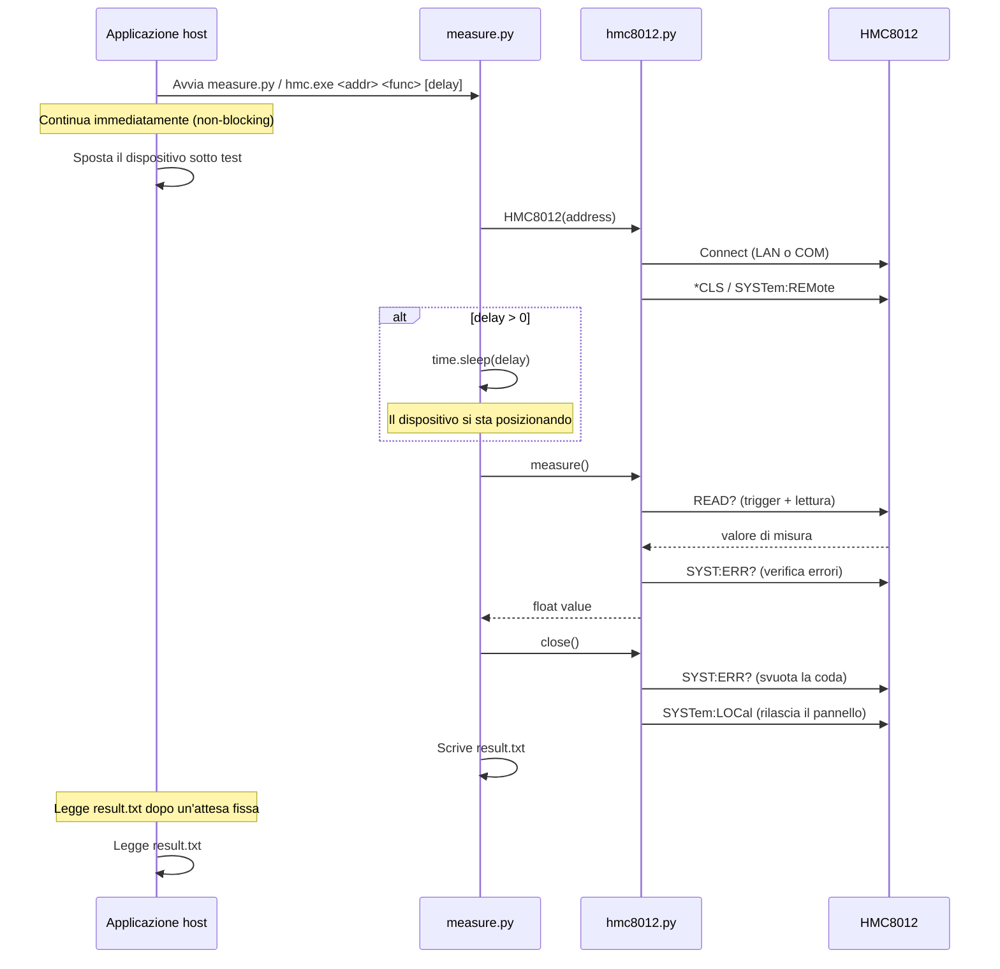
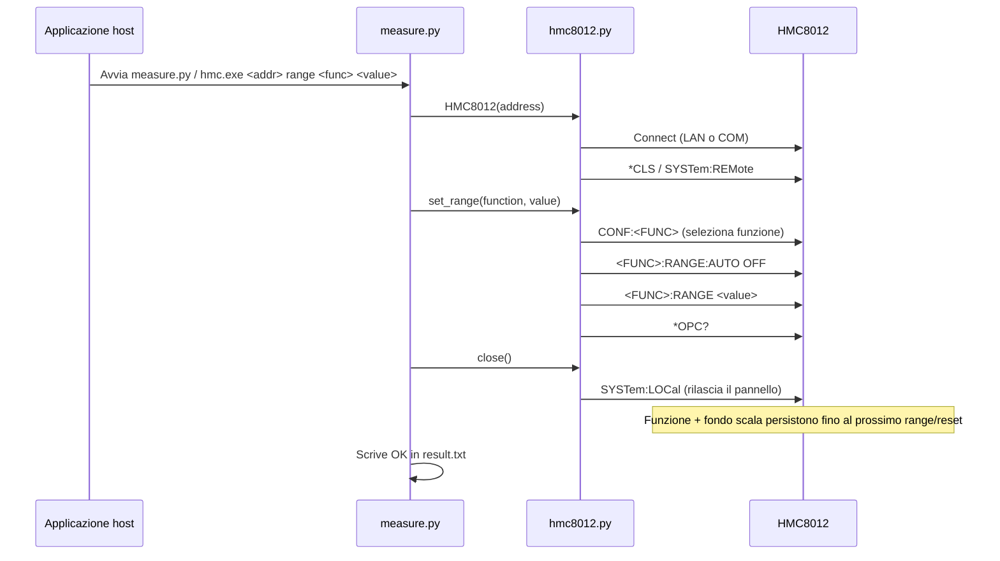
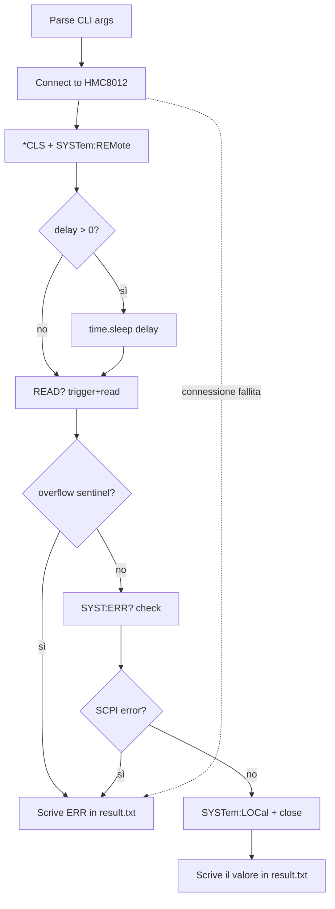
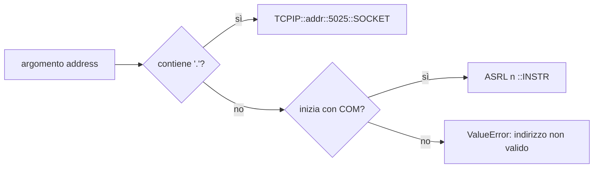

# HMC8012 Measurement Layer

Tool Python per interfacciarsi con l'HMC8012 Digital Multimeter di Rohde & Schwarz.

## Utilizzo

### Misura

Legge dallo strumento con la funzione e il fondo scala correnti. **Non** riconfigura nulla; usare il comando `range` prima.

```bat
python measure.py <address> <function> [delay_seconds]
hmc.exe <address> <function> [delay_seconds]
```

| Argomento | Descrizione |
|-|-|
| `address` | Indirizzo IP (es. `192.168.0.2`) o porta COM (es. `COM3`) |
| `function` | Tipo di misura (vedi tabella sotto) |
| `delay_seconds` | Attesa opzionale in secondi prima della misura (default: 0) |

### Impostare il Fondo Scala

Configura funzione e fondo scala sullo strumento. Le impostazioni vengono mantenute fino al prossimo comando `range` o `reset`. La connessione **non** resetta lo strumento.

```bat
python measure.py <address> range <function> <value>
hmc.exe <address> range <function> <value>
```

| Argomento | Descrizione |
|-|-|
| `function` | dcv, acv, dci, aci, res, fres, cap |
| `value` | Fondo scala in unita SI base (es. `2` per 2A, `0.4` per 400mV) oppure `AUTO` |

### Reset

Ripristina lo strumento ai valori di fabbrica.

```bat
python measure.py <address> reset
hmc.exe <address> reset
```

### Funzioni Supportate

| Nome | Misura | Comando SCPI | Fondi scala disponibili |
| --- | --- | --- | --- |
| `dcv` | Tensione DC | `CONF:VOLT:DC <range>` | 400mV, 4V, 40V, 400V, 1000V |
| `acv` | Tensione AC | `CONF:VOLT:AC <range>` | 400mV, 4V, 40V, 400V, 750V |
| `dci` | Corrente DC | `CONF:CURR:DC <range>` | 20mA, 200mA, 2A, 10A |
| `aci` | Corrente AC | `CONF:CURR:AC <range>` | 20mA, 200mA, 2A, 10A |
| `res` | Resistenza a 2 fili | `CONF:RES <range>` | 400, 4k, 40k, 400k, 4M, 40M, 250M |
| `fres` | Resistenza a 4 fili | `CONF:FRES <range>` | 400, 4k, 40k, 400k, 4M |
| `cap` | Capacità | `CONF:CAP <range>` | 5nF, 50nF, 500nF, 5uF, 50uF, 500uF |
| `temp` | Temperatura (PT100) | `CONF:TEMP` | — |
| `freq` | Frequenza | `CONF:FREQ` | — |
| `cont` | Continuità | `CONF:CONT` | — |
| `diod` | Test diodo | `CONF:DIOD` | — |

### Valori di Fondo Scala (SCPI)

I valori di fondo scala usano le unita SI base (volt, ampere, ohm, farad). Ad esempio, `0.4` = 400mV, `0.02` = 20mA.

| Funzione | Valori di fondo scala | Unita |
|-|-|-|
| `dcv` | 0.4, 4, 40, 400, 1000 | V |
| `acv` | 0.4, 4, 40, 400, 750 | V |
| `dci` | 0.02, 0.2, 2, 10 | A |
| `aci` | 0.02, 0.2, 2, 10 | A |
| `res` | 400, 4e3, 40e3, 400e3, 4e6, 40e6, 2.5e8 | Ohm |
| `fres` | 400, 4e3, 40e3, 400e3, 4e6 | Ohm |
| `cap` | 5e-9, 50e-9, 500e-9, 5e-6, 50e-6, 500e-6 | F |

### Esempi

```bat
rem 1. Reset dello strumento ai valori di fabbrica
hmc.exe 192.168.0.2 reset

rem 2. Configura corrente DC con fondo scala 2A
hmc.exe 192.168.0.2 range dci 2

rem 3. Misura (usa la funzione e il fondo scala configurati)
hmc.exe 192.168.0.2 dci

rem 4. Misura con ritardo di 1.5s per il posizionamento
hmc.exe 192.168.0.2 dci 1.5

rem 5. Cambia a tensione DC, fondo scala 40V
hmc.exe 192.168.0.2 range dcv 40

rem 6. Misura tensione DC
hmc.exe 192.168.0.2 dcv

rem 7. Passa a fondo scala automatico per tensione AC
hmc.exe COM3 range acv AUTO

rem 8. Misura tensione AC
hmc.exe COM3 acv
```

## Output

**result.txt** (stessa directory dello script):

- Misura riuscita: il valore numerico come numero semplice (es. `4.872341`)
- Range/reset riuscito: `OK`
- In caso di errore: tre righe:

```
ERR
[APP] <comando> failed (<layer>).
[EXC] <TipoEccezione>: <messaggio>
```

La riga `[APP]` identifica il comando fallito e il layer in cui si è verificato l'errore:

| Layer | Significato |
|-|-|
| `VISA/network` | Strumento non raggiunto — errore di connessione o trasporto |
| `instrument SCPI` | Strumento raggiunto, ha riportato un errore SCPI tramite `SYST:ERR?` |
| `instrument` | Strumento ha risposto correttamente, ma il valore indica overflow (`9.9e+37`) |
| `input sanitization` | Argomento non valido, rifiutato prima di aprire la connessione |
| `unexpected` | Eccezione non classificata — vedere `[EXC]` per i dettagli |

La riga `[EXC]` contiene il tipo di eccezione Python e il suo messaggio verbatim.

**stderr** usa gli stessi prefissi per tutto l'output diagnostico:
- `[APP]` — messaggio scritto dal nostro codice (avanzamento, risultato, classificazione errore)
- `[EXC]` — tipo di eccezione e messaggio, solo in caso di errore

## Come Funziona

Lo script si connette al multimetro (senza resettarlo), attende il delay di posizionamento se specificato, invia `READ?` e scrive il risultato in `result.txt`. Funzione e fondo scala si configurano separatamente con il comando `range` e vengono mantenuti tra le chiamate.

### Flusso di Sistema (Misura)



### Flusso di Sistema (Range)



### Flusso Interno (Misura)



### Rilevamento Connessione



## Struttura dei File

| File | Scopo |
| --- | --- |
| `measure.py` | Entry point CLI: gestione comandi, parsing argomenti, ritardo, output su file |
| `hmc8012.py` | Driver strumento HMC8012: connessione, comandi SCPI, misura, fondo scala |

## Riferimento al Codice

### hmc8012.py

#### Eccezioni

| Classe | Descrizione |
| --- | --- |
| `ScpiError` | Sollevata quando lo strumento riporta un errore SCPI (risposta non zero a `SYST:ERR?`). |
| `RangeOverflowError` | Sollevata quando lo strumento restituisce il valore sentinella di overflow (`9.9e+37`): l'ingresso ha superato il fondo scala selezionato. |

#### `HMC8012`

Classe driver per l'R&S HMC8012. Supporta i trasporti LAN (socket TCPIP) e COM (seriale/VCP) tramite PyVISA. Implementa il protocollo context manager (`with HMC8012(...) as dmm:`).

##### Costanti

| Nome | Valore | Descrizione |
| --- | --- | --- |
| `OVERFLOW_SENTINEL` | `9.90000000E+37` | Valore restituito dallo strumento in caso di overflow del fondo scala. |
| `SCPI_PORT` | `5025` | Porta TCP usata per le connessioni socket LAN SCPI. |
| `DEFAULT_TIMEOUT_MS` | `5000` | Timeout default per la comunicazione VISA, in millisecondi. |
| `MAX_ERROR_QUEUE_DEPTH` | `50` | Numero massimo di iterazioni per svuotare la coda errori dello strumento. |

##### Mappe

`FUNCTION_SCPI_MAP: dict[str, str]`

Associa ogni nome di funzione CLI al comando SCPI CONFigure. Usata da `set_range()` per selezionare la funzione di misura.

| Chiave | Comando SCPI |
|-|-|
| `dcv` | `CONF:VOLT:DC` |
| `acv` | `CONF:VOLT:AC` |
| `dci` | `CONF:CURR:DC` |
| `aci` | `CONF:CURR:AC` |
| `res` | `CONF:RES` |
| `fres` | `CONF:FRES` |
| `cap` | `CONF:CAP` |
| `temp` | `CONF:TEMP` |
| `freq` | `CONF:FREQ` |
| `cont` | `CONF:CONT` |
| `diod` | `CONF:DIOD` |

`RANGE_SCPI_MAP: dict[str, str]`

Associa i nomi delle funzioni al prefisso SCPI SENSe usato da `set_range()` per il controllo del fondo scala.

| Chiave | Prefisso SCPI |
|-|-|
| `dcv` | `VOLT:DC:RANGE` |
| `acv` | `VOLT:AC:RANGE` |
| `dci` | `CURR:DC:RANGE` |
| `aci` | `CURR:AC:RANGE` |
| `res` | `RES:RANGE` |
| `fres` | `FRES:RANGE` |
| `cap` | `CAP:RANGE` |

##### Metodi pubblici

| Firma | Descrizione |
|-|-|
| `__init__(address, timeout_ms=5000)` | Costruisce la stringa di risorsa VISA da `address` (IP o porta COM). Non apre la connessione. |
| `connect() → None` | Apre la risorsa VISA, imposta i caratteri di terminazione, invia `*CLS`, `SYSTem:REMote`. **Non** resetta lo strumento. Chiamato automaticamente da `__enter__`. |
| `close() → None` | Svuota la coda errori dello strumento, invia `SYSTem:LOCal` per ripristinare il controllo dal pannello frontale, chiude la risorsa VISA. Chiamato automaticamente da `__exit__`. |
| `reset() → None` | Invia `*RST`, `*CLS`, poi `*OPC?` per confermare il completamento. Ripristina i valori di fabbrica. |
| `identify() → str` | Restituisce la stringa di identificazione `*IDN?` dello strumento. |
| `measure() → float` | Invia `READ?` per leggere con la configurazione corrente. Controlla overflow ed errori SCPI, restituisce il valore float. Solleva `RangeOverflowError` o `ScpiError`. |
| `set_range(function, range_value="AUTO") → None` | Seleziona la funzione tramite `CONF:…`, poi imposta il fondo scala tramite comandi SENSe. Le impostazioni vengono mantenute fino al prossimo `set_range()` o `reset()`. Solleva `ValueError` per funzioni non supportate. |

##### Metodi privati

| Firma | Descrizione |
|-|-|
| `_check_errors() → None` | Interroga `SYST:ERR?` una volta; solleva `ScpiError` se il codice di risposta è diverso da zero. |
| `_drain_error_queue() → None` | Legge `SYST:ERR?` in loop (fino a `MAX_ERROR_QUEUE_DEPTH`) finché la coda non è vuota. Chiamato durante `close()`. |
| `_write(command) → None` | Invia una stringa di comando SCPI allo strumento. Solleva `ConnectionError` se non connesso. |
| `_query(command) → str` | Invia una query SCPI e restituisce la stringa di risposta senza spazi. Solleva `ConnectionError` se non connesso. |
| `_build_resource_string(address) → str` | Metodo statico. Rileva il tipo di connessione dalla stringa di indirizzo e restituisce la stringa di risorsa VISA corretta (`TCPIP::…::5025::SOCKET` o `ASRL<n>::INSTR`). Solleva `ValueError` per formati non riconosciuti. |

---

### measure.py

#### Costanti a livello di modulo

| Nome | Valore | Descrizione |
|-|-|-|
| `SCRIPT_DIR` | `Path(sys.argv[0]).resolve().parent` | Directory assoluta dello script/eseguibile, usata per risolvere il percorso di `result.txt`. |
| `DEFAULT_OUTPUT` | `SCRIPT_DIR / "result.txt"` | Percorso default del file di output. |
| `VALID_FUNCTIONS` | chiavi ordinate di `HMC8012.VALID_FUNCTIONS` | Tutti i nomi di funzione di misura riconosciuti, usati nei messaggi di utilizzo/errore. |
| `VALID_RANGE_FUNCTIONS` | chiavi ordinate di `HMC8012.RANGE_SCPI_MAP` | Nomi di funzione che supportano la selezione del fondo scala. |

#### Funzioni

| Firma | Descrizione |
|-|-|
| `main() → None` | Entry point CLI. Analizza `sys.argv`, smista verso `cmd_measure`, `cmd_range` o `cmd_reset`. Esce con codice 1 per comandi sconosciuti o numero di argomenti errato. |
| `cmd_measure(address, args) → None` | Gestisce il comando di misura. Estrae funzione e ritardo opzionale da `args`; apre `HMC8012` come context manager; chiama `dmm.measure()`; scrive il risultato float in `result.txt`. Scrive `ERR` ed esce con codice 1 in caso di eccezione. |
| `cmd_range(address, args) → None` | Gestisce il sotto-comando `range`. Valida funzione e valore, chiama `dmm.set_range()`, scrive `OK` in `result.txt`. Scrive `ERR` ed esce con codice 1 in caso di errore. |
| `cmd_reset(address) → None` | Gestisce il comando `reset`. Apre `HMC8012` e chiama `dmm.reset()`. Scrive `OK` o `ERR` in `result.txt`. |
| `write_result(value, app_msg="", exc_detail="", output_path=DEFAULT_OUTPUT) → None` | Scrive `result.txt`, sovrascrivendo il contenuto esistente. La riga 1 è sempre `value`; se `app_msg` è fornito viene scritto alla riga 2; se `exc_detail` è fornito viene scritto alla riga 3. |
| `_write_error(command, layer, exc) → None` | Scrive un errore stratificato sia su stderr che in `result.txt`. Formatta `[APP] <comando> failed (<layer>).` e `[EXC] <tipo>: <messaggio>`, li stampa su stderr, poi chiama `write_result("ERR", ...)`. |
| `_usage_error(message) → None` | Stampa un messaggio di errore e il riepilogo di utilizzo completo su stderr, poi chiama `sys.exit(1)`. |

## Compilazione dell'Eseguibile Standalone

Per distribuire il tool come `hmc.exe` autocontenuto (senza Python né NI-VISA sulla macchina target), compilare con Nuitka **su una macchina Windows**.

> **Versione Python:** il compilatore MinGW-w64 bundled di Nuitka non supporta Python 3.13+. Usare **Python 3.12** per compilare.

```bat
pip install nuitka pyvisa pyvisa-py pyserial
python -m nuitka --onefile --output-filename=hmc.exe --include-package=pyvisa --include-package=pyvisa_py --include-package=serial measure.py
```

Al primo avvio Nuitka chiederà di scaricare MinGW-w64 se non trova un compilatore C: rispondere `yes`.

Il file `hmc.exe` generato si trova nella directory corrente e accetta gli stessi argomenti di `python measure.py`.

## Dipendenze

- Python 3.x
- `pyvisa` - comunicazione VISA con gli strumenti
- `pyvisa-py` - backend VISA in puro Python (non richiede NI-VISA per connessioni LAN)
- `pyserial` - richiesto su Windows per le connessioni via porta COM

```bash
pip install -r requirements.txt
```
