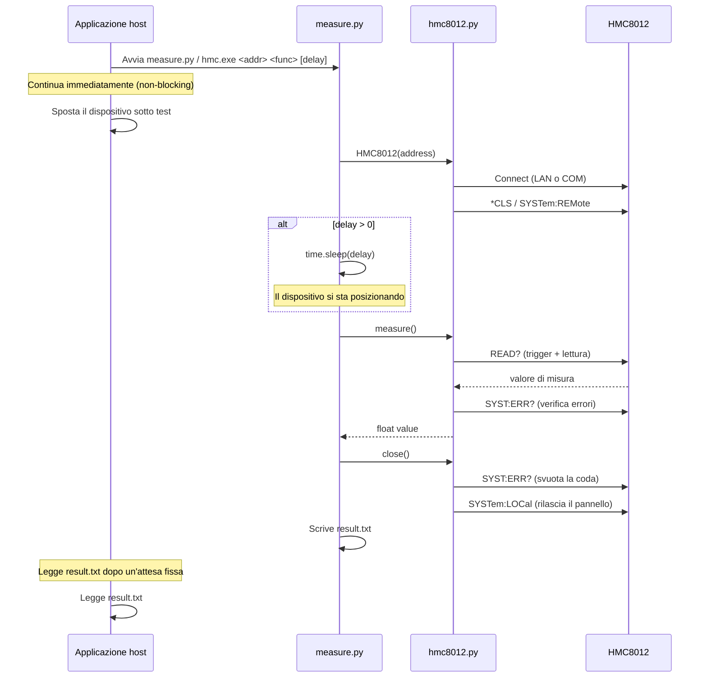
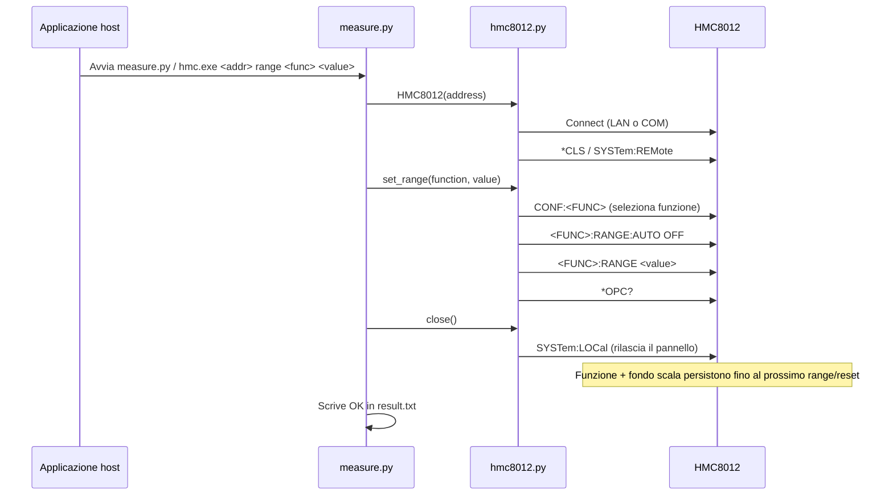
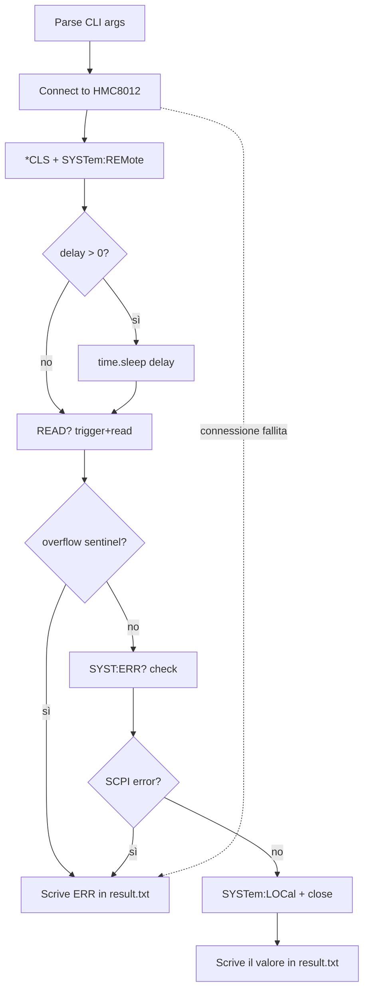
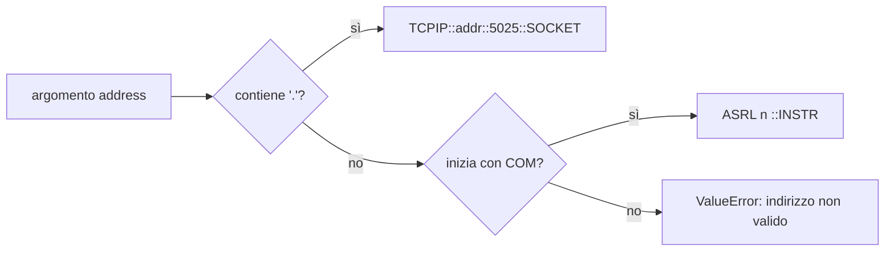

# HMC8012 Measurement Layer

Tool Python per interfacciarsi con l'HMC8012 Digital Multimeter di Rohde & Schwarz.

## Utilizzo

### Misura

Legge dallo strumento con la funzione e il fondo scala correnti. **Non** riconfigura nulla; usare il comando `range` prima.

```bat
python measure.py <address> <function> [delay_seconds]
hmc.exe <address> <function> [delay_seconds]
```

| Argomento | Descrizione |
|-|-|
| `address` | Indirizzo IP (es. `192.168.1.25`) o porta COM (es. `COM5`) |
| `function` | Tipo di misura (vedi tabella sotto) |
| `delay_seconds` | Attesa opzionale in secondi prima della misura (default: 0) |

### Impostare il Fondo Scala

Configura funzione e fondo scala sullo strumento. Le impostazioni vengono mantenute fino al prossimo comando `range` o `reset`. La connessione **non** resetta lo strumento.

```bat
python measure.py <address> range <function> <value>
hmc.exe <address> range <function> <value>
```

| Argomento | Descrizione |
|-|-|
| `function` | dcv, acv, dci, aci, res, fres, cap |
| `value` | Fondo scala in unita SI base (es. `2` per 2A, `0.4` per 400mV) oppure `AUTO` |

### Reset

Ripristina lo strumento ai valori di fabbrica.

```bat
python measure.py <address> reset
hmc.exe <address> reset
```

### Cattura continua DCI

La cattura continua acquisisce campioni di corrente DC nel tempo, esegue la pipeline di analisi (picchi, assestamento, regione stabile) e scrive il **valore stabile** in `result.txt`. Impostare prima il fondo scala DCI (es. `range dci 0.2`). Vedi [Cattura continua: valore stabile](#cattura-continua-valore-stabile) per come si ricava il valore stabile.

**Cattura a tempo (solo result.txt):**

```bat
python measure.py <address> capture [duration] [timeout]
```

Con un solo numero, timeout = duration + 10 secondi.

**Cattura a tempo con grafico live:**

```bat
python measure.py <address> capture-plot [duration] [timeout]
```

Stessa regola per il timeout. Il grafico mostra la forma d’onda in tempo reale e a fine cattura la regione stabile e un box riepilogo (valore stabile, σ, N, Δt, rate).

**Start/stop (senza durata fissa):**

```bat
python measure.py <address> capture-plot start [FAST|SLOW|MED]
```

Esegue fino alla creazione del file sentinel (massimo 1 ora). Il rate ADC è opzionale (default FAST).

```bat
python measure.py <address> capture-plot stop
```

Crea il file sentinel; il processo che ha eseguito `start` termina la cattura, esegue l’analisi e scrive `result.txt` come al solito.

### Funzioni Supportate

| Nome | Misura | Comando SCPI | Fondi scala disponibili |
| --- | --- | --- | --- |
| `dcv` | Tensione DC | `CONF:VOLT:DC <range>` | 400mV, 4V, 40V, 400V, 1000V |
| `acv` | Tensione AC | `CONF:VOLT:AC <range>` | 400mV, 4V, 40V, 400V, 750V |
| `dci` | Corrente DC | `CONF:CURR:DC <range>` | 20mA, 200mA, 2A, 10A |
| `aci` | Corrente AC | `CONF:CURR:AC <range>` | 20mA, 200mA, 2A, 10A |
| `res` | Resistenza a 2 fili | `CONF:RES <range>` | 400, 4k, 40k, 400k, 4M, 40M, 250M |
| `fres` | Resistenza a 4 fili | `CONF:FRES <range>` | 400, 4k, 40k, 400k, 4M |
| `cap` | Capacità | `CONF:CAP <range>` | 5nF, 50nF, 500nF, 5uF, 50uF, 500uF |
| `temp` | Temperatura (PT100) | `CONF:TEMP` | — |
| `freq` | Frequenza | `CONF:FREQ` | — |
| `cont` | Continuità | `CONF:CONT` | — |
| `diod` | Test diodo | `CONF:DIOD` | — |

### Valori di Fondo Scala (SCPI)

I valori di fondo scala usano le unita SI base (volt, ampere, ohm, farad). Ad esempio, `0.4` = 400mV, `0.02` = 20mA.

| Funzione | Valori di fondo scala | Unita |
|-|-|-|
| `dcv` | 0.4, 4, 40, 400, 1000 | V |
| `acv` | 0.4, 4, 40, 400, 750 | V |
| `dci` | 0.02, 0.2, 2, 10 | A |
| `aci` | 0.02, 0.2, 2, 10 | A |
| `res` | 400, 4e3, 40e3, 400e3, 4e6, 40e6, 2.5e8 | Ohm |
| `fres` | 400, 4e3, 40e3, 400e3, 4e6 | Ohm |
| `cap` | 5e-9, 50e-9, 500e-9, 5e-6, 50e-6, 500e-6 | F |

### Esempi

```bat
rem 1. Reset dello strumento ai valori di fabbrica
hmc.exe 192.168.1.25 reset

rem 2. Configura corrente DC con fondo scala 2A
hmc.exe 192.168.1.25 range dci 2

rem 3. Misura (usa la funzione e il fondo scala configurati)
hmc.exe 192.168.1.25 dci

rem 4. Misura con ritardo di 1.5s per il posizionamento
hmc.exe 192.168.1.25 dci 1.5

rem 5. Cambia a tensione DC, fondo scala 40V
hmc.exe 192.168.1.25 range dcv 40

rem 6. Misura tensione DC
hmc.exe 192.168.1.25 dcv

rem 7. Passa a fondo scala automatico per tensione AC
hmc.exe COM5 range acv AUTO

rem 8. Misura tensione AC
hmc.exe COM5 acv
```

## Output

**result.txt** (stessa directory dello script):

- Misura riuscita: il valore numerico come numero semplice (es. `4.872341`)
- Range/reset riuscito: `OK`
- In caso di errore: tre righe:

```
ERR
[APP] <comando> failed (<layer>).
[EXC] <TipoEccezione>: <messaggio>
```

La riga `[APP]` identifica il comando fallito e il layer in cui si è verificato l'errore:

| Layer | Significato |
|-|-|
| `VISA/network` | Strumento non raggiunto — errore di connessione o trasporto |
| `instrument SCPI` | Strumento raggiunto, ha riportato un errore SCPI tramite `SYST:ERR?` |
| `instrument` | Strumento ha risposto correttamente, ma il valore indica overflow (`9.9e+37`) |
| `input sanitization` | Argomento non valido, rifiutato prima di aprire la connessione |
| `unexpected` | Eccezione non classificata — vedere `[EXC]` per i dettagli |

La riga `[EXC]` contiene il tipo di eccezione Python e il suo messaggio verbatim.

**stderr** usa gli stessi prefissi per tutto l'output diagnostico:
- `[APP]` — messaggio scritto dal nostro codice (avanzamento, risultato, classificazione errore)
- `[EXC]` — tipo di eccezione e messaggio, solo in caso di errore

## Cattura continua: valore stabile

Il multimetro HMC8012 misura la corrente in continua (DCI). Lo script scrive in `result.txt` **un solo numero**: la **corrente stabile** (media di una fase a regime scelta), nello stesso formato della misura singola. **Modalità** (`analyzer.py`: `stable_target`): **baseline** (predefinita) — segmento “calmo” più lungo con media &lt; 0,4 A (baseline motore spento, es. 7–8,5 s). **post_peak** — regione assestata dopo l’ultimo picco (plateau motore acceso). Default: baseline.

Il valore stabile è la **media della corrente nella parte “calma” del segnale**, cioè dopo l’ultimo picco significativo e dopo che la corrente si è assestata. Viene calcolato in `analyzer.py` (`analyze_waveform`):

1. **Filtro overflow** — Il multimetro può restituire un valore sentinella (es. 9.9e+37) quando va in overflow. Questi punti vengono tolti da tempi e valori (tenendo allineati i due array). Se troppi campioni sono overflow, l’analisi fallisce.

2. **Ricerca dei picchi** — Si cercano i massimi locali con prominenza sufficiente (es. 3 volte la deviazione standard del segnale) per individuare lo spike della corrente (e eventuali altri picchi).

3. **Ancoraggio all’ultimo picco** — Per il valore stabile si considera solo la coda del segnale **dopo** l’ultimo picco significativo.

4. **Punto di settling (assestamento)** — Una finestra mobile (es. 20 campioni) e una soglia di std (es. 0.01 A) definiscono l’inizio della **regione stabile**.

5. **Regione stabile e media** — Tutti i campioni da quell'indice in poi formano la regione stabile. Il **valore stabile** è la **media** di quei campioni; **σ** è la **deviazione standard di quegli stessi campioni** (vedi sottosezione sotto).

**Modalità predefinita: baseline.** Con `stable_target` **baseline** lo script trova il segmento **più lungo** consecutivo “calmo” (std bassa) con media &lt; 0,4 A (`baseline_threshold`, `min_baseline_samples`). Quel segmento (es. 6,4–9 s che include 7–8,5 s) è la zona verde; la sua media è il valore stabile. Usare **post_peak** quando interessa la corrente alta dopo l’ultimo impulso (vedi sotto).

### Come si ricava la regione stabile — post_peak (passo per passo)

Abbiamo una sequenza di campioni di corrente nel tempo. In modalità **post_peak** la **regione stabile** è il tratto dopo l’ultimo picco in cui la corrente si è assestata. L'ordine è: **prima si individuano i picchi**, poi si prende la coda dopo l'ultimo picco, poi si salta un numero fisso di campioni, e **solo su quella coda** si applica la finestra mobile e la std per trovare dove il segnale diventa "calmo". Nel dettaglio:

1. **Individuazione dei picchi sull'intero segnale (filtrato)**  
   Eseguiamo la ricerca dei picchi sull'intera forma d'onda (es. spike di avvio e eventuali altri). Otteniamo una lista di indici dei picchi.  
   **Funzioni usate:** `detect_peaks()` in `analyzer.py`, che chiama `scipy.signal.find_peaks(values, prominence=prominence_sigma * np.std(values), distance=min_peak_distance)`. Un picco viene mantenuto solo se la sua prominenza supera quella soglia e dista almeno `min_peak_distance` campioni dal precedente.

2. **Si usa solo la coda dopo l'ultimo picco**  
   Teniamo solo la parte del segnale **dopo l'ultimo** picco. Tutto ciò che viene prima viene ignorato. Da qui in poi lavoriamo solo su questo tratto "post-picco".  
   **Nel codice:** l'ultimo picco si ottiene con `anchor = peaks[-1]`. La coda usata nei passi successivi (dopo il salto di transitorio) è `filtered_vals[anchor.index + min_samples_after_peak:]`, salvata come `post_peak_values` in `analyze_waveform()`.

3. **Salto fisso di campioni (transitorio)**  
   Subito dopo il picco la corrente sta ancora scendendo. Saltiamo i primi **min_samples_after_peak** campioni (default 100) di questa coda, così non consideriamo la discesa come "stabile". Questo salto è il **salto di transitorio**.  
   **Nel codice:** parametro `min_samples_after_peak` in `analyze_waveform()` in `analyzer.py` (default 100). La coda che poi scandiamo con la finestra inizia all'indice `anchor.index + min_samples_after_peak`.

4. **Finestra mobile e std su questa coda**  
   Sul **resto** dei campioni (dopo il salto) facciamo scorrere una finestra di **settling_window** punti (default 20). Per ogni posizione calcoliamo la **deviazione standard** dei valori nella finestra. Dove il segnale è ancora in movimento la std è alta; dove è piatto è bassa.  
   **Formula (Python/NumPy):** per ogni finestra usiamo la stessa definizione di `np.std(finestra)` con default `ddof=0`, cioè σ = sqrt(mean((x - mean(x))**2)). Nel codice, `find_settling_point()` in `analyzer.py` usa `sliding_window_view(values, window_size)` da `numpy.lib.stride_tricks`, poi `rolling_std = windows.std(axis=-1)` così che ogni elemento di `rolling_std` sia la std di una finestra.

5. **Prima "sequenza calma"**  
   Richiediamo che **n_settling_windows** finestre consecutive (default 3) abbiano std sotto **settling_threshold** (es. 0,01 A). **L'indice di inizio di quella sequenza** è il primo indice della regione stabile.  
   **Nel codice:** `find_settling_point()` in `analyzer.py`, con `window_size=settling_window`, `std_threshold=settling_threshold`, `n_consecutive=n_settling_windows`. Tutti questi sono argomenti di `analyze_waveform()`.

6. **Regione stabile = da quell'indice finché la std risale**  
   Non usiamo tutto il resto della cattura fino alla fine: quando l'utente stoppa la cattura, il device può essersi già fermato e la corrente può avere una risalita/caduta finale. Quindi scandiamo in avanti dall'inizio del settling e **terminiamo la regione stabile** quando la std mobile torna sopra la soglia (prima finestra che non è più "calma"). Tutti i campioni dall'inizio del settling a quell'indice formano la **regione stabile** (zona verde). Su quelli calcoliamo la **media** (valore stabile) e la **std** (σ).

In sintesi: **ricerca picchi → coda dopo l'ultimo picco → salto transitorio → finestra mobile + std → prima sequenza di 3 finestre calme (inizio) → scandire in avanti finché la std risale (fine) → regione stabile = solo quel segmento.** I parametri configurabili sono in `analyzer.py`: in `analyze_waveform()` per `min_samples_after_peak`, `settling_window`, `settling_threshold`, `n_settling_windows`; in `find_settling_point()` la logica finestra/std.

### Regione stabile, valore stabile e σ (deviazione standard)

La **zona verde** nel grafico è la **regione stabile**: l'insieme dei campioni dal punto di settling fino al punto in cui la std mobile risale (non necessariamente fino alla fine della cattura). Le tre grandezze usano **esattamente quello stesso insieme di campioni**:

| Grandezza | Significato | Come si calcola |
|-----------|-------------|-----------------|
| **Regione stabile** (zona verde) | La parte del segnale considerata assestata (corrente a regime). | Dall'indice di settling all'indice in cui la std mobile torna per la prima volta sopra soglia (ci fermiamo prima di una risalita/caduta finale). |
| **Valore stabile** (linea + numero) | La corrente che riportiamo. | **Media** dei campioni nella regione stabile. |
| **σ** (sigma nel box) | Quanto varia la corrente **dentro** la zona verde. | **Deviazione standard** degli **stessi** campioni usati per la media. |

Quindi: **σ è la deviazione standard dei campioni dentro la zona verde.** Stessa fetta di dati → media = valore stabile, std = σ. Se σ è piccolo (es. pochi mA), la zona è piatta e la misura è affidabile. Se σ è grande (es. vicino alla media o quasi mezzo ampere), la regione può ancora includere transitorio (il settling parte troppo in anticipo) oppure il segnale è rumoroso; è un avviso di qualità.

**Dove succede:** `analyzer.py` (filter_overflows, detect_peaks, find_settling_point, analyze_waveform); `capture.py` (loop ContinuousCapture, CaptureResult, precondizioni: DCI, rate ADC FAST/SLOW/MED, range non in auto); `hmc8012.py` (measure_fast, get_function, get_adc_rate, get_range_auto); `measure.py` (cmd_capture, cmd_capture_plot, _run_capture_session, start/stop); `plotting.py` (show_capture_plot; grafico live in measure.py).

---

## Come Funziona

Lo script si connette al multimetro (senza resettarlo), attende il delay di posizionamento se specificato, invia `READ?` e scrive il risultato in `result.txt`. Funzione e fondo scala si configurano separatamente con il comando `range` e vengono mantenuti tra le chiamate.

### Flusso di Sistema (Misura)


```mermaid
sequenceDiagram
    participant HOST as Applicazione host
    participant PY as measure.py
    participant DRV as hmc8012.py
    participant DMM as HMC8012

    HOST->>PY: Avvia measure.py / hmc.exe <addr> <func> [delay]
    Note over HOST: Continua immediatamente (non-blocking)
    HOST->>HOST: Sposta il dispositivo sotto test

    PY->>DRV: HMC8012(address)
    DRV->>DMM: Connect (LAN o COM)
    DRV->>DMM: *CLS / SYSTem:REMote

    alt delay > 0
        PY->>PY: time.sleep(delay)
        Note over PY: Il dispositivo si sta posizionando
    end

    PY->>DRV: measure()
    DRV->>DMM: READ? (trigger + lettura)
    DMM-->>DRV: valore di misura
    DRV->>DMM: SYST:ERR? (verifica errori)
    DRV-->>PY: float value

    PY->>DRV: close()
    DRV->>DMM: SYST:ERR? (svuota la coda)
    DRV->>DMM: SYSTem:LOCal (rilascia il pannello)

    PY->>PY: Scrive result.txt
    Note over HOST: Legge result.txt dopo un'attesa fissa
    HOST->>HOST: Legge result.txt
```

### Flusso di Sistema (Range)


```mermaid
sequenceDiagram
    participant HOST as Applicazione host
    participant PY as measure.py
    participant DRV as hmc8012.py
    participant DMM as HMC8012

    HOST->>PY: Avvia measure.py / hmc.exe <addr> range <func> <value>

    PY->>DRV: HMC8012(address)
    DRV->>DMM: Connect (LAN o COM)
    DRV->>DMM: *CLS / SYSTem:REMote

    PY->>DRV: set_range(function, value)
    DRV->>DMM: CONF:<FUNC> (seleziona funzione)
    DRV->>DMM: <FUNC>:RANGE:AUTO OFF
    DRV->>DMM: <FUNC>:RANGE <value>
    DRV->>DMM: *OPC?

    PY->>DRV: close()
    DRV->>DMM: SYSTem:LOCal (rilascia il pannello)

    Note over DMM: Funzione + fondo scala persistono fino al prossimo range/reset
    PY->>PY: Scrive OK in result.txt
```

### Flusso Interno (Misura)


```mermaid
flowchart TD
    A[Parse CLI args] --> B[Connect to HMC8012]
    B --> C[*CLS + SYSTem:REMote]
    C --> D{delay > 0?}
    D -- sì --> E[time.sleep delay]
    D -- no --> F
    E --> F[READ? trigger+read]
    F --> G{overflow sentinel?}
    G -- sì --> ERR[Scrive ERR in result.txt]
    G -- no --> H[SYST:ERR? check]
    H --> I{SCPI error?}
    I -- sì --> ERR
    I -- no --> J[SYSTem:LOCal + close]
    J --> K[Scrive il valore in result.txt]

    B -.->|connessione fallita| ERR
```

### Rilevamento Connessione


```mermaid
flowchart LR
    A[argomento address] --> B{contiene '.'?}
    B -- sì --> C["TCPIP::addr::5025::SOCKET"]
    B -- no --> D{inizia con COM?}
    D -- sì --> E["ASRL n ::INSTR"]
    D -- no --> F[ValueError: indirizzo non valido]
```

## Struttura dei File

| File | Scopo |
| --- | --- |
| `measure.py` | Entry point CLI: gestione comandi, parsing argomenti, ritardo, capture/capture-plot, output su file |
| `hmc8012.py` | Driver strumento HMC8012: connessione, comandi SCPI, misura, fondo scala |
| `capture.py` | ContinuousCapture: loop di campionamento DCI, sentinel/deadline, sample_callback per grafico live |
| `analyzer.py` | Analisi forma d’onda: filtro overflow, picchi, punto di settling, valore stabile (media della regione stabile) |
| `plotting.py` | Grafico post-cattura; il grafico live durante la cattura è in measure.py |

## Riferimento al Codice

### hmc8012.py

#### Eccezioni

| Classe | Descrizione |
| --- | --- |
| `ScpiError` | Sollevata quando lo strumento riporta un errore SCPI (risposta non zero a `SYST:ERR?`). |
| `RangeOverflowError` | Sollevata quando lo strumento restituisce il valore sentinella di overflow (`9.9e+37`): l'ingresso ha superato il fondo scala selezionato. |

#### `HMC8012`

Classe driver per l'R&S HMC8012. Supporta i trasporti LAN (socket TCPIP) e COM (seriale/VCP) tramite PyVISA. Implementa il protocollo context manager (`with HMC8012(...) as dmm:`).

##### Costanti

| Nome | Valore | Descrizione |
| --- | --- | --- |
| `OVERFLOW_SENTINEL` | `9.90000000E+37` | Valore restituito dallo strumento in caso di overflow del fondo scala. |
| `SCPI_PORT` | `5025` | Porta TCP usata per le connessioni socket LAN SCPI. |
| `DEFAULT_TIMEOUT_MS` | `5000` | Timeout default per la comunicazione VISA, in millisecondi. |
| `MAX_ERROR_QUEUE_DEPTH` | `50` | Numero massimo di iterazioni per svuotare la coda errori dello strumento. |

##### Mappe

`FUNCTION_SCPI_MAP: dict[str, str]`

Associa ogni nome di funzione CLI al comando SCPI CONFigure. Usata da `set_range()` per selezionare la funzione di misura.

| Chiave | Comando SCPI |
|-|-|
| `dcv` | `CONF:VOLT:DC` |
| `acv` | `CONF:VOLT:AC` |
| `dci` | `CONF:CURR:DC` |
| `aci` | `CONF:CURR:AC` |
| `res` | `CONF:RES` |
| `fres` | `CONF:FRES` |
| `cap` | `CONF:CAP` |
| `temp` | `CONF:TEMP` |
| `freq` | `CONF:FREQ` |
| `cont` | `CONF:CONT` |
| `diod` | `CONF:DIOD` |

`RANGE_SCPI_MAP: dict[str, str]`

Associa i nomi delle funzioni al prefisso SCPI SENSe usato da `set_range()` per il controllo del fondo scala.

| Chiave | Prefisso SCPI |
|-|-|
| `dcv` | `VOLT:DC:RANGE` |
| `acv` | `VOLT:AC:RANGE` |
| `dci` | `CURR:DC:RANGE` |
| `aci` | `CURR:AC:RANGE` |
| `res` | `RES:RANGE` |
| `fres` | `FRES:RANGE` |
| `cap` | `CAP:RANGE` |

##### Metodi pubblici

| Firma | Descrizione |
|-|-|
| `__init__(address, timeout_ms=5000)` | Costruisce la stringa di risorsa VISA da `address` (IP o porta COM). Non apre la connessione. |
| `connect() → None` | Apre la risorsa VISA, imposta i caratteri di terminazione, invia `*CLS`, `SYSTem:REMote`. **Non** resetta lo strumento. Chiamato automaticamente da `__enter__`. |
| `close() → None` | Svuota la coda errori dello strumento, invia `SYSTem:LOCal` per ripristinare il controllo dal pannello frontale, chiude la risorsa VISA. Chiamato automaticamente da `__exit__`. |
| `reset() → None` | Invia `*RST`, `*CLS`, poi `*OPC?` per confermare il completamento. Ripristina i valori di fabbrica. |
| `identify() → str` | Restituisce la stringa di identificazione `*IDN?` dello strumento. |
| `measure() → float` | Invia `READ?` per leggere con la configurazione corrente. Controlla overflow ed errori SCPI, restituisce il valore float. Solleva `RangeOverflowError` o `ScpiError`. |
| `set_range(function, range_value="AUTO") → None` | Seleziona la funzione tramite `CONF:…`, poi imposta il fondo scala tramite comandi SENSe. Le impostazioni vengono mantenute fino al prossimo `set_range()` o `reset()`. Solleva `ValueError` per funzioni non supportate. |

##### Metodi privati

| Firma | Descrizione |
|-|-|
| `_check_errors() → None` | Interroga `SYST:ERR?` una volta; solleva `ScpiError` se il codice di risposta è diverso da zero. |
| `_drain_error_queue() → None` | Legge `SYST:ERR?` in loop (fino a `MAX_ERROR_QUEUE_DEPTH`) finché la coda non è vuota. Chiamato durante `close()`. |
| `_write(command) → None` | Invia una stringa di comando SCPI allo strumento. Solleva `ConnectionError` se non connesso. |
| `_query(command) → str` | Invia una query SCPI e restituisce la stringa di risposta senza spazi. Solleva `ConnectionError` se non connesso. |
| `_build_resource_string(address) → str` | Metodo statico. Rileva il tipo di connessione dalla stringa di indirizzo e restituisce la stringa di risorsa VISA corretta (`TCPIP::…::5025::SOCKET` o `ASRL<n>::INSTR`). Solleva `ValueError` per formati non riconosciuti. |

---

### measure.py

#### Costanti a livello di modulo

| Nome | Valore | Descrizione |
|-|-|-|
| `SCRIPT_DIR` | `Path(sys.argv[0]).resolve().parent` | Directory assoluta dello script/eseguibile, usata per risolvere il percorso di `result.txt`. |
| `DEFAULT_OUTPUT` | `SCRIPT_DIR / "result.txt"` | Percorso default del file di output. |
| `VALID_FUNCTIONS` | chiavi ordinate di `HMC8012.VALID_FUNCTIONS` | Tutti i nomi di funzione di misura riconosciuti, usati nei messaggi di utilizzo/errore. |
| `VALID_RANGE_FUNCTIONS` | chiavi ordinate di `HMC8012.RANGE_SCPI_MAP` | Nomi di funzione che supportano la selezione del fondo scala. |

#### Funzioni

| Firma | Descrizione |
|-|-|
| `main() → None` | Entry point CLI. Analizza `sys.argv`, smista verso `cmd_measure`, `cmd_range` o `cmd_reset`. Esce con codice 1 per comandi sconosciuti o numero di argomenti errato. |
| `cmd_measure(address, args) → None` | Gestisce il comando di misura. Estrae funzione e ritardo opzionale da `args`; apre `HMC8012` come context manager; chiama `dmm.measure()`; scrive il risultato float in `result.txt`. Scrive `ERR` ed esce con codice 1 in caso di eccezione. |
| `cmd_range(address, args) → None` | Gestisce il sotto-comando `range`. Valida funzione e valore, chiama `dmm.set_range()`, scrive `OK` in `result.txt`. Scrive `ERR` ed esce con codice 1 in caso di errore. |
| `cmd_reset(address) → None` | Gestisce il comando `reset`. Apre `HMC8012` e chiama `dmm.reset()`. Scrive `OK` o `ERR` in `result.txt`. |
| `write_result(value, app_msg="", exc_detail="", output_path=DEFAULT_OUTPUT) → None` | Scrive `result.txt`, sovrascrivendo il contenuto esistente. La riga 1 è sempre `value`; se `app_msg` è fornito viene scritto alla riga 2; se `exc_detail` è fornito viene scritto alla riga 3. |
| `_write_error(command, layer, exc) → None` | Scrive un errore stratificato sia su stderr che in `result.txt`. Formatta `[APP] <comando> failed (<layer>).` e `[EXC] <tipo>: <messaggio>`, li stampa su stderr, poi chiama `write_result("ERR", ...)`. |
| `_usage_error(message) → None` | Stampa un messaggio di errore e il riepilogo di utilizzo completo su stderr, poi chiama `sys.exit(1)`. |

## Compilazione dell'Eseguibile Standalone

Per distribuire il tool come `hmc.exe` autocontenuto (senza Python né NI-VISA sulla macchina target), compilare con Nuitka **su una macchina Windows**.

> **Versione Python:** il compilatore MinGW-w64 bundled di Nuitka non supporta Python 3.13+. Usare **Python 3.12** per compilare.

```bat
pip install nuitka pyvisa pyvisa-py pyserial
python -m nuitka --onefile --output-filename=hmc.exe --include-package=pyvisa --include-package=pyvisa_py --include-package=serial measure.py
```

Al primo avvio Nuitka chiederà di scaricare MinGW-w64 se non trova un compilatore C: rispondere `yes`.

Il file `hmc.exe` generato si trova nella directory corrente e accetta gli stessi argomenti di `python measure.py`.

## Dipendenze

- Python 3.x
- `pyvisa` - comunicazione VISA con gli strumenti
- `pyvisa-py` - backend VISA in puro Python (non richiede NI-VISA per connessioni LAN)
- `pyserial` - richiesto su Windows per le connessioni via porta COM

```bash
pip install -r requirements.txt
```
