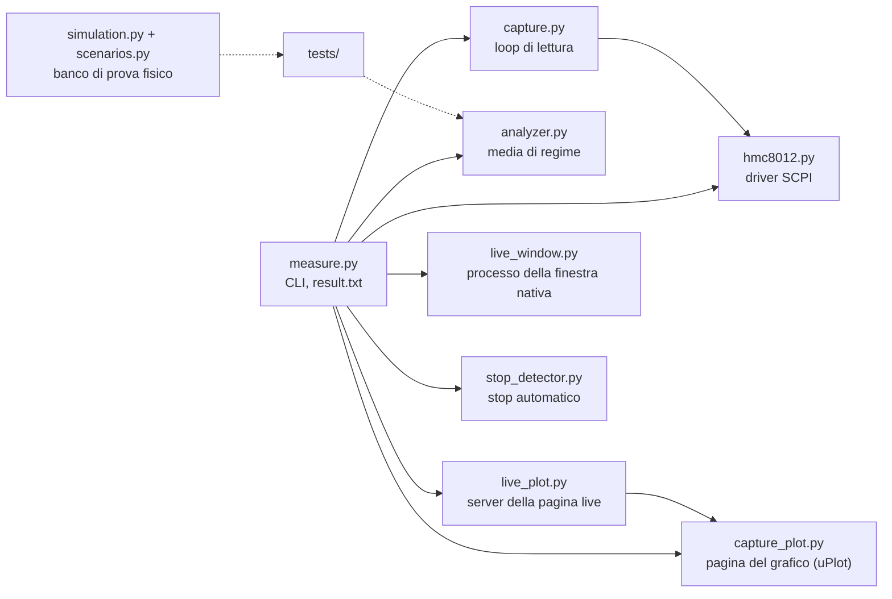

# HMC8012 Measurement Layer

Strumento a riga di comando per il multimetro digitale Rohde & Schwarz HMC8012, chiamato da un programma host (una macro VBA). Ogni chiamata fa una cosa, scrive l'esito in `result.txt` accanto all'eseguibile e termina. Oltre alle letture istantanee, `capture` registra la corrente di alimentazione di un motore mentre è in funzione e ne riporta la corrente media di regime, gestendo il picco di spunto e il rumore. Se non si indica la durata, la cattura si ferma da sola quando il motore si è fermato. Su richiesta mostra anche il grafico della cattura, in tempo reale in una piccola finestra oppure salvato in un file HTML.

English version: [README.md](README.md).

## Avvio rapido

| Comando | Cosa fa |
|-|-|
| `hmc.exe 192.168.0.2 dci` | Una lettura di corrente DC |
| `hmc.exe 192.168.0.2 range dci 2` | Corrente DC, fondo scala 2 A, resta finché non si cambia |
| `hmc.exe 192.168.0.2 capture` | Cattura che si ferma da sola 3 s dopo l'arresto del motore (al massimo 30 s): avviala, poi muovi il motore |
| `hmc.exe 192.168.0.2 capture 10` | Cattura di 10 s esatti |
| `hmc.exe 192.168.0.2 capture --live` | Cattura con il grafico in tempo reale in una piccola finestra |
| `hmc.exe --version` | Versione di questo eseguibile |

L'esito è in `result.txt` accanto a `hmc.exe`: il valore in ampere, `OK` oppure `ERR`.

### Sviluppo

Python 3.11 o successivo:

```bash
python -m venv venv
source venv/bin/activate
pip install -r requirements.txt
python -m pytest -q
```

Su Windows l'ambiente si attiva con `venv\Scripts\activate`.

## Comandi

`<indirizzo>` è un indirizzo IP (`192.168.0.2`, LAN, porta 5025) o una porta COM (`COM3`, porta COM virtuale USB, solo Windows). `hmc.exe` e `python measure.py` accettano gli stessi argomenti.

| Comando | Cosa fa | `result.txt` |
|-|-|-|
| `<indirizzo> <funzione> [ritardo]` | Una lettura con le impostazioni correnti, dopo un ritardo opzionale in secondi | valore o `ERR` |
| `<indirizzo> range <funzione> <valore>` | Seleziona la funzione e il fondo scala; restano fino al prossimo `range` o `reset` | `OK` o `ERR` |
| `<indirizzo> adc` | Legge l'ADC rate della funzione attiva | `SLOW`, `MED`, `FAST` o `ERR` |
| `<indirizzo> adc <SLOW\|MED\|FAST>` | Imposta l'ADC rate della funzione attiva (l'ultima selezionata) | `OK` o `ERR` |
| `<indirizzo> reset` | Ripristina le impostazioni di fabbrica (ADC rate SLOW, autorange attivo) | `OK` o `ERR` |
| `<indirizzo> capture [durata] [timeout] [opzioni]` | Registra la corrente DC e riporta la corrente media a regime. Senza `durata` si ferma da sola quando il motore torna a riposo (al massimo 30 s); con `durata` registra per `durata` secondi. Vedi [Cattura](#cattura) | valore o `ERR` |
| `--version` | Stampa la versione sulla console | invariato |

### Cattura

- Senza `durata` la cattura si ferma 3 s dopo che la corrente è tornata al livello di riposo iniziale, purché prima il motore abbia girato per almeno 0.5 s. Le pause più brevi di 3 s dentro un movimento non la fermano. Se il motore non si ferma mai, la cattura termina a 30 s.
- `timeout` vale di default `durata + 10` s (40 s senza `durata`).
- La cattura legge sempre con ADC rate SLOW. Se lo strumento è a un altro rate, passa a SLOW e alla fine ripristina il rate precedente, anche se la cattura fallisce, così le misure successive mantengono le loro impostazioni.
- Impostare prima il fondo scala della corrente DC con `range`: la cattura rifiuta l'autorange.

Opzioni per la diagnosi, spente di default, combinabili e in qualsiasi posizione:

| Opzione | Cosa aggiunge |
|-|-|
| `--live` | Mostra in tempo reale il grafico delle letture durante la cattura, in una piccola finestra (circa 1000x640). Alla fine evidenzia il tratto a regime e l'intervallo usato per la media, e mostra il valore o l'errore. La finestra resta aperta anche dopo la chiusura di `hmc.exe`, finché non la chiudi tu. |
| `--save-plot` | Scrive lo stesso grafico in `capture_plot_<data UTC>.html` accanto all'eseguibile: un solo file che si apre anche offline con doppio clic, come scheda normale del browser. Si ingrandisce trascinando. |
| `--save-samples` | Scrive le letture grezze in `capture_samples_<data UTC>.csv` accanto all'eseguibile. |

- Nessuna opzione cambia `result.txt`. Un file che non si riesce a scrivere o una finestra che non si apre vengono segnalati solo sulla console.
- Con `--live`, dopo aver scritto `result.txt`, `hmc.exe` aspetta al massimo 3 s perché la finestra riceva l'esito.
- La finestra live è una finestra nativa (pywebview sul runtime WebView2, presente in Windows 11 e nei Windows 10 aggiornati) gestita da un secondo processo `hmc.exe`. Compare quando quel processo è partito e mostra subito tutte le letture fatte fino a quel momento. Senza WebView2 la pagina si apre in una scheda del browser.
- La pagina è servita solo su `127.0.0.1`, mai sulla rete.

### Funzioni e fondi scala

| Nome | Misura | Comando SCPI | Valori di fondo scala (unità SI) |
|-|-|-|-|
| `dcv` | Tensione DC | `CONF:VOLT:DC` | 0.4, 4, 40, 400, 1000 V |
| `acv` | Tensione AC | `CONF:VOLT:AC` | 0.4, 4, 40, 400, 750 V |
| `dci` | Corrente DC | `CONF:CURR:DC` | 0.02, 0.2, 2, 10 A |
| `aci` | Corrente AC | `CONF:CURR:AC` | 0.02, 0.2, 2, 10 A |
| `res` | Resistenza a 2 fili | `CONF:RES` | 400, 4e3, 40e3, 400e3, 4e6, 40e6, 2.5e8 Ohm |
| `fres` | Resistenza a 4 fili | `CONF:FRES` | 400, 4e3, 40e3, 400e3, 4e6 Ohm |
| `cap` | Capacità | `CONF:CAP` | 5e-9, 50e-9, 500e-9, 5e-6, 50e-6, 500e-6 F |
| `temp` | Temperatura (PT100) | `CONF:TEMP` | nessuno |
| `freq` | Frequenza | `CONF:FREQ` | nessuno |
| `cont` | Continuità | `CONF:CONT` | nessuno |
| `diod` | Test diodo | `CONF:DIOD` | nessuno |

`range <funzione> AUTO` attiva l'autorange.

## Contratto con il programma host

**File.** `result.txt` viene scritto accanto a `hmc.exe`, che quindi deve stare in una cartella scrivibile. Il collegamento LAN non richiede altro; quello COM (USB) richiede il driver VCP dell'HMC8012.

**`result.txt`:**

- Viene cancellato all'avvio di ogni comando (tranne `--version`) e scritto in un solo passaggio (file temporaneo, poi rinomina) alla fine: mentre un comando è in corso il file non esiste, e se il file esiste è completo.
- La riga 1 è il valore (punto decimale), `OK`, l'ADC rate oppure `ERR`.
- Dopo `ERR`, la riga 2 è `[APP] <comando> failed (<livello>).` e la riga 3 è `[EXC] <tipo>: <messaggio>`.
- L'exit code è 0 in caso di successo e 1 in caso di errore.

| Livello | Significato |
|-|-|
| `VISA/network` | Strumento non raggiunto: errore di connessione o trasporto |
| `instrument SCPI` / `instrument` | Strumento raggiunto, ma ha segnalato un errore, un overflow, oppure la cattura si è fermata per letture fallite |
| `instrument config` | Cattura: funzione sbagliata o autorange ancora attivo |
| `insufficient samples` | Cattura: troppo poche letture valide |
| `analysis` | Cattura: letture registrate, ma nessun valore affidabile (vedi la tabella degli errori sotto) |
| `input sanitization` | Argomento non valido |
| `unexpected` | Qualsiasi altro errore; i dettagli sono in `[EXC]` |

**Tempi.** Ogni comando paga prima l'avvio di `hmc.exe` (l'eseguibile a file singolo si estrae all'avvio; di solito qualche secondo, da misurare sul PC di laboratorio). Una cattura dura poi `durata` secondi (senza durata, fino a 3 s dopo l'arresto del motore), più l'analisi, che richiede molto meno di 0.1 s.

Per una lettura istantanea, attendere la fine del processo, poi leggere il file:

```vba
Dim sh As Object, rc As Long
Set sh = CreateObject("WScript.Shell")
rc = sh.Run("""C:\hmc\hmc.exe"" 192.168.0.2 dci", 0, True)
```

`True` fa aspettare a `Run` la fine di `hmc.exe`; poi la riga 1 di `C:\hmc\result.txt` è il valore oppure `ERR`.

Per una cattura il motore deve muoversi mentre `hmc.exe` è in esecuzione: quindi lo si avvia senza attendere e si aspetta `result.txt`:

```vba
Const RESULT_FILE As String = "C:\hmc\result.txt"
Dim sh As Object, deadline As Date
If Dir(RESULT_FILE) <> "" Then Kill RESULT_FILE
Set sh = CreateObject("WScript.Shell")
sh.Run """C:\hmc\hmc.exe"" 192.168.0.2 capture", 0, False
' Qui si avvia il motore.
deadline = Now + TimeSerial(0, 0, 45)
Do While Dir(RESULT_FILE) = "" And Now < deadline
    DoEvents
Loop
```

- Prima cancellare il vecchio `result.txt`. Lo cancella anche `hmc.exe`, ma solo dopo il suo avvio; fino ad allora ci sarebbe ancora il valore del comando precedente.
- `False` fa tornare subito `Run`, così il motore può partire mentre la cattura procede.
- La scadenza di 45 s copre la cattura più lunga (30 s), l'avvio e un margine; con `capture 10` bastano 30 s. Se dopo la scadenza il file non c'è, la cattura non è terminata.
- `result.txt` viene scritto in un solo passaggio, quindi quando esiste è completo: la riga 1 è il valore oppure `ERR`.
- Leggere i numeri con `Val()`, che usa sempre il punto decimale. `CDbl` segue le impostazioni di Windows e in italiano si aspetta la virgola.

**Una cattura, un movimento.** Avviare la cattura almeno 1 s prima che il motore si muova (l'analisi deve prima misurare la corrente di riposo). Con una durata fissa il motore deve fermarsi prima della fine della cattura; senza durata è la cattura ad aspettarlo.

## Come si calcola il valore della cattura

`result.txt` contiene la **corrente media di alimentazione durante il regime**, dalla fine del transitorio di avvio allo stop, in una cattura del tipo riposo, avvio/spunto, regime, stop, riposo. Ripple, PWM e variazioni di carico durante il regime fanno parte della media. Il codice è in `analyzer.py` (`analyze_waveform`):

1. **Validazione.** I timestamp devono crescere. Letture NaN/inf e sentinelle di overflow (+/-9.9E37) non sono valide; oltre il 20% di letture non valide la cattura viene rifiutata.
2. **Riferimento di riposo.** La cattura deve iniziare con almeno 0.25 s di corrente di riposo stabile (più metà della finestra di smoothing da 0.5 s).
3. **Regime.** Il regime è dove la corrente smussata, pesata nel tempo, sta sopra il riposo di più di due tolleranze (il motore aggiunge soltanto corrente), con una media sopra il riposo oltre il rumore, per almeno `min_run_s` (0.5 s). Due regimi separati nella stessa cattura vengono rifiutati. I bordi del regime vengono rifiniti sulle letture grezze.
4. **Finestra di media.** L'inizio e la fine del regime vengono tagliati (ciascuno fino a `max_settle_s`, default 1 s, a passi di 0.1 s, prima i tagli più piccoli) per escludere spunto, accelerazione e decelerazione. Una finestra è accettata quando non contiene letture non valide, i suoi blocchi da 1 s concordano sulla media entro la tolleranza (max(2 mA, 2% della media), più il rumore delle letture) e la media è precisa: due errori standard, dalle letture e dalla dispersione delle medie dei blocchi, entro la tolleranza.
5. **Risultato.** La media pesata nel tempo sulla finestra: ogni lettura pesa per l'intervallo fino alla lettura successiva, quindi poll irregolari e risposte `READ?` ripetute non la falsano.

**Errori invece di numeri sbagliati.** Quando non esiste un valore affidabile, `result.txt` riceve `ERR`:

| Errore | Significato | Cosa cambiare |
|-|-|-|
| `InvalidCaptureError` | Dati malformati, troppe letture non valide, nessun riposo stabile all'inizio, o letture in overflow/NaN durante il regime | Avviare la cattura prima che il motore si muova; alzare il fondo scala se i picchi vanno in overflow; alzare `abs_tolerance_a` se la corrente di riposo stessa fluttua di più di 2 mA |
| `SignalNotSettledError` | Nessun regime, o regime non stabile: deriva, assestamento più lungo di `max_settle_s`, un secondo livello (mantenimento, standby dopo lo stop, altra velocità) | Catturare un solo regime stabile; aumentare `max_settle_s` per assestamenti lenti |
| `AmbiguousRunError` | Più di un regime separato nella cattura | Un movimento per cattura |
| `ImpreciseValueError` | Regime stabile, ma media troppo incerta (rumore, variazioni lente del carico, poche letture) | Regime più lungo, o tolleranza più larga |

**Limiti noti.**

- Un carico periodico con periodo sottomultiplo dei 200 ms di conversione in SLOW può dare aliasing se l'apertura dell'ADC è più corta del periodo di conversione (non indicato nel manuale). Il ripple veloce (passi dello stepper, PWM del driver) si media dentro ogni conversione.
- Carichi che variano su decimi di secondo danno poche letture distinte a 5 al secondo e finiscono spesso in `ImpreciseValueError`; un regime più lungo aiuta.
- Un livello diverso più breve di circa `max_settle_s` all'inizio o alla fine del regime viene tagliato come se fosse un transitorio.
- Una pausa dentro un movimento (la corrente torna a riposo e poi riparte) dà `ERR`. Senza durata, una pausa di 3 s o più chiude anche la cattura.

## Guida per sviluppatori

### Architettura


```mermaid
flowchart LR
    CLI["measure.py<br/>CLI, result.txt"] --> DRV["hmc8012.py<br/>driver SCPI"]
    CLI --> CAP["capture.py<br/>loop di lettura"]
    CAP --> DRV
    CLI --> ANA["analyzer.py<br/>media di regime"]
    CLI --> PLOT["capture_plot.py<br/>pagina del grafico (uPlot)"]
    CLI --> LIVE["live_plot.py<br/>server della pagina live"]
    LIVE --> PLOT
    CLI --> WIN["live_window.py<br/>processo della finestra nativa"]
    CLI --> STOP["stop_detector.py<br/>stop automatico"]
    SIM["simulation.py + scenarios.py<br/>banco di prova fisico"] -.-> TESTS["tests/"]
    TESTS -.-> ANA
```

Cosa fa una `capture`:

1. `measure.py` apre lo strumento (`hmc8012.py`), seleziona la corrente DC e passa a SLOW se serve.
2. `capture.py` interroga `READ?` fino alla fine della durata oppure, senza durata, finché `stop_detector.py` non vede il motore di nuovo a riposo. Le letture fallite restano NaN; cinque di fila fermano la cattura.
3. Il rate precedente viene ripristinato.
4. `analyzer.py` calcola il valore e `measure.py` scrive `result.txt`.

Con `--live` ogni lettura va anche a `live_plot.py`, che la invia alla pagina come server-sent event; la pagina ridisegna alla frequenza dello schermo. Alla fine l'esito, o l'errore, va alla pagina live e ai file richiesti.

| Modulo | Responsabilità | Punti di ingresso pubblici |
|-|-|-|
| `measure.py` | Dispatch CLI, `result.txt`, livelli di errore | `main`, `cmd_*`, `write_result`, `clear_result` |
| `hmc8012.py` | SCPI via PyVISA (socket LAN o COM); ogni setter controlla `SYST:ERR?` | `HMC8012`, `ScpiError`, `RangeOverflowError` |
| `capture.py` | Loop di lettura a tempo, conteggio dei fallimenti | `ContinuousCapture`, `CaptureResult` |
| `stop_detector.py` | Stop automatico: chiude una cattura senza durata quando il motore ha girato ed è tornato a riposo | `StopDetector` |
| `analyzer.py` | Riposo, regime, finestra di media, precisione; solleva errori invece di tirare a indovinare | `analyze_waveform`, `AnalysisConfig`, `AnalysisResult`, classi di errore |
| `capture_plot.py` | Pagina del grafico di una cattura (salvata o live), da `plot_assets/` | `render_capture_plot`, `write_capture_plot`, `render_live_page` |
| `live_plot.py` | Serve la pagina live su `127.0.0.1` e invia le letture | `LivePlot` |
| `live_window.py` | Finestra live nativa in un processo figlio (`hmc.exe --live-window <url>`, interno) | `open_live_window`, `run_live_window` |
| `simulation.py` | Banco di prova: corrente vera del motore e modello di campionamento HMC8012 | `Phase`, `InstrumentModel`, `simulate_capture` |
| `scenarios.py` | Banco di prova: comportamenti del dispositivo con nome | `SCENARIOS`, `ScenarioParams` |
| `version.py` | Unica fonte della versione di rilascio | `__version__` |
| `plot_assets/` | Template della pagina e uPlot 1.6.32 (MIT), inclusi in `hmc.exe` | |

Le docstring di ogni modulo sono il riferimento per argomenti, valori restituiti ed errori sollevati.

### Dove modificare

| Per cambiare | Modificare |
|-|-|
| Taratura dell'analisi (finestra di smoothing, regime minimo, tagli, tolleranza) | default di `AnalysisConfig` in `analyzer.py` |
| ADC rate delle catture | `CAPTURE_ADC_RATE` in `measure.py` |
| Letture fallite che fermano una cattura | `DEFAULT_MAX_CONSECUTIVE_FAILURES` in `capture.py` |
| Tempo a riposo che chiude una cattura senza durata | `STOP_HOLD_S` in `stop_detector.py` |
| Durata massima di una cattura senza durata | `AUTO_STOP_MAX_DURATION_S` in `measure.py` |
| Aspetto del grafico (colori, etichette, disposizione) | `plot_assets/capture_plot.html` |
| Dimensione e titolo della finestra live | `WINDOW_SIZE`, `WINDOW_TITLE` in `live_window.py` |
| Un nuovo comportamento simulato per i test | un builder e una voce in `SCENARIOS` (`scenarios.py`) |
| Un nuovo comando | una funzione `cmd_*` e un ramo in `main()` (`measure.py`) |
| La versione | `version.py` (vedi Rilasci) |

### Test

`python -m pytest -q` esegue tutti i test, compresi quelli che attendono il timeout di connessione su un indirizzo irraggiungibile.

- L'analyzer è testato contro la simulazione fisica (`simulation.py`, `scenarios.py`: riposo, spunto, ripple di passo, carico PWM, corrente di mantenimento, assestamento lento, aliasing, a ogni ADC rate) e contro casi limite costruiti a mano. La regola che i test fanno rispettare: una cattura dà il valore giusto o un errore esplicito, mai un valore sbagliato.
- I test del grafico coprono il contenuto della pagina e l'invio live su una vera connessione locale.
- La build della CI controlla che il processo della finestra live compilato apra una finestra WebView2. L'aspetto della finestra si può verificare solo su un PC Windows.

### Scelte di progetto

- **Media di tutto il regime.** Con ripple o carico variabile il numero utile è l'assorbimento medio durante il funzionamento, non il tratto più piatto.
- **Meglio un errore di un numero sbagliato.** Ogni controllo (riposo all'inizio, un solo regime, blocchi stabili, precisione, nessuna lettura non valida nella finestra) rifiuta la cattura con un motivo invece di restituire un valore che potrebbe essere sbagliato.
- **Sempre SLOW, senza effetti collaterali.** SLOW è l'unico rate con accuratezza specificata e media il ripple dello stepper dentro ogni conversione; la cattura ripristina il rate precedente, così le letture istantanee mantengono le loro impostazioni.
- **Pesato nel tempo, ogni lettura valida fino alla successiva.** L'HMC8012 risponde a `READ?` con l'ultima conversione, quindi interrogando più veloce dell'ADC i valori si ripetono; il peso nel tempo rende il risultato indipendente dalla frequenza di interrogazione.
- **Le letture fallite restano come NaN.** Scartarle nasconderebbe i picchi in overflow e falserebbe la media verso il basso.
- **Le uscite di diagnosi non cambiano mai l'esito.** Grafico, finestra live e file delle letture ricevono le letture e l'esito, anche di una cattura fallita, ma `result.txt` non le aspetta e non dipende da loro.

### Note sullo strumento

Dai manuali utente e SCPI dell'HMC8012:

- La corrente DC dà 5 / 10 / 200 letture al secondo in SLOW / MED / FAST, con 5¾ / 4¾ / 4¾ cifre.
- L'accuratezza è specificata solo in SLOW, e `*RST` imposta SLOW.
- `ADCRate` "selects the ADC rate for the activated measurement function".

Non indicati nei manuali, da verificare sullo strumento:

- se `CONF:CURR:DC` senza fondo scala riporta il fondo scala in automatico (la cattura si fermerebbe con `instrument config`);
- la durata dell'apertura dell'ADC.

## Rilasci e compilazione

La versione sta in `version.py` e da nessun'altra parte: `hmc.exe --version` la stampa e la build la scrive nelle proprietà del file eseguibile. Ogni modifica rilasciata la incrementa (versionamento semantico: major per un contratto host cambiato, minor per nuovi comandi, patch per correzioni).

### Da GitHub

Ogni push su `master` esegue `.github/workflows/build-windows.yml` su un runner Windows:

1. Python 3.12 e i test.
2. La compilazione con Nuitka.
3. Uno smoke test: la versione da riga di comando e nelle proprietà del file deve coincidere con `version.py`, un comando non valido deve dare `ERR`, il report di compilazione deve elencare i file del grafico, e il processo della finestra live deve restare attivo con una finestra WebView2.
4. Il caricamento di `hmc.exe` come artifact `hmc-exe-v<versione>-<commit>`, nella pagina della run, scheda Actions.

Si può anche avviare a mano dalla scheda Actions (Run workflow).

### Su Windows

Con Python 3.12 (il MinGW-w64 incluso in Nuitka non supporta la 3.13+):

```bat
pip install -r requirements.txt nuitka
python -m pytest -q
python -m nuitka --onefile --assume-yes-for-downloads --output-filename=hmc.exe ^
  --include-package=pyvisa --include-package=pyvisa_py --include-package=serial ^
  --include-data-dir=plot_assets=plot_assets --enable-plugin=pywebview ^
  --nofollow-import-to=pyvisa.testsuite --nofollow-import-to=pyvisa_py.testsuite ^
  --noinclude-pytest-mode=nofollow ^
  --product-name=hmc8012-measure --file-description="HMC8012 measurement CLI" ^
  --file-version=3.0.0 --product-version=3.0.0 ^
  measure.py
```

Usare in `--file-version` e `--product-version` la versione di `version.py`.

## Dipendenze

- Python 3.11 o successivo (3.12 per compilare l'eseguibile)
- `pyvisa`, `pyvisa-py`: comunicazione con lo strumento senza NI-VISA
- `pyserial`: connessioni via porta COM
- `numpy`: analisi delle catture
- `pytest`: test
- `pywebview`: la finestra live (su Windows tramite `pythonnet` e il runtime WebView2)
- uPlot 1.6.32 (MIT): incluso in `plot_assets/`, niente da installare

```bash
pip install -r requirements.txt
```
