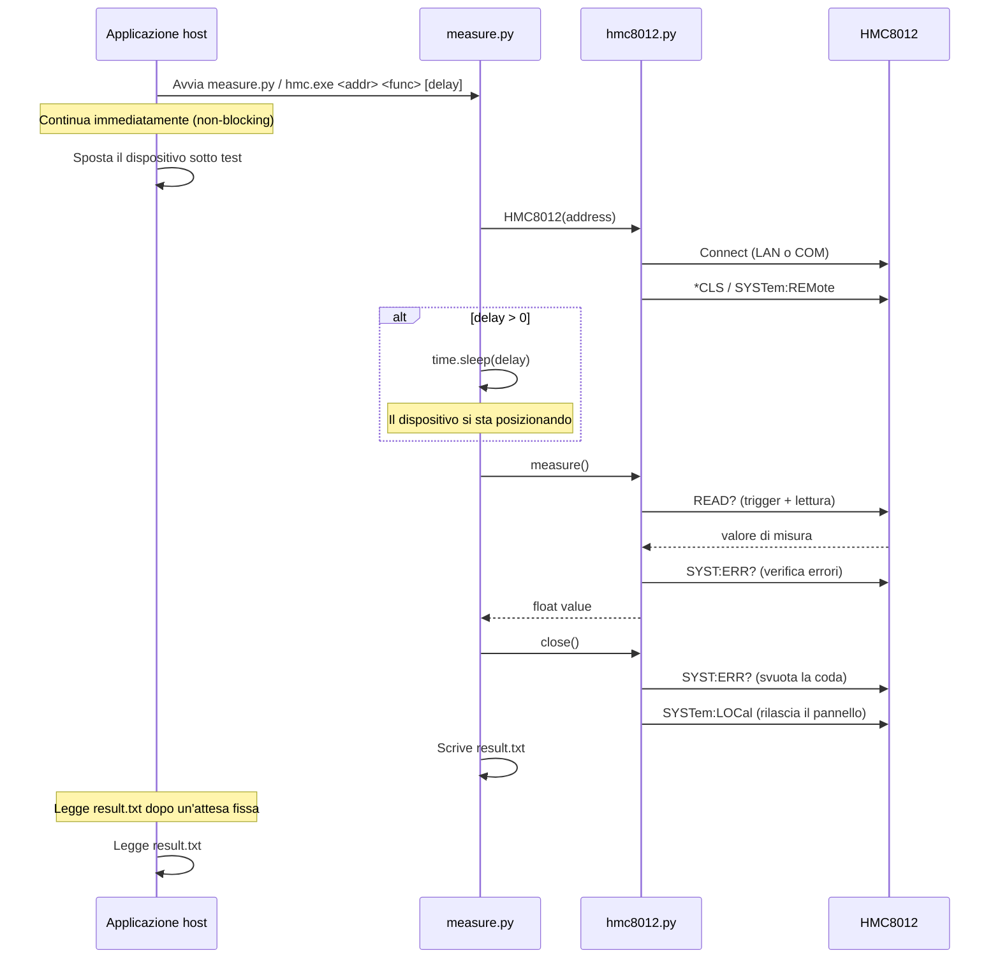
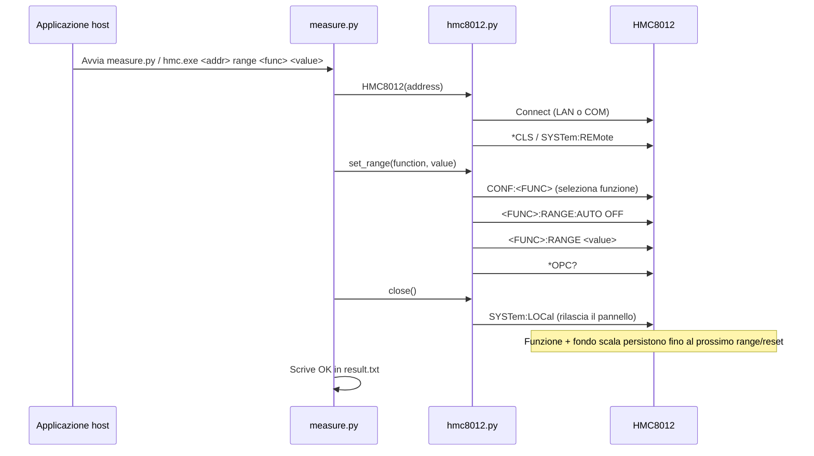
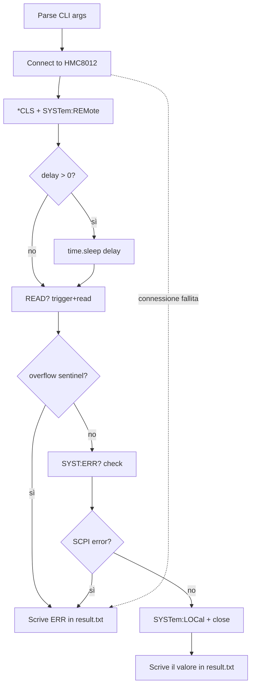
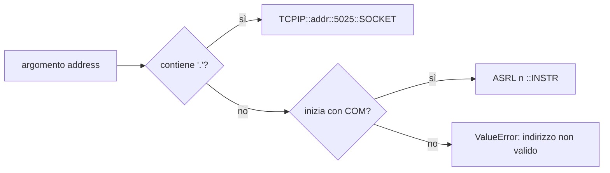

# HMC8012 Measurement Layer

Tool Python per interfacciarsi con l'HMC8012 Digital Multimeter di Rohde & Schwarz.

## Utilizzo

### Misura

Legge dallo strumento con la funzione e il fondo scala correnti. **Non** riconfigura nulla; usare il comando `range` prima.

```bat
python measure.py <address> <function> [delay_seconds]
hmc.exe <address> <function> [delay_seconds]
```

| Argomento | Descrizione |
|-|-|
| `address` | Indirizzo IP (es. `192.168.1.25`) o porta COM (es. `COM5`) |
| `function` | Tipo di misura (vedi tabella sotto) |
| `delay_seconds` | Attesa opzionale in secondi prima della misura (default: 0) |

### Impostare il Fondo Scala

Configura funzione e fondo scala sullo strumento. Le impostazioni vengono mantenute fino al prossimo comando `range` o `reset`. La connessione **non** resetta lo strumento.

```bat
python measure.py <address> range <function> <value>
hmc.exe <address> range <function> <value>
```

| Argomento | Descrizione |
|-|-|
| `function` | dcv, acv, dci, aci, res, fres, cap |
| `value` | Fondo scala in unita SI base (es. `2` per 2A, `0.4` per 400mV) oppure `AUTO` |

### Reset

Ripristina lo strumento ai valori di fabbrica.

```bat
python measure.py <address> reset
hmc.exe <address> reset
```

### Cattura continua DCI

La cattura continua acquisisce campioni di corrente DC nel tempo, trova il regime e ne scrive la corrente media (il **valore stabile**) in `result.txt`. Impostare prima il fondo scala DCI (es. `range dci 0.2`). Vedi [Cattura continua: valore stabile](#cattura-continua-valore-stabile) per come si ricava il valore stabile.

**Cattura a tempo (solo result.txt):**

```bat
python measure.py <address> capture [duration] [timeout]
```

Con un solo numero, timeout = duration + 10 secondi.

**Cattura a tempo con grafico live:**

```bat
python measure.py <address> capture-plot [duration] [timeout]
```

Stessa regola per il timeout. Il grafico mostra la forma d’onda in tempo reale e a fine cattura la regione stabile e un box riepilogo (valore stabile, σ, N, Δt, rate).

**Start/stop (senza durata fissa):**

```bat
python measure.py <address> capture-plot start [SLOW|MED|FAST]
```

Esegue fino alla creazione del file sentinel (massimo 1 ora). Il rate ADC è opzionale (default SLOW, usato anche da `capture` e da `capture-plot` a tempo: media il ripple dello stepper ed è l'unico rate con accuratezza specificata).

```bat
python measure.py <address> capture-plot stop
```

Crea il file sentinel; il processo che ha eseguito `start` termina la cattura, esegue l’analisi e scrive `result.txt` come al solito.

### Funzioni Supportate

| Nome | Misura | Comando SCPI | Fondi scala disponibili |
| --- | --- | --- | --- |
| `dcv` | Tensione DC | `CONF:VOLT:DC <range>` | 400mV, 4V, 40V, 400V, 1000V |
| `acv` | Tensione AC | `CONF:VOLT:AC <range>` | 400mV, 4V, 40V, 400V, 750V |
| `dci` | Corrente DC | `CONF:CURR:DC <range>` | 20mA, 200mA, 2A, 10A |
| `aci` | Corrente AC | `CONF:CURR:AC <range>` | 20mA, 200mA, 2A, 10A |
| `res` | Resistenza a 2 fili | `CONF:RES <range>` | 400, 4k, 40k, 400k, 4M, 40M, 250M |
| `fres` | Resistenza a 4 fili | `CONF:FRES <range>` | 400, 4k, 40k, 400k, 4M |
| `cap` | Capacità | `CONF:CAP <range>` | 5nF, 50nF, 500nF, 5uF, 50uF, 500uF |
| `temp` | Temperatura (PT100) | `CONF:TEMP` | n/d |
| `freq` | Frequenza | `CONF:FREQ` | n/d |
| `cont` | Continuità | `CONF:CONT` | n/d |
| `diod` | Test diodo | `CONF:DIOD` | n/d |

### Valori di Fondo Scala (SCPI)

I valori di fondo scala usano le unita SI base (volt, ampere, ohm, farad). Ad esempio, `0.4` = 400mV, `0.02` = 20mA.

| Funzione | Valori di fondo scala | Unita |
|-|-|-|
| `dcv` | 0.4, 4, 40, 400, 1000 | V |
| `acv` | 0.4, 4, 40, 400, 750 | V |
| `dci` | 0.02, 0.2, 2, 10 | A |
| `aci` | 0.02, 0.2, 2, 10 | A |
| `res` | 400, 4e3, 40e3, 400e3, 4e6, 40e6, 2.5e8 | Ohm |
| `fres` | 400, 4e3, 40e3, 400e3, 4e6 | Ohm |
| `cap` | 5e-9, 50e-9, 500e-9, 5e-6, 50e-6, 500e-6 | F |

### Esempi

```bat
rem 1. Reset dello strumento ai valori di fabbrica
hmc.exe 192.168.1.25 reset

rem 2. Configura corrente DC con fondo scala 2A
hmc.exe 192.168.1.25 range dci 2

rem 3. Misura (usa la funzione e il fondo scala configurati)
hmc.exe 192.168.1.25 dci

rem 4. Misura con ritardo di 1.5s per il posizionamento
hmc.exe 192.168.1.25 dci 1.5

rem 5. Cambia a tensione DC, fondo scala 40V
hmc.exe 192.168.1.25 range dcv 40

rem 6. Misura tensione DC
hmc.exe 192.168.1.25 dcv

rem 7. Passa a fondo scala automatico per tensione AC
hmc.exe COM5 range acv AUTO

rem 8. Misura tensione AC
hmc.exe COM5 acv
```

## Output

**result.txt** (stessa directory dello script):

- Misura riuscita: il valore numerico come numero semplice (es. `4.872341`)
- Range/reset riuscito: `OK`
- In caso di errore: tre righe:

```
ERR
[APP] <comando> failed (<layer>).
[EXC] <TipoEccezione>: <messaggio>
```

La riga `[APP]` identifica il comando fallito e il layer in cui si è verificato l'errore:

| Layer | Significato |
|-|-|
| `VISA/network` | Strumento non raggiunto: errore di connessione o trasporto |
| `instrument SCPI` | Strumento raggiunto, ha riportato un errore SCPI tramite `SYST:ERR?` |
| `instrument` | Strumento ha risposto correttamente, ma il valore indica overflow (`9.9e+37`) |
| `input sanitization` | Argomento non valido, rifiutato prima di aprire la connessione |
| `unexpected` | Eccezione non classificata, vedere `[EXC]` per i dettagli |

La riga `[EXC]` contiene il tipo di eccezione Python e il suo messaggio verbatim.

**stderr** usa gli stessi prefissi per tutto l'output diagnostico:
- `[APP]`: messaggio scritto dal nostro codice (avanzamento, risultato, classificazione errore)
- `[EXC]`: tipo di eccezione e messaggio, solo in caso di errore

## Cattura continua: valore stabile

Lo script scrive un solo numero in `result.txt`: la **corrente media di alimentazione del dispositivo durante il regime**, dalla fine del transitorio di avvio allo stop, in una cattura del tipo idle, avvio/spunto, regime, stop, idle. Ripple, PWM e variazioni di carico durante il regime fanno parte della media. Il calcolo è in `analyzer.py` (`analyze_waveform`):

1. **Validazione.** I timestamp devono essere strettamente crescenti. Letture NaN/inf e sentinelle di overflow (+/-9.9E37) sono campioni non validi; oltre il 20% di campioni non validi la cattura viene rifiutata.
2. **Riferimento di idle.** La cattura deve iniziare con almeno 0.25 s di corrente di idle stabile (più metà della finestra di smoothing da 0.5 s): avviare la cattura prima che il dispositivo si muova.
3. **Regime.** Il regime è dove la corrente smussata, pesata nel tempo, sta sopra l'idle di più di due tolleranze (i motori aggiungono soltanto corrente), per almeno `min_run_s` (0.5 s). Una cattura con due regimi separati viene rifiutata. I bordi del regime vengono rifiniti sulle letture grezze.
4. **Finestra di media.** L'analyzer taglia l'inizio e la fine del regime (ciascuno fino a `max_settle_s`, default 1 s, a passi di 0.1 s, prima i tagli più piccoli) per escludere spunto, accelerazione e decelerazione. Una finestra è accettata quando non contiene letture non valide, i suoi blocchi da 1 s (due finestre di smoothing) concordano sulla media entro la tolleranza (max(2 mA, 2% della media), più il rumore delle letture) e la media è precisa: due errori standard, dalle letture e dalla dispersione delle medie dei blocchi, entro la tolleranza. Quindi il primo e l'ultimo `max_settle_s` del regime possono restare fuori quando differiscono dal resto: spunto, accelerazione, decelerazione, o un carico breve subito prima dello stop.
5. **Risultato:** media pesata nel tempo sulla finestra, con ogni lettura mantenuta fino alla successiva, così poll irregolari e risposte `READ?` ripetute non la falsano.

**Errori invece di numeri sbagliati.** `result.txt` riceve `ERR` con il motivo quando:

| Errore | Significato | Cosa cambiare |
|-|-|-|
| `InvalidCaptureError` | Dati malformati, troppe letture non valide, nessun idle stabile all'inizio, o letture in overflow/NaN durante il regime | Avviare la cattura prima che il dispositivo si muova; alzare il fondo scala DCI se i picchi vanno in overflow; alzare `abs_tolerance_a` se la corrente di idle stessa fluttua di più di 2 mA |
| `SignalNotSettledError` | Nessun regime, o regime non stabile: deriva, assestamento più lungo di `max_settle_s`, un secondo livello (mantenimento, standby dopo lo stop, altra velocità) | Catturare un solo regime stabile; aumentare `max_settle_s` per assestamenti lenti |
| `AmbiguousRunError` | Più di un regime separato nella cattura | Un movimento per cattura |
| `ImpreciseValueError` | Regime stabile ma media troppo incerta (rumore, burst lenti, poche letture) | Regime più lungo, ADC più lento o tolleranza più larga |

**I campioni grezzi** vengono sempre salvati in `capture_samples_<data UTC>.csv` prima dell'analisi, anche quando la cattura si interrompe, così una cattura fallita si può rianalizzare nel simulatore. Una lettura fallita (overflow, risposta illeggibile) resta come `nan` al suo istante: scartarla nasconderebbe il picco a cui apparteneva. Cinque letture fallite di fila interrompono la cattura e danno `ERR`.

**Limiti noti.**

- Una corrente periodica (ripple di passo, PWM, burst) con frequenza multipla esatta o quasi esatta della frequenza di conversione ADC viene campionata in modo stroboscopico: le letture variano così lentamente, o per niente, che il regime sembra stabile al livello sbagliato. Il test a blocchi intercetta i battimenti lenti dentro il regime, ma un carico esattamente sincrono non è rilevabile dai campioni. SLOW integra su molti periodi del ripple veloce, quindi è il rate più sicuro (e l'unico con accuratezza specificata), ma un carico con periodo sottomultiplo dei suoi 200 ms di conversione può ancora dare aliasing se l'apertura dell'ADC è più corta del periodo di conversione (non indicato nel manuale; il simulatore assume il 50%).
- Un livello diverso più breve di circa `max_settle_s` all'inizio o alla fine del regime viene tagliato come se fosse un transitorio.

Nel grafico della cattura la zona verde è la finestra di media, la linea verde tratteggiata il valore riportato e sigma la deviazione standard delle letture nella finestra.

## Simulatore

`simulate.py` esegue il vero analyzer su catture simulate realistiche (modello della corrente del dispositivo più modello di acquisizione dell'HMC8012) e confronta il risultato con il valore vero noto: PASS (entro tolleranza), FAIL (valore sbagliato), RAISE (errore esplicito).

```bash
python simulate.py                                     # finestra interattiva: scenario, ADC rate, fondo scala, slider
python simulate.py --scenario long_idle_after --adc SLOW
python simulate.py --matrix --seeds 10                 # tabella PASS/FAIL/RAISE, tutti gli scenari x ADC rate
python simulate.py --csv capture_samples_2026-10-01_15-00-00.csv   # rianalizza una cattura reale
# opzioni comuni: --window S  --tolerance PCT  --min-run S  --max-settle S  --seed N  --save grafico.png
```

Gli scenari (`scenarios.py`) modellano un dispositivo con motori passo-passo: regime nominale, idle lungo dopo lo stop, corrente di regime sopra 0.4 A, carico PWM veloce, burst più lenti della finestra, corrente di mantenimento dopo lo stop, mantenimento prima e dopo il movimento, assestamento lento, aliasing del ripple di passo in FAST, dispositivo ancora acceso a fine cattura, e ripple vicino alla frequenza di conversione FAST (il limite noto sopra). I livelli di corrente sono indicativi; si regolano con gli slider.

Modello di acquisizione (`simulation.py`): letture al secondo per ADC rate dal manuale HMC8012. Ogni conversione integra la corrente su un'apertura (assunta pari al 50% del periodo di conversione; non indicata nel manuale), viene quantizzata alla risoluzione del fondo scala e restituita da poll `READ?` che, in trigger AUTO, restituiscono l'ultima conversione (duplicati se si interroga più veloce dell'ADC). Le letture fuori scala diventano marcatori `nan` e cinque di fila terminano la cattura (esito RAISE), come fa il loop di cattura.

Grafico: linea grigia = corrente vera, punti blu = campioni, linea arancione = livello smussato, banda grigia = regime, banda verde e linea tratteggiata = finestra di media e valore riportato, linea nera punteggiata = valore atteso. Il riquadro del titolo è verde (PASS), rosso (FAIL) o arancione (RAISE).

## Come Funziona

Lo script si connette al multimetro (senza resettarlo), attende il delay di posizionamento se specificato, invia `READ?` e scrive il risultato in `result.txt`. Funzione e fondo scala si configurano separatamente con il comando `range` e vengono mantenuti tra le chiamate.

### Flusso di Sistema (Misura)


```mermaid
sequenceDiagram
    participant HOST as Applicazione host
    participant PY as measure.py
    participant DRV as hmc8012.py
    participant DMM as HMC8012

    HOST->>PY: Avvia measure.py / hmc.exe <addr> <func> [delay]
    Note over HOST: Continua immediatamente (non-blocking)
    HOST->>HOST: Sposta il dispositivo sotto test

    PY->>DRV: HMC8012(address)
    DRV->>DMM: Connect (LAN o COM)
    DRV->>DMM: *CLS / SYSTem:REMote

    alt delay > 0
        PY->>PY: time.sleep(delay)
        Note over PY: Il dispositivo si sta posizionando
    end

    PY->>DRV: measure()
    DRV->>DMM: READ? (trigger + lettura)
    DMM-->>DRV: valore di misura
    DRV->>DMM: SYST:ERR? (verifica errori)
    DRV-->>PY: float value

    PY->>DRV: close()
    DRV->>DMM: SYST:ERR? (svuota la coda)
    DRV->>DMM: SYSTem:LOCal (rilascia il pannello)

    PY->>PY: Scrive result.txt
    Note over HOST: Legge result.txt dopo un'attesa fissa
    HOST->>HOST: Legge result.txt
```

### Flusso di Sistema (Range)


```mermaid
sequenceDiagram
    participant HOST as Applicazione host
    participant PY as measure.py
    participant DRV as hmc8012.py
    participant DMM as HMC8012

    HOST->>PY: Avvia measure.py / hmc.exe <addr> range <func> <value>

    PY->>DRV: HMC8012(address)
    DRV->>DMM: Connect (LAN o COM)
    DRV->>DMM: *CLS / SYSTem:REMote

    PY->>DRV: set_range(function, value)
    DRV->>DMM: CONF:<FUNC> (seleziona funzione)
    DRV->>DMM: <FUNC>:RANGE:AUTO OFF
    DRV->>DMM: <FUNC>:RANGE <value>
    DRV->>DMM: *OPC?

    PY->>DRV: close()
    DRV->>DMM: SYSTem:LOCal (rilascia il pannello)

    Note over DMM: Funzione + fondo scala persistono fino al prossimo range/reset
    PY->>PY: Scrive OK in result.txt
```

### Flusso Interno (Misura)


```mermaid
flowchart TD
    A[Parse CLI args] --> B[Connect to HMC8012]
    B --> C[*CLS + SYSTem:REMote]
    C --> D{delay > 0?}
    D -- sì --> E[time.sleep delay]
    D -- no --> F
    E --> F[READ? trigger+read]
    F --> G{overflow sentinel?}
    G -- sì --> ERR[Scrive ERR in result.txt]
    G -- no --> H[SYST:ERR? check]
    H --> I{SCPI error?}
    I -- sì --> ERR
    I -- no --> J[SYSTem:LOCal + close]
    J --> K[Scrive il valore in result.txt]

    B -.->|connessione fallita| ERR
```

### Rilevamento Connessione


```mermaid
flowchart LR
    A[argomento address] --> B{contiene '.'?}
    B -- sì --> C["TCPIP::addr::5025::SOCKET"]
    B -- no --> D{inizia con COM?}
    D -- sì --> E["ASRL n ::INSTR"]
    D -- no --> F[ValueError: indirizzo non valido]
```

## Struttura dei File

| File | Scopo |
| --- | --- |
| `measure.py` | Entry point CLI: gestione comandi, parsing argomenti, ritardo, capture/capture-plot, output su file |
| `hmc8012.py` | Driver strumento HMC8012: connessione, comandi SCPI, misura, fondo scala |
| `capture.py` | ContinuousCapture: loop di campionamento DCI, sentinel/deadline, sample_callback per grafico live |
| `analyzer.py` | Analisi della corrente di regime: validazione, rilevamento idle e regime, finestra di media stabile, controllo di precisione |
| `plotting.py` | Grafico post-cattura; il grafico live durante la cattura è in measure.py |
| `simulation.py` | Modello fisico: fasi della corrente del dispositivo e acquisizione HMC8012 (apertura, quantizzazione, poll READ?) |
| `scenarios.py` | Catalogo scenari per il simulatore e i test dell'analyzer |
| `simulator_core.py` | Esegue e valuta l'analyzer su catture simulate; carica i CSV delle catture |
| `simulator_view.py` | Grafici matplotlib e finestra interattiva del simulatore |
| `simulate.py` | CLI del simulatore |

## Riferimento al Codice

### hmc8012.py

#### Eccezioni

| Classe | Descrizione |
| --- | --- |
| `ScpiError` | Sollevata quando lo strumento riporta un errore SCPI (risposta non zero a `SYST:ERR?`). |
| `RangeOverflowError` | Sollevata quando lo strumento restituisce il valore sentinella di overflow (`9.9e+37`): l'ingresso ha superato il fondo scala selezionato. |

#### `HMC8012`

Classe driver per l'R&S HMC8012. Supporta i trasporti LAN (socket TCPIP) e COM (seriale/VCP) tramite PyVISA. Implementa il protocollo context manager (`with HMC8012(...) as dmm:`).

##### Costanti

| Nome | Valore | Descrizione |
| --- | --- | --- |
| `OVERFLOW_SENTINEL` | `9.90000000E+37` | Valore restituito dallo strumento in caso di overflow del fondo scala. |
| `SCPI_PORT` | `5025` | Porta TCP usata per le connessioni socket LAN SCPI. |
| `DEFAULT_TIMEOUT_MS` | `8000` | Timeout default per la comunicazione VISA, in millisecondi. |
| `MAX_ERROR_QUEUE_DEPTH` | `50` | Numero massimo di iterazioni per svuotare la coda errori dello strumento. |

##### Mappe

`FUNCTION_SCPI_MAP: dict[str, str]`

Associa ogni nome di funzione CLI al comando SCPI CONFigure. Usata da `set_range()` per selezionare la funzione di misura.

| Chiave | Comando SCPI |
|-|-|
| `dcv` | `CONF:VOLT:DC` |
| `acv` | `CONF:VOLT:AC` |
| `dci` | `CONF:CURR:DC` |
| `aci` | `CONF:CURR:AC` |
| `res` | `CONF:RES` |
| `fres` | `CONF:FRES` |
| `cap` | `CONF:CAP` |
| `temp` | `CONF:TEMP` |
| `freq` | `CONF:FREQ` |
| `cont` | `CONF:CONT` |
| `diod` | `CONF:DIOD` |

`RANGE_SCPI_MAP: dict[str, str]`

Associa i nomi delle funzioni al prefisso SCPI SENSe usato da `set_range()` per il controllo del fondo scala.

| Chiave | Prefisso SCPI |
|-|-|
| `dcv` | `VOLT:DC:RANGE` |
| `acv` | `VOLT:AC:RANGE` |
| `dci` | `CURR:DC:RANGE` |
| `aci` | `CURR:AC:RANGE` |
| `res` | `RES:RANGE` |
| `fres` | `FRES:RANGE` |
| `cap` | `CAP:RANGE` |

##### Metodi pubblici

| Firma | Descrizione |
|-|-|
| `__init__(address, timeout_ms=8000)` | Costruisce la stringa di risorsa VISA da `address` (IP o porta COM). Non apre la connessione. |
| `connect() → None` | Apre la risorsa VISA, imposta i caratteri di terminazione, invia `*CLS`, `SYSTem:REMote`. **Non** resetta lo strumento. Chiamato automaticamente da `__enter__`. |
| `close() → None` | Svuota la coda errori dello strumento, invia `SYSTem:LOCal` per ripristinare il controllo dal pannello frontale, chiude la risorsa VISA. Chiamato automaticamente da `__exit__`. |
| `reset() → None` | Invia `*RST`, `*CLS`, poi `*OPC?` per confermare il completamento. Ripristina i valori di fabbrica. |
| `identify() → str` | Restituisce la stringa di identificazione `*IDN?` dello strumento. |
| `measure() → float` | Invia `READ?` per leggere con la configurazione corrente. Controlla overflow ed errori SCPI, restituisce il valore float. Solleva `RangeOverflowError` o `ScpiError`. |
| `set_range(function, range_value="AUTO") → None` | Seleziona la funzione tramite `CONF:…`, poi imposta il fondo scala tramite comandi SENSe. Le impostazioni vengono mantenute fino al prossimo `set_range()` o `reset()`. Solleva `ValueError` per funzioni non supportate. |

##### Metodi privati

| Firma | Descrizione |
|-|-|
| `_check_errors() → None` | Interroga `SYST:ERR?` una volta; solleva `ScpiError` se il codice di risposta è diverso da zero. |
| `_drain_error_queue() → None` | Legge `SYST:ERR?` in loop (fino a `MAX_ERROR_QUEUE_DEPTH`) finché la coda non è vuota. Chiamato durante `close()`. |
| `_write(command) → None` | Invia una stringa di comando SCPI allo strumento. Solleva `ConnectionError` se non connesso. |
| `_query(command) → str` | Invia una query SCPI e restituisce la stringa di risposta senza spazi. Solleva `ConnectionError` se non connesso. |
| `_build_resource_string(address) → str` | Metodo statico. Rileva il tipo di connessione dalla stringa di indirizzo e restituisce la stringa di risorsa VISA corretta (`TCPIP::…::5025::SOCKET` o `ASRL<n>::INSTR`). Solleva `ValueError` per formati non riconosciuti. |

---

### measure.py

#### Costanti a livello di modulo

| Nome | Valore | Descrizione |
|-|-|-|
| `SCRIPT_DIR` | `Path(sys.argv[0]).resolve().parent` | Directory assoluta dello script/eseguibile, usata per risolvere il percorso di `result.txt`. |
| `DEFAULT_OUTPUT` | `SCRIPT_DIR / "result.txt"` | Percorso default del file di output. |
| `VALID_FUNCTIONS` | chiavi ordinate di `HMC8012.VALID_FUNCTIONS` | Tutti i nomi di funzione di misura riconosciuti, usati nei messaggi di utilizzo/errore. |
| `VALID_RANGE_FUNCTIONS` | chiavi ordinate di `HMC8012.RANGE_SCPI_MAP` | Nomi di funzione che supportano la selezione del fondo scala. |

#### Funzioni

| Firma | Descrizione |
|-|-|
| `main() → None` | Entry point CLI. Analizza `sys.argv`, smista verso `cmd_measure`, `cmd_range` o `cmd_reset`. Esce con codice 1 per comandi sconosciuti o numero di argomenti errato. |
| `cmd_measure(address, args) → None` | Gestisce il comando di misura. Estrae funzione e ritardo opzionale da `args`; apre `HMC8012` come context manager; chiama `dmm.measure()`; scrive il risultato float in `result.txt`. Scrive `ERR` ed esce con codice 1 in caso di eccezione. |
| `cmd_range(address, args) → None` | Gestisce il sotto-comando `range`. Valida funzione e valore, chiama `dmm.set_range()`, scrive `OK` in `result.txt`. Scrive `ERR` ed esce con codice 1 in caso di errore. |
| `cmd_reset(address) → None` | Gestisce il comando `reset`. Apre `HMC8012` e chiama `dmm.reset()`. Scrive `OK` o `ERR` in `result.txt`. |
| `write_result(value, app_msg="", exc_detail="", output_path=DEFAULT_OUTPUT) → None` | Scrive `result.txt`, sovrascrivendo il contenuto esistente. La riga 1 è sempre `value`; se `app_msg` è fornito viene scritto alla riga 2; se `exc_detail` è fornito viene scritto alla riga 3. |
| `_write_error(command, layer, exc) → None` | Scrive un errore stratificato sia su stderr che in `result.txt`. Formatta `[APP] <comando> failed (<layer>).` e `[EXC] <tipo>: <messaggio>`, li stampa su stderr, poi chiama `write_result("ERR", ...)`. |
| `_usage_error(message) → None` | Stampa un messaggio di errore e il riepilogo di utilizzo completo su stderr, poi chiama `sys.exit(1)`. |

## Compilazione dell'Eseguibile Standalone

Per distribuire lo strumento come `hmc.exe` autonomo (senza Python né NI-VISA sulla macchina di destinazione), va compilato con Nuitka su Windows.

**Da GitHub (senza macchina Windows).** Ogni push su `master` esegue `.github/workflows/build-windows.yml` su un runner Windows: installa Python 3.12, esegue i test, compila `hmc.exe`, verifica che si avvii e lo pubblica come artifact `hmc-exe-<commit>` nella pagina della run, nella scheda Actions del repository. Il workflow si può anche avviare a mano da lì (Run workflow).

**Su una macchina Windows.** Usare **Python 3.12** (il MinGW-w64 incluso in Nuitka non supporta la 3.13+):

```bat
pip install -r requirements.txt nuitka
python -m pytest -q
python -m nuitka --onefile --enable-plugin=tk-inter --assume-yes-for-downloads --output-filename=hmc.exe --include-package=pyvisa --include-package=pyvisa_py --include-package=serial measure.py
```

`hmc.exe` accetta gli stessi argomenti di `python measure.py` e scrive `result.txt` e i CSV delle catture accanto a sé, quindi va messo in una cartella scrivibile. Il collegamento COM (USB) richiede il driver VCP dell'HMC8012; la LAN non richiede nulla.

## Dipendenze

- Python 3.11 o successivo (3.12 per compilare l'eseguibile)
- `pyvisa` - comunicazione VISA con gli strumenti
- `pyvisa-py` - backend VISA in puro Python (non richiede NI-VISA per connessioni LAN)
- `pyserial` - richiesto su Windows per le connessioni via porta COM
- `numpy` - analisi delle catture
- `matplotlib` - grafici delle catture e simulatore
- `pytest` - test

```bash
pip install -r requirements.txt
```
